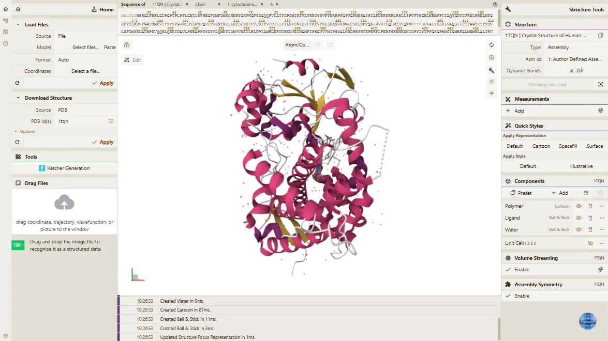
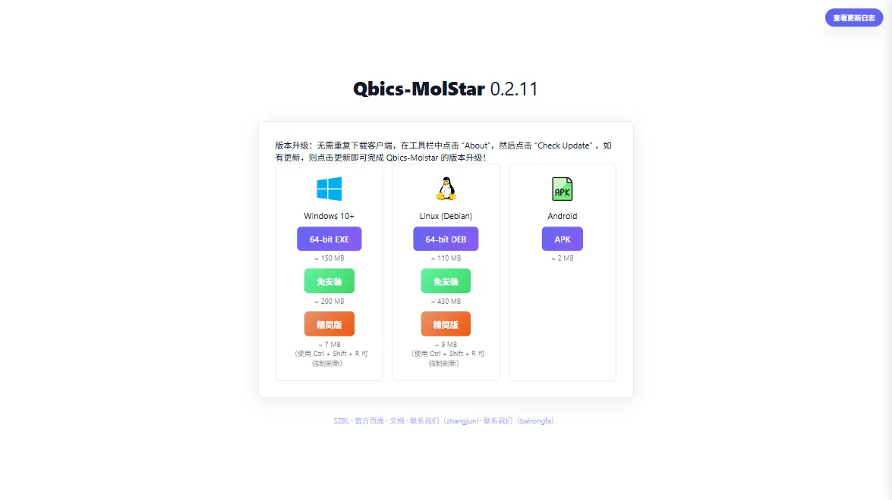
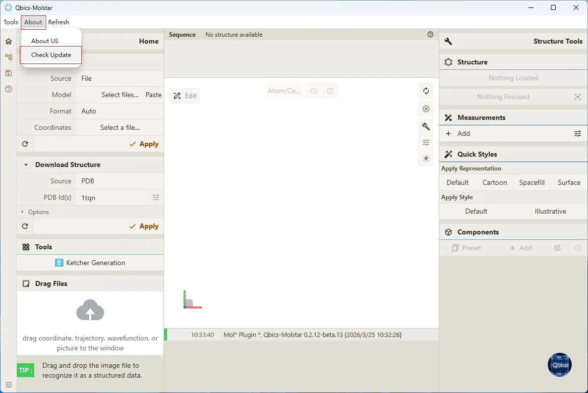
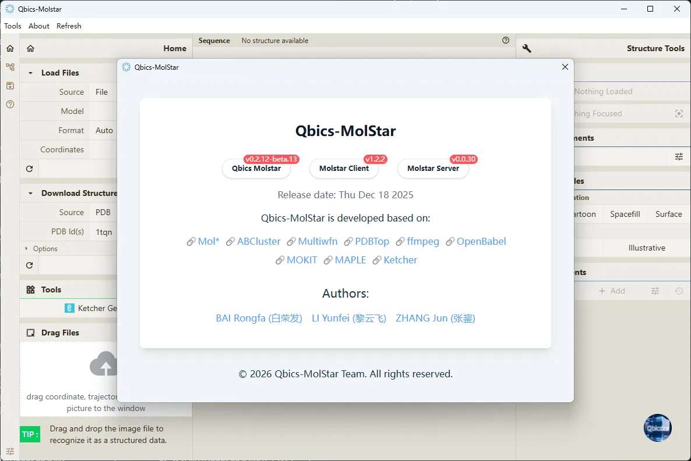

# 一、前言

> **Qbics-Molstar 分子可视化平台用户手册**
>
> 官方网站：[https://molstar.szbl.ac.cn/viewer](https://molstar.szbl.ac.cn/viewer)
> 
> 官方文档：[https://molstar.szbl.ac.cn/docs](https://molstar.szbl.ac.cn/docs)
> 
> 第三方文档：[https://rxht.github.io/molstar/](https://rxht.github.io/molstar/)

## 1. 平台简介

Qbics-Molstar是基于开源 [Mol*](https://github.com/molstar/molstar) 项目进行二次定制开发的专业分子可视化平台，由深圳湾实验室（[szbl.ac.cn](https://szbl.ac.cn)）提供技术支持，专注于生物大分子（蛋白质、核酸、多糖等）及小分子（配体、药物分子等）的结构可视化、分析与编辑。平台具备高效的3D渲染能力，支持多种分子结构格式解析，集成结构分析、测量标注、高级显示、编辑导出等核心功能，可满足科研人员在分子结构研究、论文配图、项目汇报、药物设计等场景下的专业需求，兼具易用性与科研严谨性。平台支持在线访问与客户端安装两种使用模式，适配不同科研场景的设备与环境需求。

## 2. 适用场景与用途

本平台主要适用于以下科研场景，覆盖结构生物学、生物信息学等多个领域：

- 结构生物学研究：分子结构的可视化验证、二级/三级结构分析、结构特征提取，辅助解析分子功能机制；

- 科研成果展示：论文配图、项目汇报中的分子结构高清渲染、标注与排版，提升成果展示的专业性；

- 教学与培训：分子结构基础教学、科研操作培训，帮助学习者直观理解分子空间结构与相互作用。

## 3. 浏览器与使用环境要求

为确保平台稳定运行、3D视图流畅渲染及功能正常使用，科研人员需满足以下浏览器与使用环境要求，避免因环境问题影响科研操作效率：

- 浏览器要求：优先使用Chrome 90.0及以上版本、Firefox 88.0及以上版本，不建议使用IE浏览器、Edge 90.0以下低版本浏览器（可能出现功能异常、渲染卡顿等问题）；

- 硬件环境：CPU建议Intel i5及以上或同等性能处理器，内存≥8GB（加载大型分子结构如蛋白质复合物时，建议≥16GB），显卡需支持WebGL 2.0及以上（集成显卡可满足基础操作，独立显卡可提升3D渲染速度，适合复杂结构分析）；

- 网络环境：在线加载PDB ID结构、图片识别等资源时，需保证网络稳定（建议带宽≥10Mbps）；本地文件上传与本地操作无需依赖网络；

- 系统环境：

    - 在线访问模式：Windows 10及以上、macOS 11及以上、Linux（Ubuntu 20.04及以上）操作系统均可正常使用，且需依赖浏览器运行（建议使用Chrome、Firefox等浏览器）；

    - 客户端安装模式：支持Windows 10+ 64-bit、Linux (Debian) 64-bit、Android系统，不同系统对应适配的安装包类型不同，安装后无需依赖浏览器即可运行。

## 4. 访问地址与客户端升级说明

### 4.1 平台使用方式

平台提供两种核心使用方式，科研人员可根据场景需求选择：

- 在线访问模式：官方唯一访问地址为 https://molstar.szbl.ac.cn/viewer，建议科研人员收藏该地址，避免访问非官方链接导致数据安全风险；无需安装任何软件，打开浏览器即可使用，适合临时科研操作、跨设备快速访问；
        
> 在线访问模式：打开浏览器，输入官方访问地址即可进入平台主界面，平台主界面截图如下：
        

      

- 客户端安装模式：访问 https://molstar.szbl.ac.cn/download，根据自身操作系统选择对应安装包（Windows 10+ 64-bit EXE、Linux (Debian) 64-bit DEB、Android APK），安装包体积精简（Android APK约2MB，Windows版本约150MB），支持免安装运行；客户端模式运行更稳定，渲染速度更快，适合长期科研项目、大型结构分析及离线操作。
        
> 客户端下载页面：可访问 https://molstar.szbl.ac.cn/download，根据自身操作系统选择对应安装包。
        

### 4.2 版本升级说明

客户端版本无需重复下载安装包即可升级：在客户端工具栏中点击“About”（关于），选择“Check Update”（检查更新），若存在新版本，点击“更新”即可完成升级，确保使用到最新功能及稳定性优化。

在客户端工具栏中点击“About”（关于），选择“About US”（关于我们），即可查看平台作者信息、联系邮箱、平台版本等内容。

