# 九、数据导出与导入

> **Qbics-Molstar 分子可视化平台用户手册**
>
> 官方网站：[https://molstar.szbl.ac.cn/viewer](https://molstar.szbl.ac.cn/viewer)
> 
> 官方文档：[https://molstar.szbl.ac.cn/docs](https://molstar.szbl.ac.cn/docs)
> 
> 第三方文档：[https://rxht.github.io/molstar/](https://rxht.github.io/molstar/)

## 1. 导入/导出 Representation【渲染格式刷】

Qbics-Molstar的导入/导出Representation（渲染格式刷）功能，核心用于实现分子结构渲染参数的保存与跨结构复用。当用户操作多个相同分子结构时，可将其中一个结构完成的渲染显示配置（如原子样式、化学键渲染效果、颜色搭配等）快速同步至其他结构，无需对每个结构重复调整渲染参数，大幅提升多相同结构的可视化操作效率。

### 1.1 导出渲染格式

- 打开目标分子结构数据，完成该结构的所有渲染参数调整，确认显示效果符合使用需求后，进行后续操作；
   
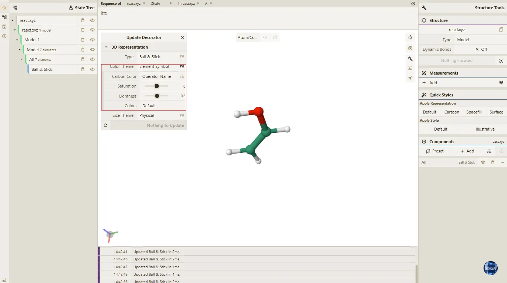

- 将鼠标光标移动至界面中该结构对应的**Model**选项上，单击鼠标右键，调出右键操作菜单；

- 在弹出的右键菜单中，选择**Export Representation**选项，系统将自动触发文件下载，生成一个`*.json`格式的文件，该文件完整保存当前结构的所有渲染参数信息，可将其保存至本地指定路径。
   
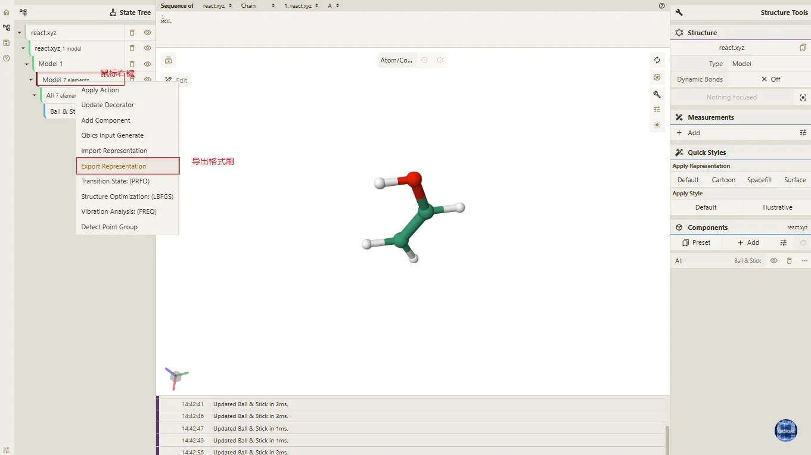

### 1.2 导入渲染格式

- 打开需要同步渲染格式的新/其他相同分子结构数据，该结构可为未做任何渲染调整的原始状态；

- 将鼠标光标移动至该结构对应的**Model**选项上，单击鼠标右键，调出右键操作菜单；

- 在弹出的右键菜单中，选择**Import Representation**选项，系统将弹出文件选择对话框；
   
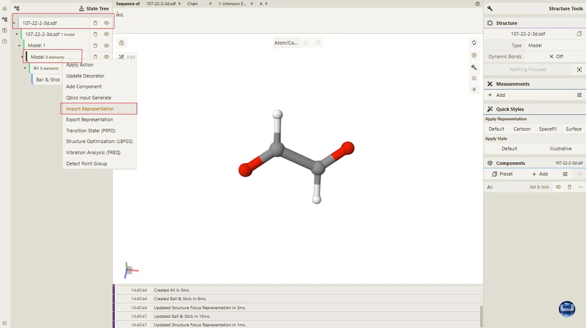

- 在文件选择对话框中，选中此前导出的`*.json`渲染参数文件并确认，系统将自动解析文件中的渲染参数并应用至当前结构；

- 参数导入完成后，当前分子结构将立即同步为与原结构一致的渲染显示效果。 

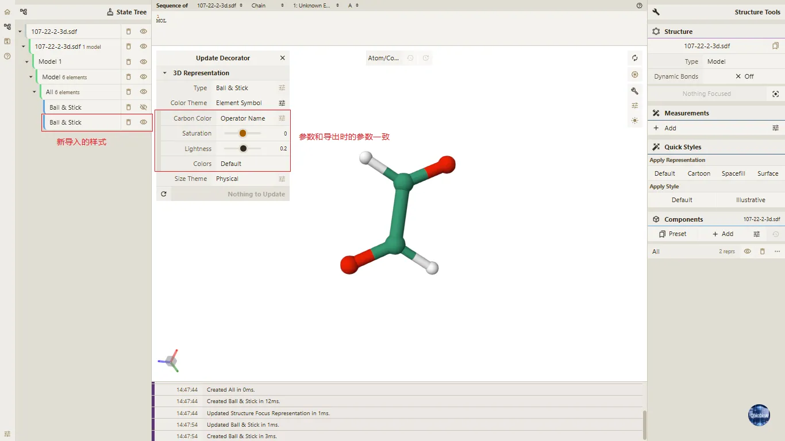

> **注意事项**
> 
> - 导出的`*.json`渲染参数文件与原分子结构强关联，仅适用于相同分子结构的渲染同步，跨不同结构导入可能出现渲染效果适配异常；
> 
> - 建议为不同分子结构的渲染参数文件设置差异化命名，避免多文件管理及导入时出现混淆；
> 
> - 若待导入渲染格式的结构已做过自定义渲染调整，导入新参数后原有配置将被完全覆盖，如需保留原有配置，建议提前导出备份；
> 
> - 渲染参数文件为`json`格式的纯文本文件，请勿手动修改文件内的参数信息，否则可能导致文件损坏无法正常导入；
> 
> - 该功能支持对多个相同分子结构依次执行导入操作，可实现多结构渲染格式的批量同步，提升操作效率。
> 

## 2. 导出 Animation

Qbics-Molstar的导出Animation功能，支持将分子结构的各类动态可视化效果渲染并导出为通用视频/动图格式，平台内置轨迹展示、视角变换、结构旋转、简正振动等多类可配置动画类型，且支持自定义动画属性、选择多种输出格式，满足分子结构动态演示、科研成果可视化展示、报告素材制作等多样化使用需求。

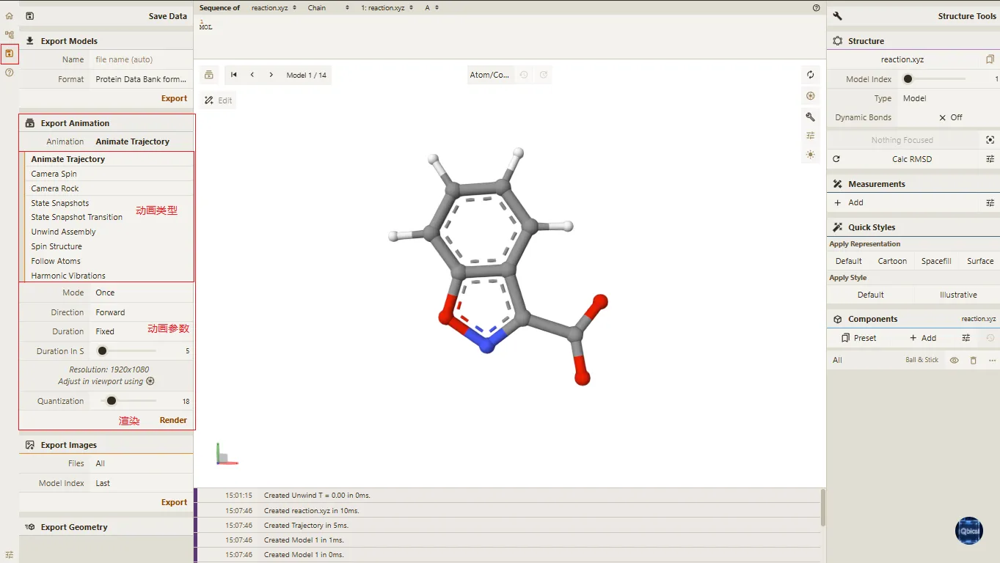

### 2.1 前置配置（视频导出分辨率）

在进行动画渲染与导出前，需先完成视频导出分辨率的前置配置，分辨率直接决定导出动画的画质清晰度，平台支持自定义分辨率设置，适配不同展示场景需求，具体操作步骤如下：

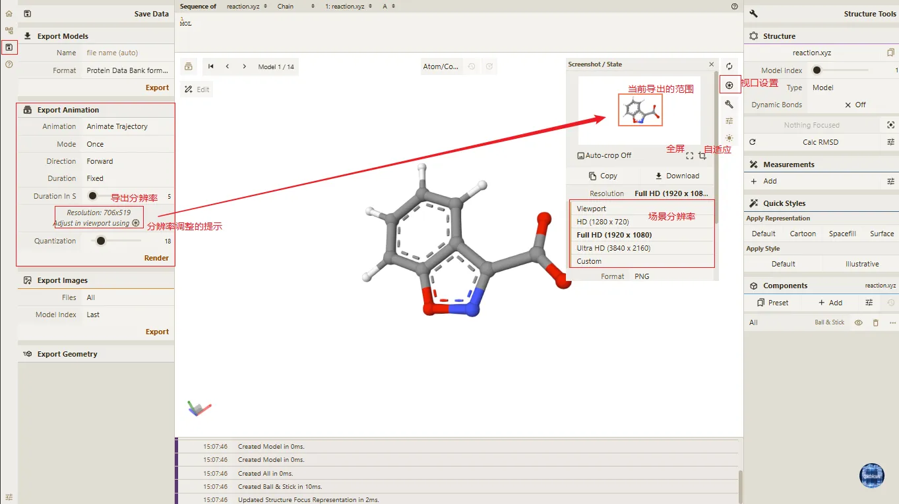

- 在3D视图区的右上角全局工具栏中，点击 **Screenshot / State Snapshot** 按钮（截图/状态快照按钮），弹出截图/状态快照配置弹窗；
 
- 在弹窗中的 **Resolution** 的下拉选项中，选择当前场景所需的分辨率，建议根据展示需求选择合适的分辨率，具体可选类型如下：
  
  - **Viewport**：当前视图区域的分辨率，建议与导出分辨率一致，否则可能导致动画显示异常。
  
  - **HD(1280 x 720)**：建议分辨率，提供平衡的画质与文件大小。
  
  - **Full HD(1920 x 1080)**：提供最高画质，文件大小也较大。
  
  - **Ultra HD(3840 x 2160)**：提供最高画质，文件大小也较大。
  
  - **Custom**：自定义分辨率,根据具体需求设置自定义分辨率，建议在1280x720至3840x2160之间选择，避免文件大小过大。

- 选择完成后，在 **Auto-crop Off** 后面的选项中，选择截取模式：可选中全屏截取或自适应截取；自适应截取时，系统将根据当前视图区域内的分子结构，自动调整截取区域，确保动画展示效果最佳。

- 所有配置完成后，关闭弹窗，即可进行后续动画渲染与导出操作。

### 2.2 支持的Animation类型及基础操作

平台提供多类动画类型，各类型适配不同分子结构动态展示场景，且均需先完成对应动画的基础预览配置，具体类型及基础操作要求如下：

- **Animate Trajectory（轨迹动画）**：需加载包含多帧信息的格式文件（如.xyz、.h5md等），可配置动画模式（往返、循环、一次）、持续时间、FPS等参数；
  
- **Harmonic Vibrations（简正振动动画）**：需加载包含简正振动数据的 **.log** 或 **.out** 格式文件，可配置振幅模式、持续时间、动画模式（往返、循环、一次）等参数；
   
- **Camera Rock（相机左右摇摆动画）**：无特定文件格式要求，可配置动画时长、摇摆速度、摇摆角度、摇摆模式（往返、循环、一次）等参数；
  
- **Camera Spin（相机旋转动画）**：无特定文件格式要求，可配置动画时长、旋转速度、旋转方向、旋转模式（往返、循环、一次）；

- **Spin Structure（结构转圈动画）**：无特定文件格式要求，仅可配置动画持续时间；

### 2.3 操作步骤

- **动画预览与参数确认**：点击3D视图左上角动画播放器打开动画控制器，完成对应动画类型的基础操作与参数配置后，点击 `Start` 按钮，实时预览动画效果（结合界面图片所示，播放器包含播放、暂停、进度条调节功能）；预览过程中可通过进度条拖拽，查看动画不同帧的展示效果，同时核对已配置的动画参数（如时长、FPS、旋转速度等）、前置设置的分辨率参数，确认动画展示效果、各项参数均符合需求，避免后续重复渲染；若预览发现效果不符或参数有误，可暂停预览，返回对应配置界面调整参数后，再次预览确认；预览无误后，关闭动画控制器弹窗。

    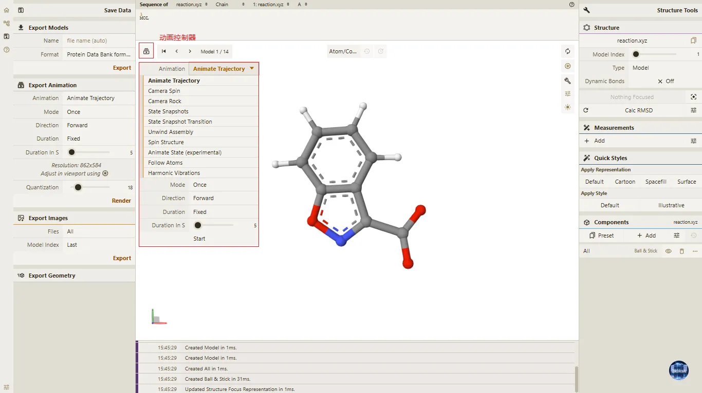

- **渲染动画帧**：在 **Export Animation** 界面中完成动画类型选择及参数配置后，点击 `Render` 按钮，系统将开始逐帧渲染动画，主界面会实时显示当前渲染帧进度，等待渲染过程完成。

- **选择输出格式**：动画帧渲染完成后，界面将弹出导出设置窗口，在窗口中选择所需的输出格式，平台支持**MP4、AVI、GIF、MKV**四种通用格式，可根据使用场景选择。

- **完成动画导出**：确认输出格式后，点击窗口中的 `Save Animation` 按钮，系统将按照配置生成并导出动画文件；若需重新调整参数并渲染，可点击`Clear`按钮清空当前已完成的渲染结果，再重新执行渲染操作。

> **注意事项**
> 
> - Animate Trajectory（轨迹动画）的使用前提为加载的文件（如.xyz、.h5md等）包含多帧信息，若文件无多帧数据，将无法触发该动画类型的预览与渲染，需更换包含多帧信息的文件。
>  
> - Harmonic Vibrations（简正振动动画）仅支持加载包含简正振动数据的.log或.out格式文件，其他格式文件无法解析简正振动数据，无法使用该动画功能。
>  
> - 各动画类型的可配置参数不同，仅平台标注的参数支持自定义调整，无标注参数为系统默认配置，无法修改。
>  
> - 渲染前建议先在动画播放器中预览效果，避免因参数设置不合理导致重复渲染，提升操作效率。
>  
> - 渲染高帧数、高分辨率动画时，需保证设备有足够的运行内存及存储空间，避免渲染过程中出现卡顿、中断或文件保存失败。
>  
> - 不同输出格式适配不同使用场景：GIF格式适用于短时长、低分辨率的动态展示，MP4、MKV格式适用于高画质、长时长的视频演示，AVI格式适用于专业视频编辑后续处理。
>  
> - 点击 `Clear` 按钮将直接清空当前所有渲染结果，且该操作无法恢复，点击前需确认无需保留已渲染帧。
>
> - 动画渲染过程中，请勿切换平台窗口、关闭文件或进行其他占用设备资源的操作，以免影响渲染进度或导致渲染失败。

## 3. 导出 Atom Index Range

Qbics-Molstar 的导出 Atom Index Range 功能，支持对分子结构中选定的目标原子进行原子索引范围数据的提取与导出，生成的索引数据文件可用于后续原子定位、结构分析、数据二次处理等科研场景。该功能操作流程简洁，可精准筛选并导出指定原子的索引信息，有效提升分子结构数据处理的针对性与效率，具体操作步骤如下：

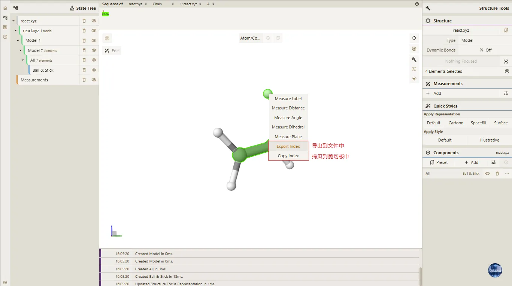

- **导入结构文件**：打开文件或拖拽文件的方式，将目标分子结构文件导入平台，完成结构的加载与渲染。

- **选择粒度**：在3D主视图的顶部工具栏最左侧的 **粒度选择** 功能模块中，点击下拉菜单，在在弹出的选项中选择所需粒度，推荐选择 **Atom/Coarse Element** 选项，完成粒度配置后即可进行后续对象选择操作。

- **选定目标原子**：在3D 主视图的分子结构模型中，通过鼠标点击或框选的方式，选中需要导出索引范围的目标原子，选中后原子将以高亮状态显示，确认选中的原子为所需对象。

- **执行导出操作**：在 3D 主视图区域内的空白区域点击鼠标右键，在弹出的右键操作菜单中选择对应提取方式，具体方式如下：
  
  - **Export Index**：系统自动提取选中原子的索引范围数据，并完成文件的下载保存；
  
  - **Copy Index**：系统自动提取选中原子的索引范围数据，并将数据复制到剪贴板。       

> **注意事项**
> 
> - 操作过程中不能处于编辑模式，否则无法导出索引范围数据。
> 
> - 结构文件导入后需确保完成正常渲染，结构显示异常将无法进行后续的对象选择与导出操作。
> 
> - 粒度选择需与待选目标原子匹配，根据实际需求选择对应粒度类型，确保可精准选中目标原子。
> 
> - 原子选择时需确认目标原子处于高亮显示状态，未选中或误选原子会导致提取的索引数据与需求不符。
> 
> - 右键执行操作时，需确保鼠标光标处于 3D 主视图的空白区域，否则无法调出包含提取选项的右键菜单。

## 4. 导出 Geometry

Qbics-Molstar 的导出 Geometry 功能，支持对分子结构的几何数据进行格式选择与参数配置后导出，生成的几何数据文件可用于分子结构几何分析、数据交互、后续建模等科研场景，操作流程简洁且支持多格式适配，能满足不同场景下的几何数据使用需求，具体操作步骤如下：

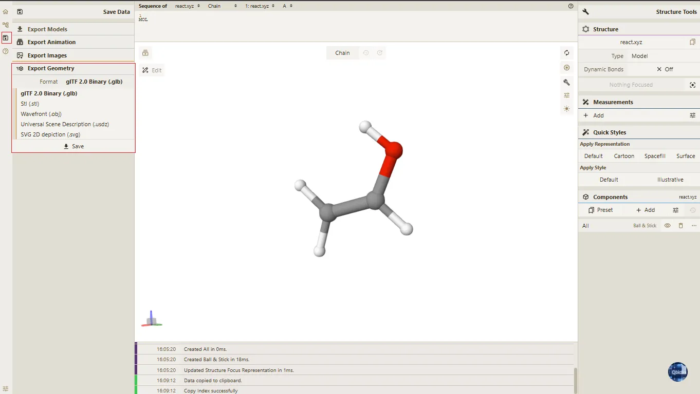

- **导入结构文件**：打开文件或拖拽文件的方式，将目标分子结构文件导入平台，完成结构的加载与渲染。

- **选择导出格式并配置属性**：在导出Geometry专属操作界面中，从格式列表中选定所需的`Format`类型，平台支持gITF 2.0 Binary（glb）、Stl（stl）、Wavefront（obj）、Universal Scene Description（usdz）、SVG 2D depiction（svg）格式；同时根据所选格式的要求，完成对应的属性参数设置。
   
- **执行几何数据导出**：完成格式选择与属性配置后，点击界面中的`Save`按钮，系统将按照配置自动提取并解析分子结构的几何数据，生成对应格式的文件并完成本地下载保存。

> **注意事项**
> 
> - 需根据后续使用场景选择适配的几何文件格式，避免因格式不兼容导致数据无法正常解析。
> 
> - 操作前需确保分子结构文件已正常加载并完成渲染，结构数据异常将直接导致几何数据提取失败。
> 
> - 导出前确认设备本地存储空间充足，避免因空间不足造成文件保存中断或失败。
> 
> - 格式与属性配置需在点击`Save`按钮前完成调整，文件开始下载后无法中断操作或修改配置参数。
>
> - 导出SVG 2D depiction（svg）格式时，结果如下：
> 
>   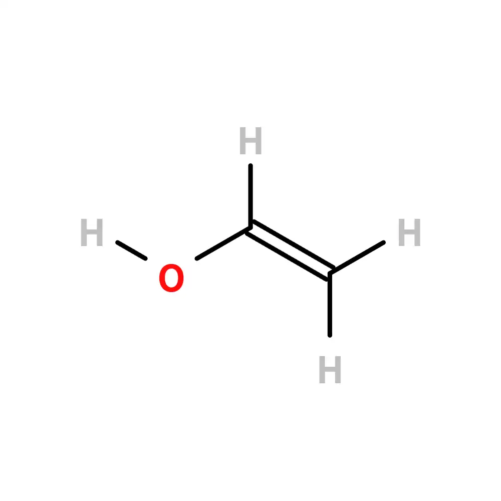

## 5. 导出 Model

### 5.1 在 Save Data 面板中导出Model
Qbics-Molstar的导出Model功能，支持将已加载渲染的分子结构模型按指定格式导出为独立文件，适配多类科研常用的分子结构格式，导出的模型文件可直接用于其他分子建模、结构分析软件的二次编辑与使用，满足跨平台、跨软件的分子结构数据交互需求，操作流程简洁高效，具体操作步骤如下：

- **导入结构文件**：打开文件或拖拽文件的方式，将目标分子结构文件导入平台，完成结构的加载与渲染。
  
- **导出文件**：点击Save按钮，跳转至 **Save Data** 界面。
  
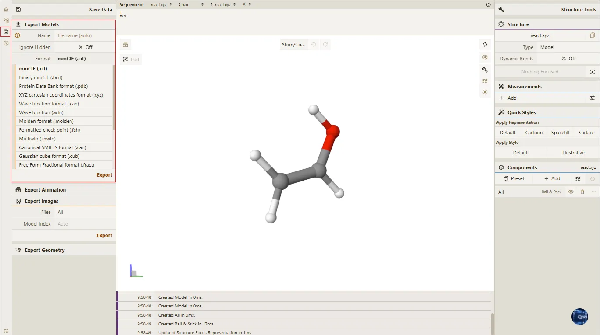
  
- **导出文件名称**：点击文件名输入框，可手动输入自定义的文件名称（支持中英文、数字及常用符号），若不手动输入，系统将自动生成默认文件名。

- **Ignore Hidden**：若勾选该选项，系统将仅导出当前可见对象的结构对象数据。若不勾选该选项，系统将导出所有对象的结构对象数据，包括隐藏/删除的结构对象数据。
        
- **文件格式**：点击格式选择栏，从下拉选项中选定所需的分子结构模型格式，平台支持的导出格式如下：   
        
  - mmCIF (.cif)

  - Binary mmCIF (.bcif)

  - Protein Data Bank format (.pdb)（默认导出格式）

  - XYZ cartesian coordinates format (.xyz)

  - Wave function format (.can)

  - Wave function (.wfn)

  - Molden format (.molden)

  - Formatted check point (.fch)

  - Multiwfn (.mwfn)

  - Canonical SMILES format (.can)

  - Gaussian cube format (.cub)

  - Free Form Fractional format (.fract)

  - GRO format (.gro)

  - Macromolecular Crystallographic (.mmcif)

  - MDL MOL format (.mol)

  - Sybyl Mol2 format (.mol2)

  - AutoDock PDBQT format (.pdbqt)

  - SMILES format (.smi)

  - RXH cartesian coordinate format and bonds (.rxh)

- **模型导出**：确认选定的导出格式后，点击界面中的`Export`按钮，系统将自动解析当前分子结构模型的完整数据，按选定格式生成模型文件并完成本地下载保存。

**提示**：若当前打开多个分子结构文件，系统将自动将所有模型文件打包为zip压缩包格式导出，无需额外配置打包参数，压缩包名称与手动输入或系统默认的文件名一致
          

> **注意事项**
>
> - 操作前需确保分子结构模型已完整加载并正常渲染，模型数据缺失、显示异常会导致导出文件损坏或数据不完整。
> 
> - 导出操作执行前，确认设备本地有充足的存储空间，避免因空间不足造成文件导出中断或保存失败；若导出zip压缩包（多文件场），需预留足够存储空间以容纳压缩包文件。
> 
> - 格式选择、文件名输入需在点击`Export`按钮前完成确认，文件开始导出后无法中断操作、修改导出格式或文件名。
> 
> - 若需导出包含完整编辑记录的分子结构模型，需提前保存所有编辑操作，未保存的修改将不会同步至导出的模型文件中。
> 
> - 部分格式对分子结构数据有专属适配要求，需根据当前模型的结构类型选择对应格式，避免导出数据出现解析异常。
> 
> - 手动输入文件名时，建议避免使用特殊符号（如@、#、$等），以免导致文件保存失败或无法正常打开。
> 
> - 多文件导出为zip压缩包后，解压压缩包即可获取各个独立的分子结构模型文件，解压时需确保解压工具支持zip格式。
> 

### 5.2 在 3D 主视图中导出 Model

Qbics-Molstar 支持通过 **框选（矩形选择** 方式，在 3D 视图中快速、精准地选中目标结构区域，然后在鼠标右键菜单中选择 `Export Model (CIF)` 选项，即可导出选中的分子结构模型，具体操作步骤如下：

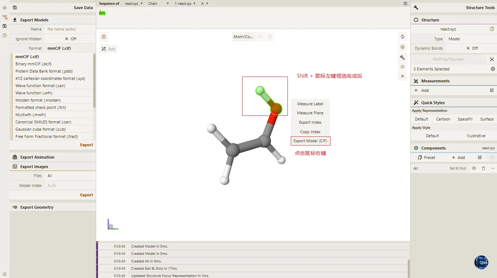

- 通过 “打开文件” 或拖拽文件的方式，加载目标分子结构文件，确保分子结构正常渲染，无数据缺失、显示异常。

- 在 「State Tree」 面板中隐藏或删除不进行框选的结构层级，避免框选结果中包含不需要的对象。

- 在 3D 主视图中，按住 `Shift` 键的同时 **长按鼠标左键并拖动**，绘制矩形选择框，框选需要选中的目标结构区域。

- 在鼠标拖动过程中，系统将实时更新选中区域并高亮框选范围内的对应结构对象（原子/残基/链/配体），确保框选范围与目标结构区域一致。

- 松开鼠标左键后，高亮的结构对象（原子/残基/链/配体）即为选中内容。

- 框选完成后点击空白区域，即可取消当前框选结果。

- 选中目标结构后，可点击鼠标右键，弹出右键菜单，选择 `Export Model (CIF)` 选项，即可导出选中的分子结构模型。

> **注意事项**
>
> - 框选时需确保选择框完整覆盖目标结构。
>
> - 在 **编辑模式** 下也可进行框选选择原子。
>
> - 若需清空当前选择，可在 3D 视图空白处点击鼠标左键，即可取消当前框选结果。

## 6. 导出图片

### 6.1 导出单张图片

Qbics-Molstar的导出图片功能，支持将已加载渲染的分子结构模型导出为高清图片文件，平台适配**PNG**、**JPEG**、**WebP**三类主流图片格式，同时支持自定义图片分辨率、设置透明背景及修改背景颜色，导出的图片可直接用于科研报告、成果展示、文档插图等场景，操作灵活且适配多样化的使用需求，操作步骤如下：

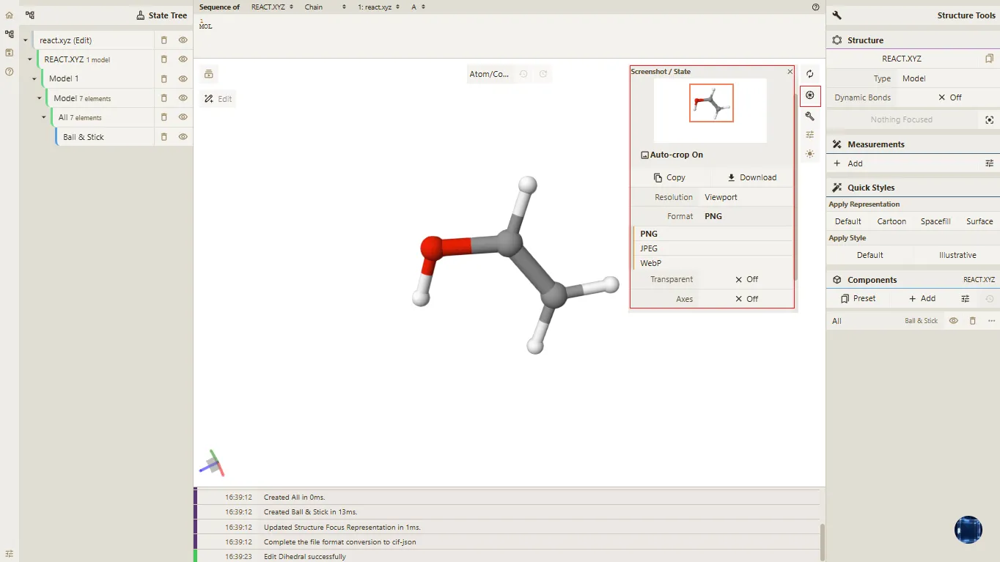

- **加载结构文件**：打开或拖拽文件的方式导入目标分子结构文件，完成模型的加载与正常渲染，可提前调整模型视角至所需展示角度。
  
- **打开截图配置弹窗**：点击3D 主视图右上角的相机形状截图按钮，弹出图片导出的配置弹窗，弹窗内包含格式、分辨率等核心设置选项。
  
- **选择图片导出格式**：在配置弹窗中点击`Format`按钮，从下拉选项中选定所需的图片格式，可选格式为PNG、JPEG、WebP。
  
- **设置图片分辨率**：在配置弹窗中点击`Resolution`按钮，选择平台预设的图片尺寸；若预设尺寸无法满足需求，可选择`Custom`选项，手动输入自定义的图片尺寸参数。
  
- **执行图片导出**：完成格式与分辨率配置后，点击弹窗中的`Download`按钮，系统将按照配置生成图片文件并完成本地下载保存。

- **导出透明背景图片**：在图片导出配置弹窗中，找到`Transparent`按钮并点击，将其状态切换为`on`，此时系统将自动剔除模型背景颜色；完成该设置后，点击弹窗中的`Download`按钮，即可获得无背景的透明图片。
  
> **注意事项**
>
> - 操作前需确保分子结构模型已完整加载并正常渲染，模型显示异常会导致导出图片出现画面缺失、模糊等问题。
> 
>  - 不同图片格式适配不同使用场景，PNG格式支持透明效果，适合文档插图；JPEG格式压缩率高，适合快速分享；WebP格式兼顾画质与文件大小，适合网页展示。
> 
>  - 自定义分辨率时，需输入合理的尺寸数值，避免因尺寸过大导致图片文件体积过大，或尺寸过小导致模型细节模糊。
> 
>  - 透明背景设置仅对PNG、WebP格式生效，JPEG格式不支持透明通道，设置后无效果。
> 
> - 调整背景颜色后需关闭设置弹窗再执行导出操作，未关闭弹窗会导致背景颜色设置无法同步至导出图片。
> 
> - 导出图片前需确认设备本地存储空间充足，避免因空间不足导致图片下载失败。
> 
> - 建议在导出前将分子结构模型调整至最佳展示视角，导出后无法再对图片中的模型视角进行修改。

### 6.2 批量导出图片

Qbics-Molstar的批量导出图片功能，支持将单个或多个已加载渲染的分子结构模型，按指定格式导出为高清图片文件，适配科研常用场景，导出的图片可直接用于科研报告、成果展示、文档插图等场景。该功能操作灵活，支持多格式适配及轨迹帧导出，可满足多样化的图片使用需求，具体操作步骤如下：

- **导入结构文件**：以打开文件或拖拽文件的方式，将单个或多个目标分子结构文件导入平台，完成所有分子结构的加载与正常渲染，确保模型无显示异常。
  
- **导出文件**：点击界面中的`Save`按钮，系统将跳转至Save Data界面，后续操作均在此界面完成。
  
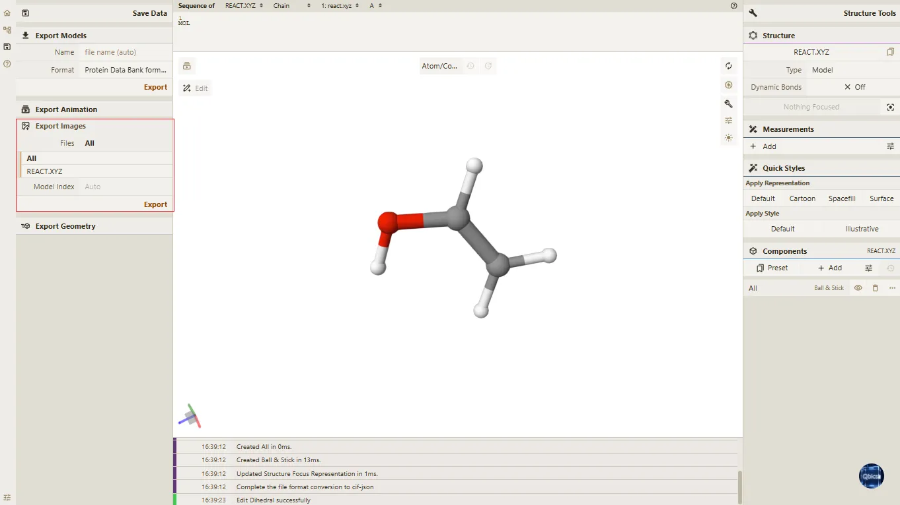
  
- **选择导出文件**：在`Export Images`界面中，点击`Files`下拉选择框，可查看当前已加载的所有分子结构模型文件；按需选择需导出的单个或多个文件，默认选择“All”（所有已加载文件），即批量导出模式。
  
- **轨迹帧（可选）**：若当前选择的分子结构模型包含轨迹数据，可在对应设置项中选择导出轨迹帧的指定帧图片，系统将自动根据轨迹数据生成对应帧的图片文件，无轨迹数据则跳过此步骤。
  
  - **Auto**：根据当前主界面中所在帧，自动导出该帧的图片文件。
  
  - **First**：导出轨迹的第一帧图片。
  
  - **Last**：导出轨迹的最后一帧图片（默认选项）。

- **导出图片**：确认所有配置（待导出文件、格式、轨迹帧设置等）无误后，点击界面中的`Export`按钮，系统将自动解析分子结构模型数据，按配置生成图片文件并完成本地下载保存。

**提示**：若当前打开多个分子结构文件，且在`Files`下拉选择框中选择“All”（所有文件），系统将自动将所有导出的图片文件打包为zip压缩包格式导出，无需额外配置打包参数，压缩包名称由系统自动生成。
          

> **注意事项**
>
> - 操作前需确保分子结构模型已完整加载并正常渲染，模型数据缺失、显示异常会导致导出文件损坏或数据不完整。
> 
> - 导出操作执行前，确认设备本地有充足的存储空间，避免因空间不足造成文件导出中断或保存失败；若导出zip压缩包（多文件场），需预留足够存储空间以容纳压缩包文件。
> 
> - 格式选择、文件名输入需在点击`Export`按钮前完成确认，文件开始导出后无法中断操作、修改导出格式或文件名。
> 
> - 若需导出包含完整编辑记录的分子结构模型，需提前保存所有编辑操作，未保存的修改将不会同步至导出的模型文件中。
> 
> - 部分格式对分子结构数据有专属适配要求，需根据当前模型的结构类型选择对应格式，避免导出数据出现解析异常。
> 
> - 多文件导出为zip压缩包后，解压压缩包即可获取各个独立的分子结构模型文件，解压时需确保解压工具支持zip格式。
> 