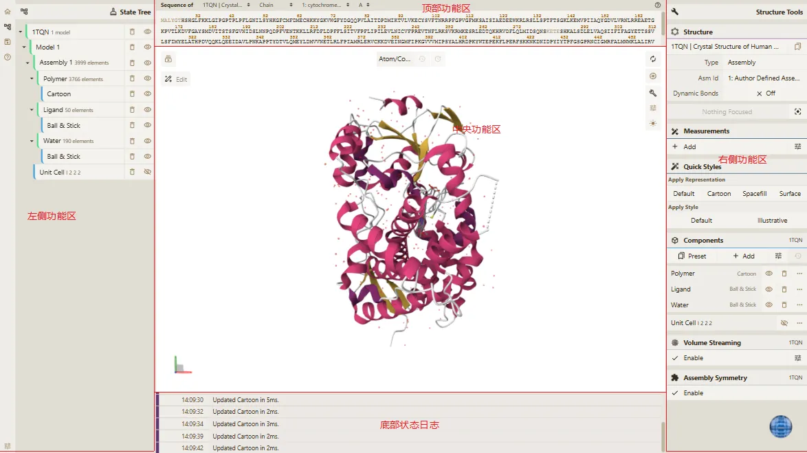
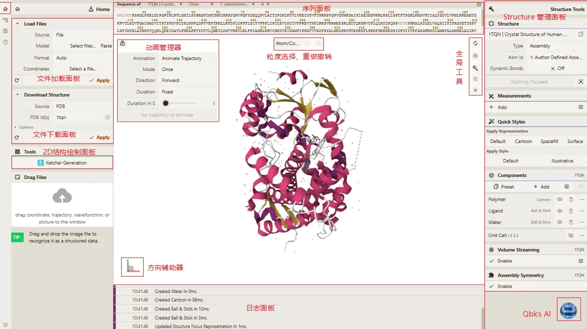
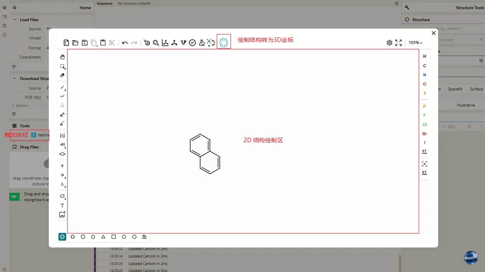
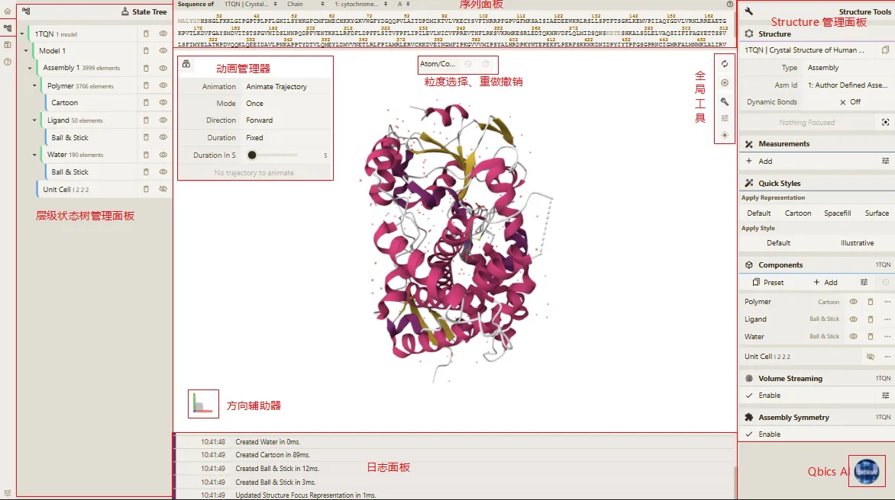
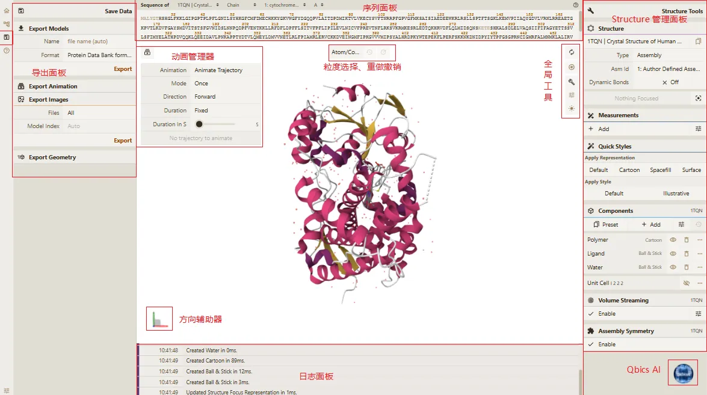
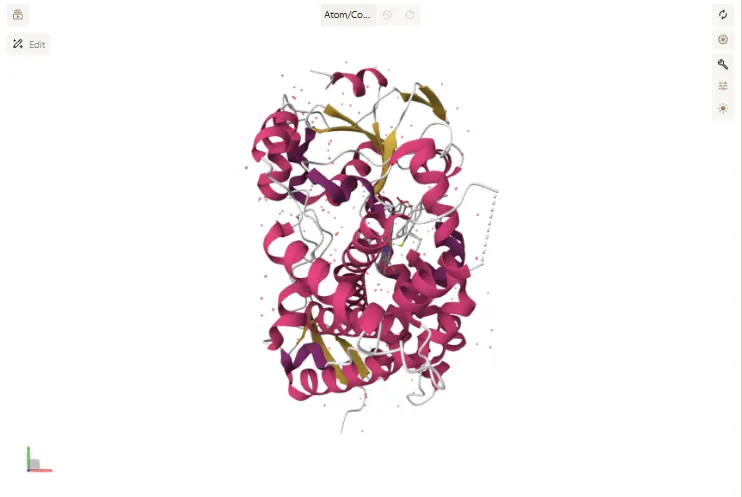
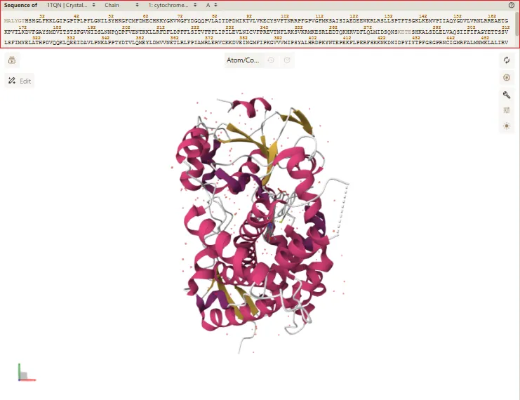

# 二、界面总览

> **Qbics-Molstar 分子可视化平台用户手册**
>
> 官方网站：[https://molstar.szbl.ac.cn/viewer](https://molstar.szbl.ac.cn/viewer)
> 
> 官方文档：[https://molstar.szbl.ac.cn/docs](https://molstar.szbl.ac.cn/docs)
> 
> 第三方文档：[https://rxht.github.io/molstar/](https://rxht.github.io/molstar/)

Qbics-Molstar平台界面采用科研友好型设计，以“高效操作、清晰分区、协同联动”为核心原则，采用 **「左侧功能区域（数据入口/状态树管理/数据导出/帮助信息）+ 中央功能区域（3D视图+辅助功能）+ 右侧功能区域（Structure管理/测量/快速样式等）+ 底部状态日志 + 顶部功能区域（序列面板）」** 的科研专属布局，所有核心功能区域均以红框标注，全面覆盖「结构加载→3D可视化→结构分析→成果导出」的全科研流程。界面各区域功能独立、联动紧密，既保证操作的专业性，又兼顾易用性，适配结构生物学、药物研发、生物信息学等领域的分子结构研究需求。
 

## 分区域详细解析

### 左侧功能区域

界面最左侧纵向区域，独占左栏，是平台的核心功能控制区，包含数据加载、结构管理、成果导出和帮助信息四大模块。

#### 1. Home（数据加载与工具区）

是平台的数据入口与工具集合区，分为4个核心子模块：

- **Load Files（文件加载面板）**：本地结构文件上传入口，支持三种上传方式：
  - **手动选择**：点击「Select files...」按钮，从本地文件选择器中选择文件
  - **拖拽上传**：直接将文件拖拽至面板区域
  - **粘贴上传**：点击「Paste」或「Parse」按钮，从剪切板读取结构数据
  - 支持多文件同时上传，可自定义Model、Format、Coordinates等加载参数，点击「Apply」完成加载
  - 兼容PDB、CIF、MOL2、XYZ等多种分子结构格式，同时支持轨迹、电子密度等数据类型

- **Download Structure（下载结构面板）**：远程数据库结构下载入口，支持多种数据源：
  - **PDB**：通过蛋白质结构数据库ID下载晶体结构
  - **SWISS-MODEL**：获取同源建模结构
  - **AlphaFold DB**：下载人工智能预测的蛋白质结构
  - **PubChem**：获取小分子化合物结构
  - **SMILES**：通过SMILES分子式直接生成3D结构
  输入对应标识后点击「Apply」，即可自动下载并加载目标结构（例如：PDB ID 1tqn的人类细胞色素b晶体结构）

- **Tools（2D结构绘制面板）**：内置「Ketchers」专业化学绘图工具，提供以下功能：
  - 快速绘制小分子2D结构式
  - 一键将2D结构转换为3D模型
  - 支持常见有机分子、药物分子的结构构建
  - 提供丰富的化学键和官能团模板

- **Drag Files（拖拽上传提示区）**：提供直观的拖拽上传指引，将本地文件直接拖拽至页面任意区域即可自动加载，支持以下数据类型：
  - 坐标文件（PDB、CIF、MOL2等）
  - 轨迹文件（MD轨迹、振动模式等）
  - 波函数文件（用于分子轨道分析）
  - 结构图片（通过图片识别提取结构）
  此功能可大幅提升操作效率，特别适合单文件或少量文件的快速加载

#### 2. 状态树（结构管理与操作区）

是结构的层级化管理核心入口，以树形层级结构完整展示已加载分子的全量信息（图中示例为PDB ID 1TQN的人类细胞色素b晶体结构），层级逻辑完全贴合分子结构的组成：

- **根节点**：1TQN 1 model（对应完整分子结构）

- **一级子节点**：Model 1（结构模型，支持多模型结构管理）

- **二级子节点**：Assembly 1 3999 elements（结构组装体，管理完整组装的结构单元，共3999个原子）

- **三级子节点**：按分子组分拆分，包括Polymer（生物大分子，3766个原子）、Ligand（配体，50个原子）、Water（水分子，190个原子）、Unit Cell（晶胞包围盒）

- **四级子节点**：各组分的显示样式，如Polymer对应Cartoon（卡通模式）、Ligand/Water对应Ball & Stick（球棍模式）

**操作功能**：
- **显示/隐藏**：点击节点右侧的眼睛图标，可控制对应结构或组件的显示状态
- **删除**：点击垃圾桶图标，可删除不需要的结构或组件
- **右键菜单**：鼠标右键点击节点，可展开更多操作选项，如重命名、复制、修改属性等
- **层级展开/折叠**：点击节点前的展开/折叠图标，可展开或折叠子层级
 
状态树实现了对结构从宏观到微观的全层级精准控制，是多结构管理、显示样式调整的核心操作界面。
 

#### 3. 数据导出（数据与动画导出区）

该区域是平台提供的一站式科研成果输出入口，专门为科研人员的成果保存与后续分析需求设计，涵盖模型、动画、图片、几何四类核心导出功能，操作便捷、格式兼容，适配各类科研场景。

##### Export Models（模型导出）

- 格式选择：支持导出.cif、.bcif、.pdb、.xyz、.can、.wfn、.molden等多种主流分子结构格式，可满足晶体学分析、跨软件数据传输、后续计算分析等不同科研需求。

- 文件名设置：支持两种命名模式，“auto”（自动模式）可生成符合科研规范的标准文件名，也可手动自定义文件名，便于文件分类管理与后续查找。

- 导出操作：点击“Export”按钮，即可一键下载当前结构的高精度坐标文件（如PDB、CIF格式），下载文件可直接用于后续科研计算与结构分析。

##### Export Animation（动画导出）

- 动画类型选择：支持导出轨迹动画、相机摇摆、相机旋转、振幅动画等多种动画类型，可适配分子动力学轨迹展示、分子空间构象全方位演示等科研需求。

- 动画渲染：点击“Render”按钮，平台将启动动画渲染流程，渲染进度可实时查看，渲染效果贴合3D视图中的结构显示样式。

- 导出操作：动画渲染完成后，点击“Save Animation”按钮，即可一键下载渲染好的动画文件，支持AVI、MP4、GIF等主流视频格式，适配科研汇报、成果可视化等场景。

##### Export Images（图片导出）

- 文件范围选择：可选择“All”导出当前界面中所有可见的分子结构，也可指定具体模型名称，精准导出目标模型的截图，避免冗余内容。

- 特殊场景支持：若加载的文件为轨迹文件，可手动指定具体帧，导出该帧对应的分子结构截图，便于捕捉轨迹中的关键构象。

- 导出操作：点击导出按钮，即可生成高清静态截图，支持PNG、JPEG等格式，可直接用于论文配图、项目汇报素材制作。

##### Export Geometry（几何导出）

将分子结构转换为通用3D模型格式（GLB/STL/OBJ等），用于3D打印或专业三维可视化展示。

#### 4. 帮助信息（平台介绍与操作提示区）

该模块是平台全量UI元素的功能说明集合，针对界面各操作按钮、面板、控件提供详细解释，帮助用户理解每个功能的作用与使用方法，核心子项如下：

- **Selections（选择操作说明）**：详细讲解分子结构的选择规则与操作技巧，包括原子/残基/链/模型等不同选择粒度的切换，适配精准结构分析的需求；

- **Coloring（着色方案说明）**：介绍平台支持的各类分子着色方式，如二级结构着色、原子类型着色、残基属性着色、自定义着色等，明确每种着色的适用场景（如二级结构着色用于蛋白结构展示、原子类型着色用于配体分析）；

- **Representations（显示样式说明）**：讲解卡通（Cartoon）、球棍（Ball & Stick）、空间填充（Spacefill）、表面（Surface）等各类分子显示样式的特点与适用场景，帮助用户快速选择适合论文配图、结构分析的显示方式；

- **Surroundings（视图环境说明）**：说明视图背景、坐标轴、剖切、光照等环境参数的设置方法与作用，用于优化3D视图的显示效果，适配论文配图、科研汇报的展示需求；

- **Create an Image（生成高清图片教程）**：详细讲解如何导出符合期刊要求的分子结构高清截图，包括分辨率设置、背景透明化、格式选择、自动裁剪等参数调整，帮助科研人员快速制作专业的论文配图；

- 全场景教程覆盖：除图片生成外，还包含结构加载、轨迹动画导出、多结构比对、相互作用分析、原子索引导出等高频科研场景的操作指南，针对不同功能提供完整的操作流程与注意事项，解决用户的实际操作疑问；

- **Moving in 3D（3D视图操作说明）**：详细讲解3D视图的基础鼠标操作，是日常结构观察的核心指引：
       

    - 左键拖动：旋转视图，调整分子结构的观察角度；

    - 右键拖动/左键+Ctrl拖动：平移视图，调整结构在视图中的位置；

    - 滚轮滚动：缩放视图，放大观察细节、缩小查看整体结构；

    - Shift+滚轮滚动：剖切视图，隐藏分子表面结构，查看内部空腔、结合界面；

    - 三指拖动：快速聚焦选中的结构片段，一键居中显示。

- **Mouse & Key Controls（键鼠快捷键速查）**：提供全平台的键盘快捷键列表，涵盖视图控制、功能操作、导出分享等各类操作，如Ctrl+S保存会话、Ctrl+P快速截图、V激活选择工具、D激活距离测量等，同时明确不同操作模式（查看模式/编辑模式）下的快捷键差异，帮助科研人员通过快捷键提升操作效率，减少鼠标点击次数。

### 中央功能区域

平台的核心渲染与操作区域，展示了1TQN蛋白质晶体结构的高精度三维模型。

### 右侧功能区域

右侧功能区域是Qbics-Molstar平台的核心功能操控中枢，采用标签式面板布局，位于中央3D视图右侧纵向区域，支持按需切换、折叠，不占用核心可视化空间，是科研人员开展分子结构分析的关键操作区。

该区域整合了从结构管理到深度分析的全流程核心功能，核心子面板及大概功能如下：

- **Structure Panel（结构管理面板）**：控制分子结构的展示形式，支持切换结构类型（如组装体、晶胞）、管理多模型结构（如NMR多构象），快速调用预设视图；

- **Measurements Panel（测量面板）**：提供精准的几何参数量化功能，支持标签标注、距离、角度、二面角测量，满足科研数据记录需求；

- **Components Panel（组件管理面板）**：按结构组分（聚合物、配体、水等）拆分控制显示样式，支持非共价相互作用可视化，适配论文配图、结构展示；

- **Assembly Symmetry Panel（组装对称面板）**：识别并展示结构的对称性特征，辅助对称相关的科研分析；

- **Superposition Panel（叠加面板）**：实现多个分子结构的空间叠加，量化结构相似性，适配多结构比对分析。

该区域各子面板功能独立且与中央3D视图、序列面板联动紧密，覆盖从结构加载、可视化调整到分析验证、协作分享的全科研流程，操作流程连贯，适配结构生物学、药物研发等多领域科研需求。

### 底部状态日志

界面最下方，中央视图的底部。

实时记录每一步操作的时间戳、执行内容与耗时（如“Created Cartoon in 89ms”）。是排查加载失败、格式错误、功能异常等问题的核心依据，保障科研操作的可追溯性与严谨性。

### 顶部功能区域

界面最顶部横向区域，独占上栏，主要包含序列面板和全局工具栏。

#### 序列面板

序列面板是Qbics-Molstar平台中**连接一维氨基酸/核酸序列与三维分子结构**的核心交互工具，专为解决长链蛋白质、多链复合物中残基快速定位、精准选择的科研痛点设计，实现序列与中央3D视图、层级状态树的深度双向联动，大幅提升结构分析效率，是结构生物学、药物研发等领域的核心辅助工具。

面板位于中央3D视图顶部，默认横向展开，支持一键折叠以释放视图空间；核心展示逻辑为**按链（Chain）分类**，完整呈现对应分子的氨基酸/核酸序列（如图中PDB ID 1TQN的cytochrome b链完整序列），所有残基严格遵循PDB标准1-based编号规则，标注残基名称与编号，确保序列与结构的编号完全匹配，从根源避免科研分析中的编号混乱。面板顶部设置链切换标签，多链结构会自动生成对应链的独立快捷入口，适配多链结构的快速切换操作。

面板通过与中央3D视图、层级状态树的深度联动，彻底打通一维序列与三维结构的映射壁垒，核心操作完全贴合科研人员的分析习惯：

- **悬停高亮，秒级定位空间位置**：鼠标悬停在序列的任意残基上时，中央3D视图中对应残基的结构片段会实时高亮，同时弹出残基信息提示卡（包含残基名称、编号、所属链、空间坐标等关键信息），无需在复杂的三维结构中手动查找，即可快速定位目标残基的空间方位，完美解决长链蛋白质中目标残基难查找的痛点。

- **点击选择，精准批量操作**：鼠标点击序列中的单个残基，将自动选中该残基的所有原子，选中状态同步至3D视图与层级状态树；支持灵活的批量选择：按住Ctrl键点击可多选不连续残基，按住Shift键点击可选择连续残基区间，选中的残基在3D视图中同步高亮，可直接用于后续的距离测量、显示样式调整、相互作用分析等科研操作，无需手动框选，大幅提升操作精准性与效率。

- **链快速切换，适配多链结构分析**：面板顶部的链标签支持一键快速切换不同链的序列视图，多链蛋白质、核酸复合物会自动生成对应链的独立标签，从根源上避免不同链的残基混淆，适配抗体、蛋白-蛋白复合物、核酸复合物等多链体系的精细化分析需求。