# 七、结构分析与高级显示

> **Qbics-Molstar 分子可视化平台用户手册**
>
> 官方网站：[https://molstar.szbl.ac.cn/viewer](https://molstar.szbl.ac.cn/viewer)
> 
> 官方文档：[https://molstar.szbl.ac.cn/docs](https://molstar.szbl.ac.cn/docs)
> 
> 第三方文档：[https://rxht.github.io/molstar/](https://rxht.github.io/molstar/)

## 1. 分子轨道图 / 分子轨道波函数计算

Qbics-Molstar平台支持基于多种格式文件实现分子电子结构的可视化分析，可完成分子轨道、电子密度等核心电子性质的渲染与参数调整，适配量子化学计算结果的可视化解析场景，平台支持的文件格式包括`.mwfn`、 `.wfn`、 `.wfx`、 `.molden`、 `.fch`、 `.fchk`等，以下详细介绍基于 **“15-冠醚-5” 闭壳层分子** `15-Crown-5.mwfn` 文件的分子轨道与电子结构可视化操作流程、样式调整及其他电子性质渲染方法。

### 1.1 分子轨道的渲染与选择

基础结构渲染完成后，可通过右键菜单实现分子轨道的渲染准备与具体轨道选择，操作步骤如下：

- 将鼠标移动至左侧面板中已加载的文件名位置，点击鼠标右键，在弹出的菜单中选择 **View Molecular Orbitals**，完成分子轨道渲染的前期准备；

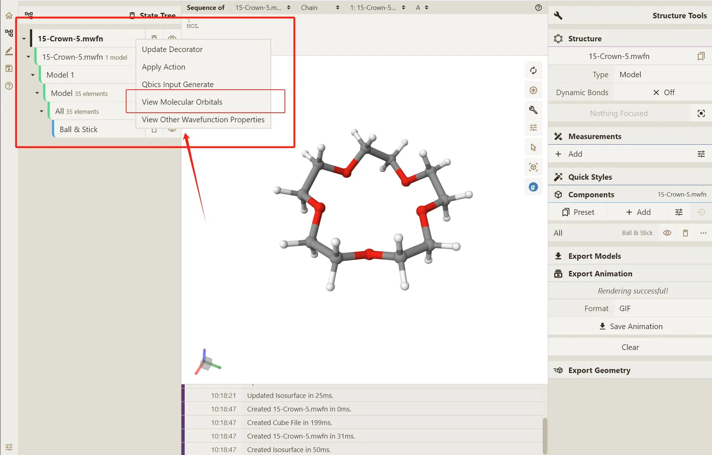

- 选择该选项后，平台将弹出轨道信息提示框，展示当前分子体系的所有轨道序号、轨道占据数（`occ`）等核心信息，轨道序号与能量正相关，序号越大则轨道能量越高；

- 根据轨道占据数识别关键轨道类型，占据数标识规则为：

  - `occ=2`：表示该轨道为完全占据的成键轨道，最后一个`occ=2`的轨道为 **最高占据轨道（HOMO）**；

  - `occ=0`：表示该轨道为未占据的虚轨道，第一个`occ=0`的轨道为 **最低非占据轨道（LUMO）**；

  - `occ=1`：通常表示开壳层分子体系中的单占轨道；

- 在轨道信息提示框中，点击目标轨道序号（如HOMO对应的轨道序号60），平台将自动完成该轨道的可视化渲染，渲染结果将实时显示在3D视图区。

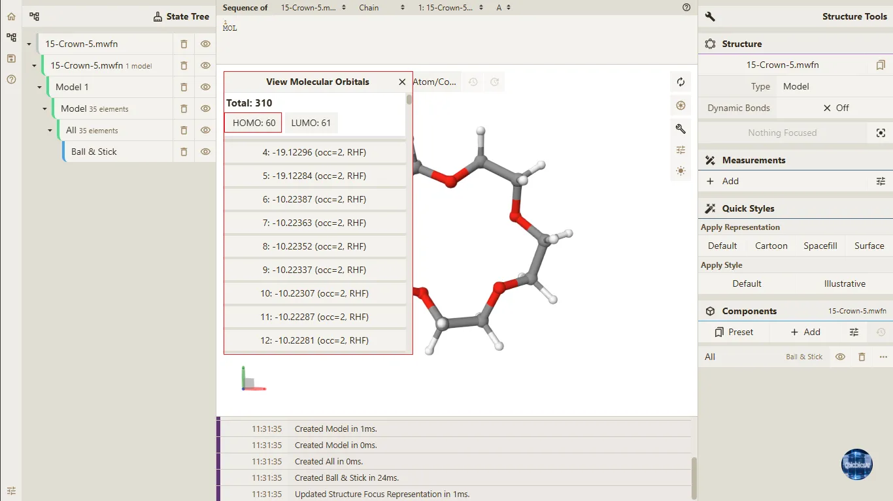

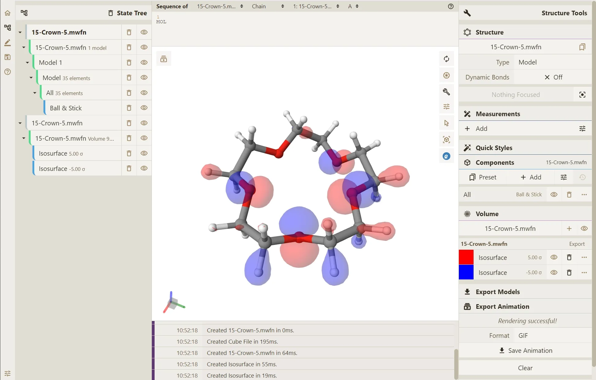


### 1.2 分子轨道渲染样式的精细化调整

平台支持对分子轨道的渲染样式进行多维度调整，包括透明度、颜色、等值面数值等，可根据分析需求优化轨道显示效果，所有调整操作均通过在 **Isosurface** 层级上进行鼠标右键菜单中的 **Update Decorator**  选项功能实现，具体调整方法如下：

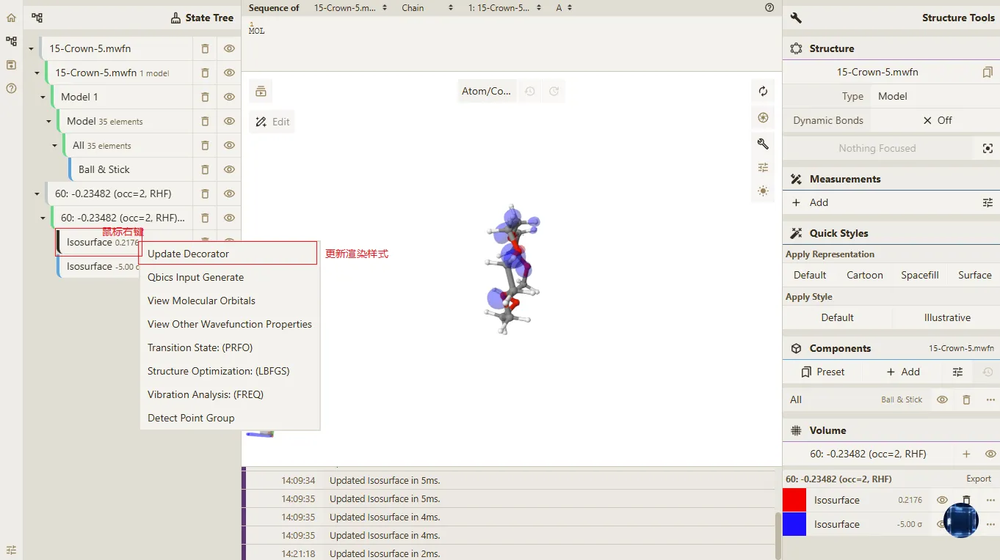

#### 1.2.1 轨道渲染透明度调整

- 在3D视图区找到已渲染的分子轨道，定位到**Isosurface**（等值面）层级，点击鼠标右键，在弹出的菜单中选择**Update Decorator**选项，打开渲染样式修改面板；

- 确认面板中**Type**选项为默认的**Isosurface**（等值面）模式；

- 点击「Type」右侧的「...」扩展按钮，展开标签精细化设置面板；

- 在标签精细化设置面板中，找到「Opacity」（透明度）调整栏；

- 通过拖拽进度条或直接键入数值的方式调整透明度，默认透明度数值为 1，调整后设置将实时生效，3D视图区的轨道渲染效果同步更新。

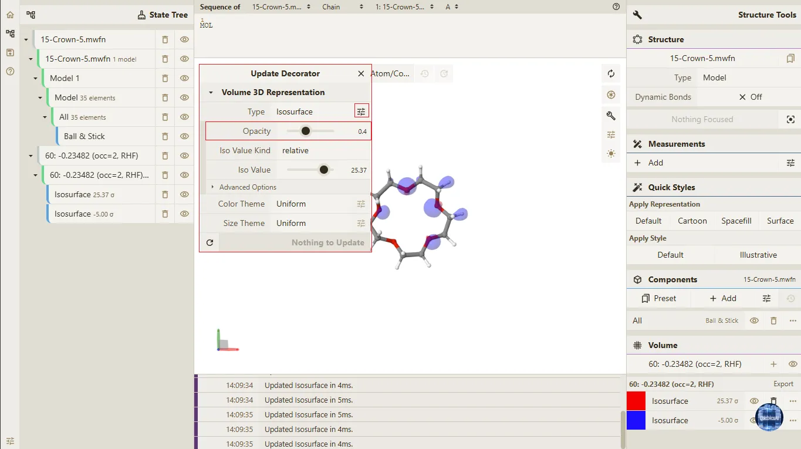

#### 1.2.2 轨道等值面数值调整

- 在3D视图区找到已渲染的分子轨道，定位到**Isosurface**（等值面）层级，点击鼠标右键，在弹出的菜单中选择**Update Decorator**选项，打开渲染样式修改面板；
  
- 确认面板中**Type**选项为默认的**Isosurface**（等值面）模式；

- 点击「Type」右侧的「...」扩展按钮，展开标签精细化设置面板；

- 在面板中找到**Iso Value Kind**（等值面数值类型）选项，选择目标定义方式：

  - **relative**：相对比例方式，为平台默认设置，适用于常规的轨道轮廓展示；

  - **absolute**：绝对数值方式，适用于对轨道显示精度有更高要求的量化分析场景；

- 根据选择的数值类型，在**Iso Value**（等值面数值）调整栏中，通过拖拽进度条或直接键入数值的方式修改数值：

  - 选择**relative**时，默认等值面数值为`±5`，可根据轨道显示需求自定义调整；

  - 选择**absolute**时，平台将显示默认的绝对数值（如`0.04`），支持手动修改为目标数值；

- 数值调整完成后，3D视图区的轨道等值面轮廓将实时同步更新，可反复调整至最佳显示效果。

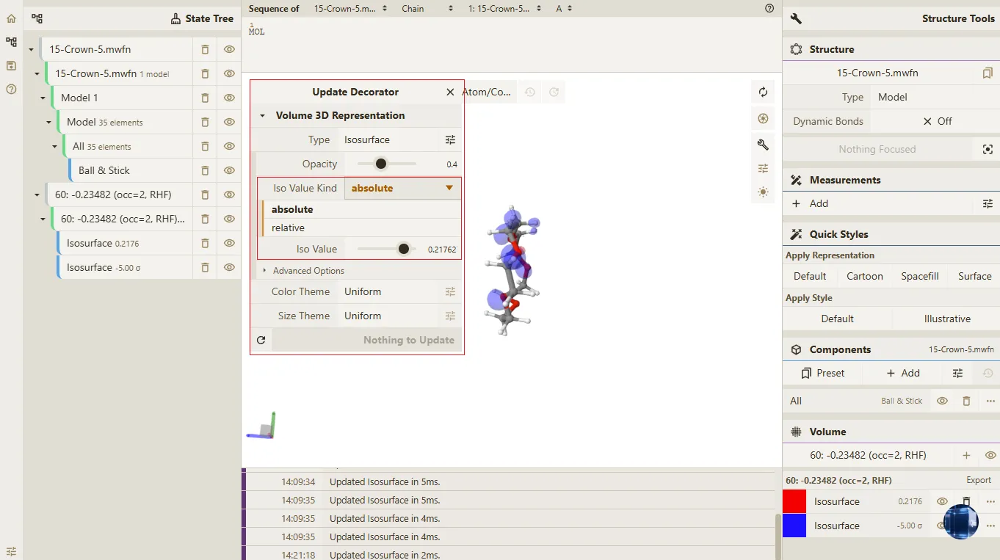

#### 1.2.3 轨道渲染颜色调整

- 在3D视图区找到已渲染的分子轨道，定位到**Isosurface**（等值面）层级，点击鼠标右键，在弹出的菜单中选择**Update Decorator**选项，打开渲染样式修改面板；

- 确认面板中**Type**选项为默认的**Isosurface**（等值面）模式；

- 点击「Color Theme」右侧的「...」扩展按钮，展开标签精细化设置面板；

- 点击面板右下角的色块，弹出**Select Color**颜色选择面板；

- 可通过如下两种方式自定义轨道渲染颜色：

  - 直接选择**Select Color**面板下方的默认色块，快速完成颜色替换；

  - 在**RGB**数值输入框中，手动键入具体RGB数值（如`RGB(199, 21, 133)`），实现精准的颜色定制；

- 颜色选择完成后，无需额外确认，3D视图区的轨道渲染颜色将实时更新。  

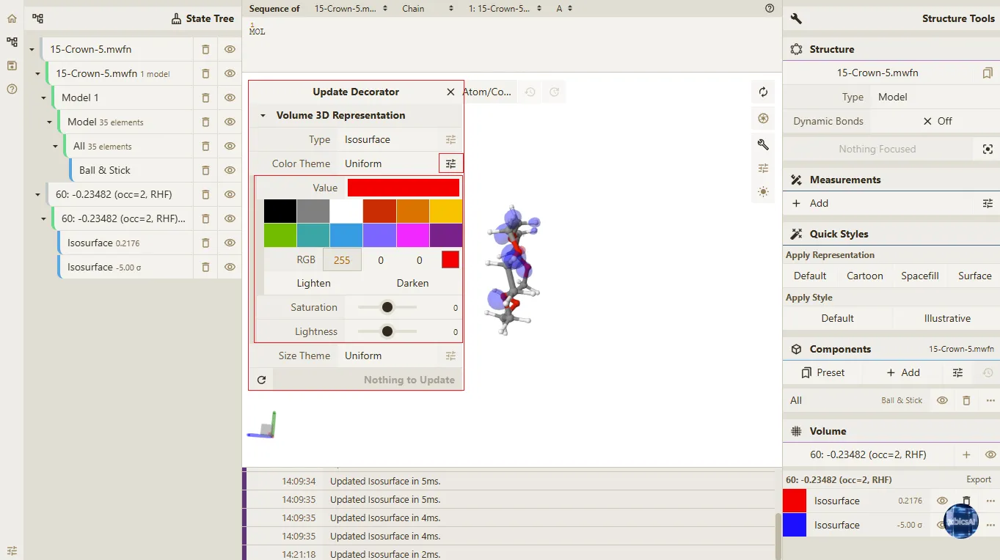

> **提示**
> 如需修改其他轨道的渲染样式属性，只需按照上述步骤操作即可。


## 2. 结构优化

平台集成 **L-BFGS (Limited-memory Broyden–Fletcher–Goldfarb–Shanno)** 算法，基于MAPLE机器学习势场分子建模框架实现分子结构优化，可对加载的分子结构进行能量最小化计算，得到稳定的分子构象。该框架兼具量子力学级别的计算精度与传统力场的计算效率，适配小分子、简单聚合物及生物催化体系的结构优化场景，平台支持结构预编辑、自动/手动参数设置，优化过程为异步执行，计算结果将自动加载并可视化展示，以下用 **“15-冠醚-5” 闭壳层分子** `15-Crown-5.mwfn` 文件详细介绍完整操作流程。

### 2.1 加载待优化的分子结构文件

平台支持**文件拖拽**和**手动选择**两种方式加载待优化文件，操作步骤如下：

- 打开Qbics-Molstar平台/客户端，点击界面中的**Load Files**功能按钮，或直接将本地文件拖拽至3D视图区；

- 文件加载完成后，平台将自动在3D视图区渲染分子结构，左侧**State Tree**面板将显示加载的文件名，确认结构渲染正常后，即可进行后续编辑与优化操作。

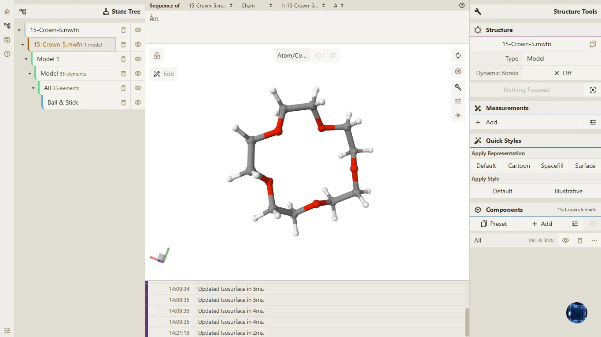


### 2.2 LBFGS算法结构优化操作

通过左侧面板调用LBFGS优化功能，支持**自动参数**和**手动参数**两种设置方式，操作步骤如下：

- 定位到左侧**State Tree**面板，找到已加载的待优化文件名称（如 15-Crown-5.mwfn）对应的树层级；

- 在该文件树层级上点击鼠标右键，在弹出的右键菜单中选择**Structure Optimization: (LBFGS)** 选项；

    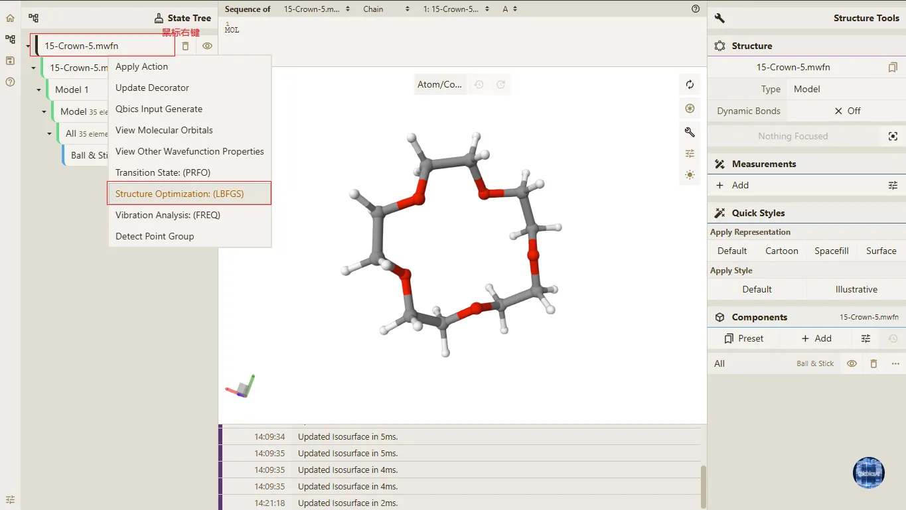

- 选择后将弹出参数设置弹窗，根据分析需求选择参数模式：

  - **自动参数（默认）**：平台配置MAPLE框架原生L-BFGS最优默认参数（memory=5、curvature=70.0、max_step=0.2Å等），无需手动调整，适配绝大多数小分子、生物分子体系的常规结构优化场景；

  - **手动修改参数**：自定义调整memory、curvature、max_step、max_iter等核心算法参数，适用于精细化结构优化或特殊体系（如大柔性分子、弱结合复合物）的优化需求；

    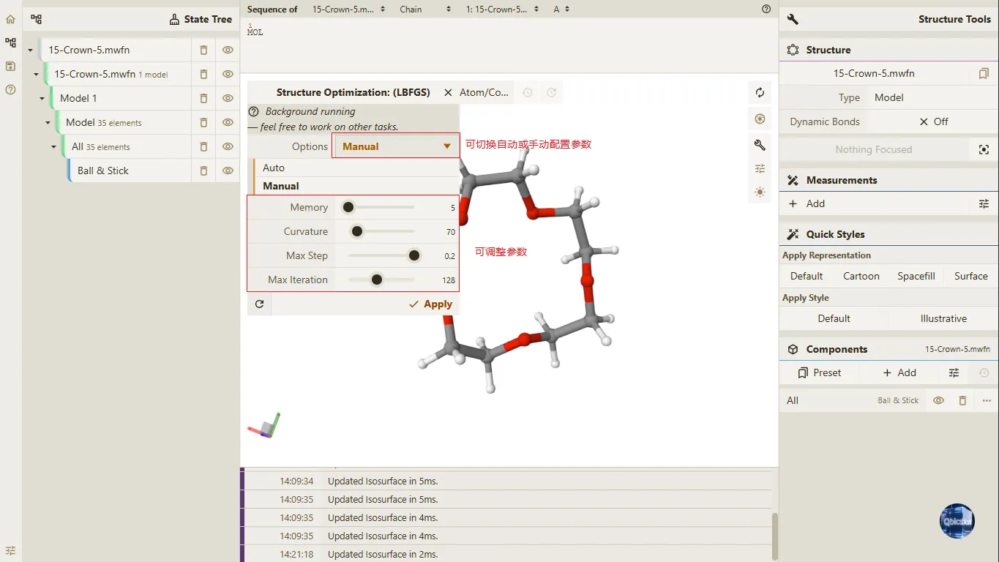

- 参数模式选择完成后，点击弹窗中的**Apply**按钮，启动LBFGS结构优化计算；

- 优化计算为**异步执行功能**，点击Apply后可进行其他操作，无需等待，计算过程中平台将在后台运行；

- 计算完成后，平台将自动加载优化结果，在3D视图区替换显示优化后的分子结构。
  
### 2.3 结构优化结果可视化

结构优化计算完成后，可通过平台动画功能查看优化轨迹并确认最终结果，操作步骤如下：

- 点击平台的**动画功能按钮**，打开轨迹可视化面板；

- 在轨迹面板中，选择查看优化过程的**轨迹帧**，按帧浏览分子结构的优化变化过程；

- 轨迹帧的**最后一帧**为LBFGS算法优化后的**最终稳定结构**，3D视图区将高亮显示该构象；

- 可结合平台的测量、标注功能，对优化后的结构进行键长、键角、二面角等参数分析，验证结构稳定性。
  
  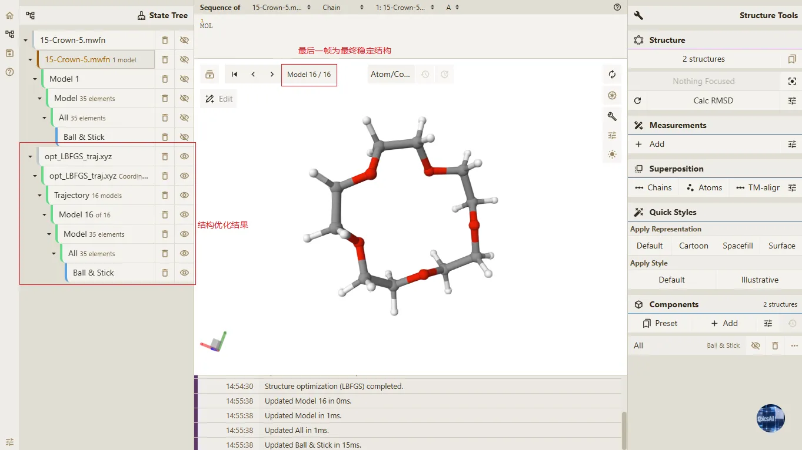


## 3. 过渡态分析

平台集成 **P-RFO（Partitioned Rational Function Optimization）** 算法，基于MAPLE机器学习势场分子建模框架实现分子过渡态优化，可对加载的过渡态初始猜测构象进行鞍点搜索计算，得到真实的一级鞍点过渡态结构。该框架兼具量子力学级别的计算精度与传统力场的计算效率，适配小分子、简单聚合物及生物催化体系的过渡态定位场景，平台支持构象预编辑、自动/手动参数设置，优化过程为异步执行，计算结果将自动加载并可视化展示，以下用 `react.xyz` 文件详细介绍完整操作流程。

```
7
OH
  C           0.82606574148010      0.55086039108041     -0.12617945891172
  H           0.45544459832603      1.24175134345121     -0.87843176681328
  O           0.56807530830522      1.02465144289647      1.11874348469907
  C           1.44110985840975     -0.58736037739486     -0.43636137324384
  H           0.90990913730383      0.39323174998265      1.76663207206389
  H           1.59168346964402     -0.85929296968553     -1.47418858923956
  H           1.80895345653104     -1.27347474033034      0.32372445144544

```

### 3.1 加载待优化的分子结构文件

平台支持**文件拖拽**和**手动选择**两种方式加载待优化文件，操作步骤如下：

- 打开Qbics-Molstar平台/客户端，点击界面中的**Load Files**功能按钮，或直接将本地文件拖拽至3D视图区；

- 文件加载完成后，平台将自动在3D视图区渲染分子结构，左侧**State Tree**面板将显示加载的文件名，确认结构渲染正常后，即可进行后续编辑与优化操作。

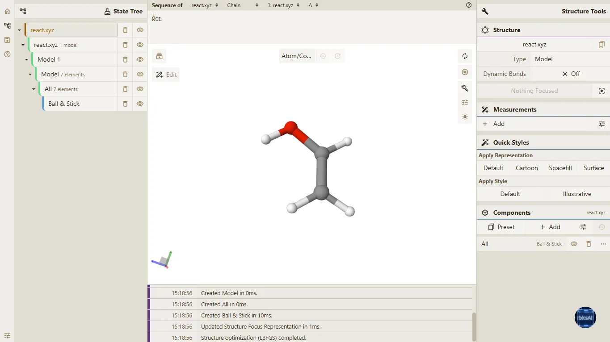

### 3.2 P-RFO算法过渡态计算操作

通过左侧面板调用P-RFO优化功能，支持**自动参数**和**手动参数**两种设置方式，操作步骤如下：

- 定位到左侧**State Tree**面板，找到已加载的待优化过渡态初始猜测构象文件名称（如 react.xyz）对应的树层级；

- 在该文件树层级上点击鼠标右键，在弹出的右键菜单中选择**Transition State: (PRFO)** 选项；

- 选择后将弹出参数设置弹窗，根据分析需求选择参数模式：

  - **自动参数（默认）**：平台配置MAPLE框架原生 P-RFO 最优默认参数（max_iter=256、trust_radius=0.2Å、trust_min=0.001等），无需手动调整，适配绝大多数小分子、生物分子体系的常规过渡态优化场景；

  - **手动修改参数**：自定义调整trust_radius、max_iter、trust_min等核心算法参数，适用于精细化过渡态搜索或特殊体系（如优化振荡、难以收敛的过渡态体系）的优化需求；

  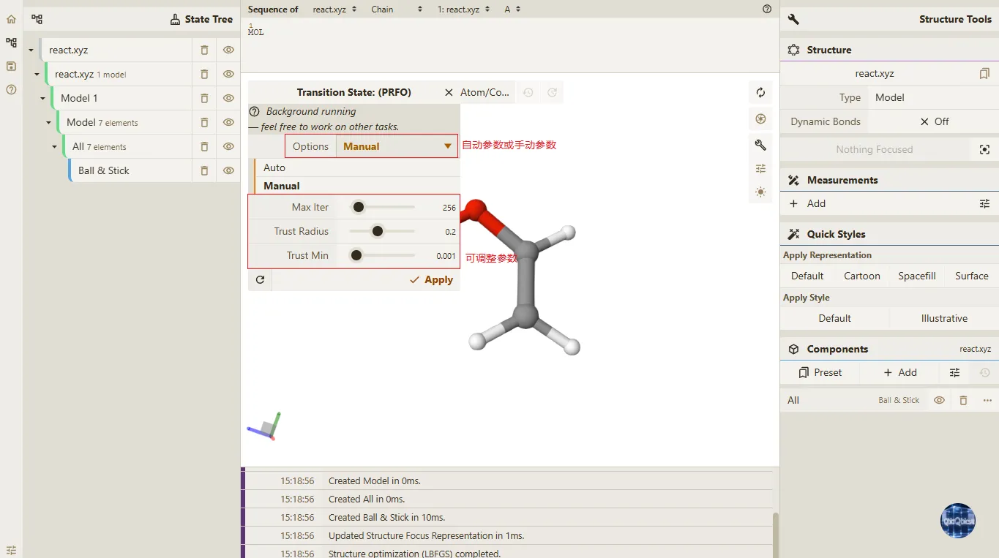

- 参数模式选择完成后，点击弹窗中的**Apply**按钮，启动 P-RFO 过渡态优化计算；

- 优化计算为**异步执行功能**，点击Apply后可进行其他操作，无需等待，计算过程中平台将在后台运行；

- 计算完成后，平台将自动加载优化结果，在3D视图区替换显示优化后的过渡态结构。


  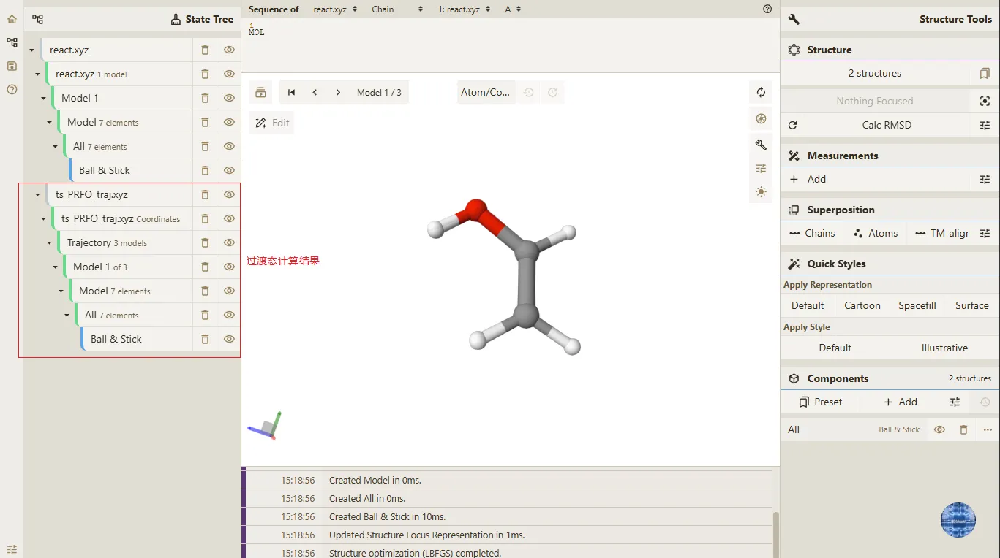
  
## 4. 结构振幅分析

平台集成 **FREQ** 振动频率分析模块，基于 MAPLE 机器学习势场分子建模框架实现分子体系的振动频率计算与热化学分析，通过构建并对角化质量加权的 Hessian 矩阵，得到简正振动模式、振动频率，同时依托刚性转子 - 谐振子（RRHO）近似方法，推导零点振动能（ZPVE）、热校正量、焓、熵、吉布斯自由能等热化学参数，适配分子结构验证、热力学性质分析等科研场景，平台支持自动 / 手动参数设置，计算过程为异步执行，结果将自动加载并可视化展示，以下用 `react.xyz` 文件详细介绍完整操作流程。

```
7
OH
  C           0.82606574148010      0.55086039108041     -0.12617945891172
  H           0.45544459832603      1.24175134345121     -0.87843176681328
  O           0.56807530830522      1.02465144289647      1.11874348469907
  C           1.44110985840975     -0.58736037739486     -0.43636137324384
  H           0.90990913730383      0.39323174998265      1.76663207206389
  H           1.59168346964402     -0.85929296968553     -1.47418858923956
  H           1.80895345653104     -1.27347474033034      0.32372445144544

```

### 4.1 加载待优化的分子结构文件

平台支持**文件拖拽**和**手动选择**两种方式加载待优化文件，操作步骤如下：

- 打开Qbics-Molstar平台/客户端，点击界面中的**Load Files**功能按钮，或直接将本地文件拖拽至3D视图区；

- 文件加载完成后，平台将自动在3D视图区渲染分子结构，左侧**State Tree**面板将显示加载的文件名，确认结构渲染正常后，即可进行后续编辑与优化操作。


### 4.2 振动频率分析操作

通过左侧面板调用 Freq 模块分析功能，支持**自动参数**和**手动参数**两种设置方式，操作步骤如下：


- 定位到左侧**State Tree**面板，找到已加载的待优化过渡态初始猜测构象文件名称（如 react.xyz）对应的树层级；

- 在该文件树层级上点击鼠标右键，在弹出的右键菜单中选择**Vibration Analysis: (FREQ)** 选项；

- 选择后将弹出参数设置弹窗，根据分析需求选择参数模式：

  - **自动参数（默认）**：平台配置MAPLE框架原生 P-RFO 最优默认参数（max_iter=256、trust_radius=0.2Å、trust_min=0.001等），无需手动调整，适配绝大多数小分子、生物分子体系的常规过渡态优化场景；

  - **手动修改参数**：自定义调整trust_radius、max_iter、trust_min等核心算法参数，适用于精细化过渡态搜索或特殊体系（如优化振荡、难以收敛的过渡态体系）的优化需求；

  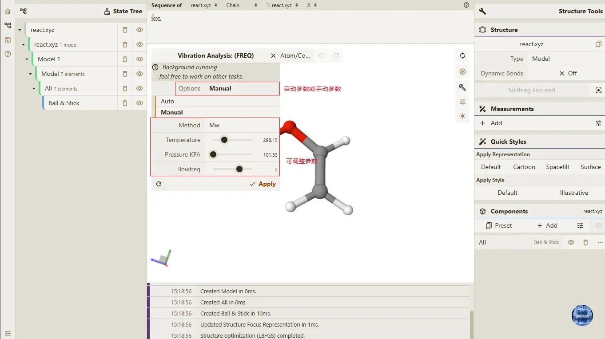

- 参数模式选择完成后，点击弹窗中的**Apply**按钮，启动 Freq 模块振动频率分析计算；   

- 分析计算为**异步执行功能**，点击Apply后可进行其他操作，无需等待，计算过程中平台将在后台运行；

- 计算完成后，平台将自动加载分析结果，在3D视图区展示简正振动模式，同时生成热化学参数数据报告。

  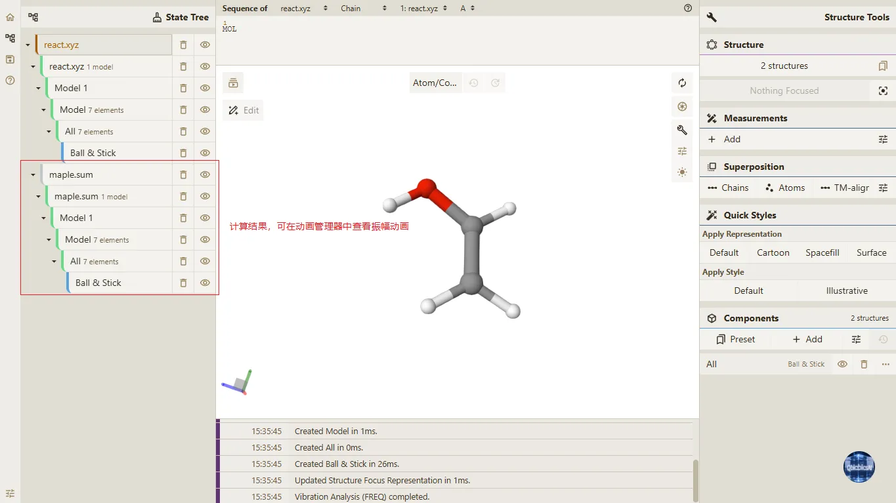

### 4.3 振动频率分析结果可视化展示

计算完成后如果需要可视化展示振幅动画效果，点击在3D视图区的左上角动画管理器按钮，在动画控制器弹窗中的 **Animation** 下拉选项中选择 **Harmonic Vibrations** 选项，即可展示现有的振幅动画，同时在动画控制器弹窗中调整动画参数，如振幅、频率等，以获得更符合需求的动画效果。

**动画参数调整（核心可视化操作）**

对应截图中红框标注的可调整参数，操作步骤如下：

- 选择振动模式：
 Harmonic Vibric Vibrations 面板的文件列表中，点击目标振动模式序号（如1 (530.56 cm⁻¹)），切换查看不同简正振动模式的振幅特征；

- 调整振幅比例：
  拖动Amplitude滑块（截图中红框标识），缩放原子位移的振幅大小，直观观察振动幅度对结构的影响；

- 调整动画时长：
  拖动Duration In Ms滑块，设置动画播放的总时长（单位：毫秒），适配慢放 / 快放观察需求；

- 设置动画模式：
  选择Mode为Loop（循环），实现振动模式的持续循环演示，便于长期观察。

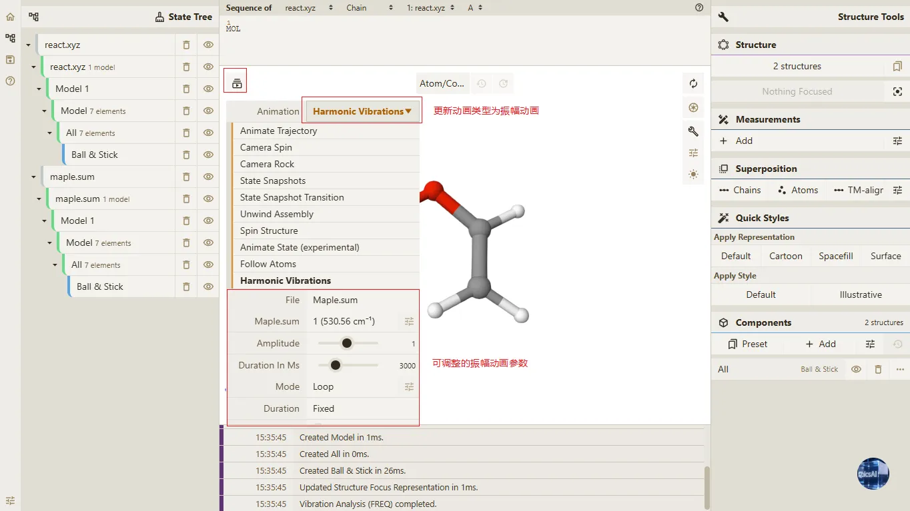

调整完振幅动画参数后点击**Start**按钮，即可开始播放振幅动画。

