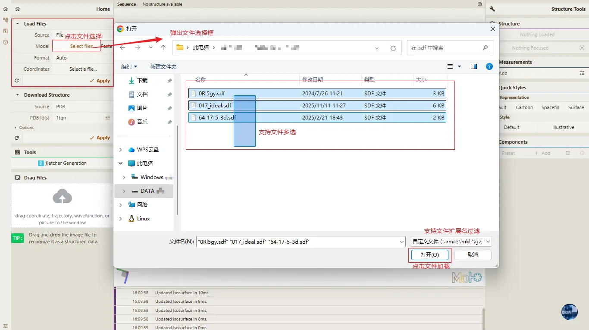
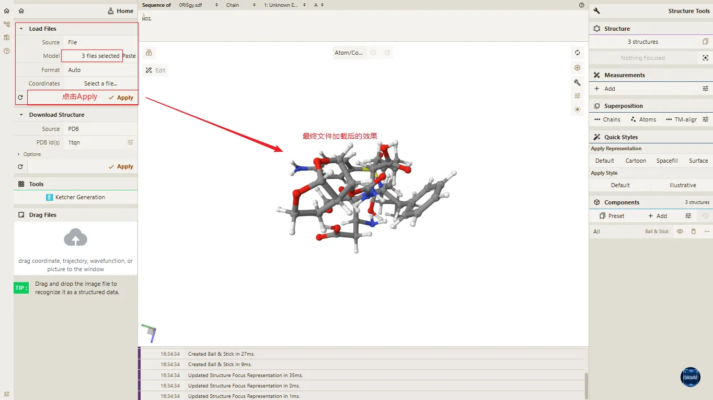
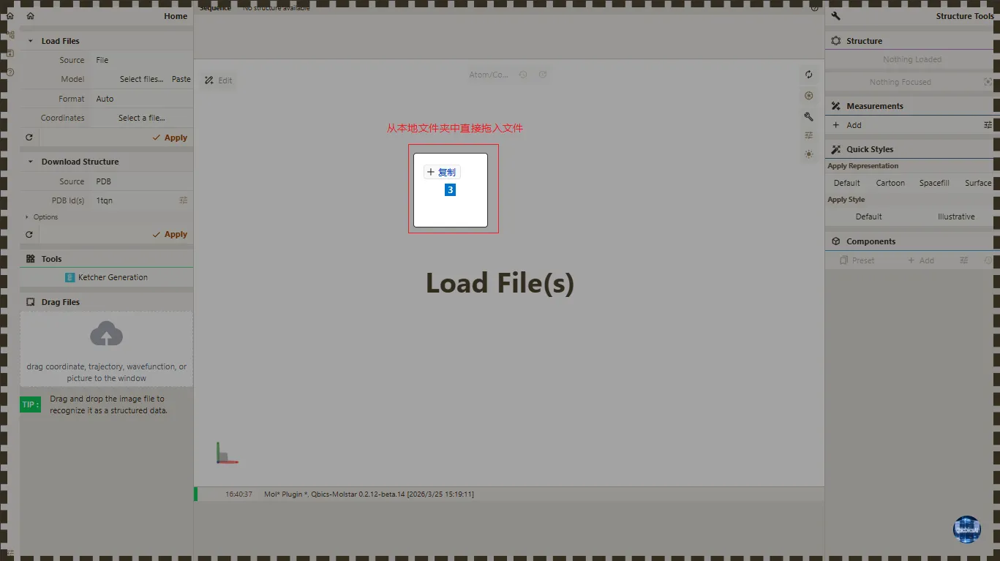
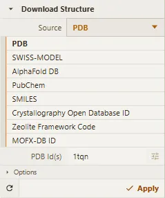
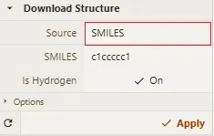
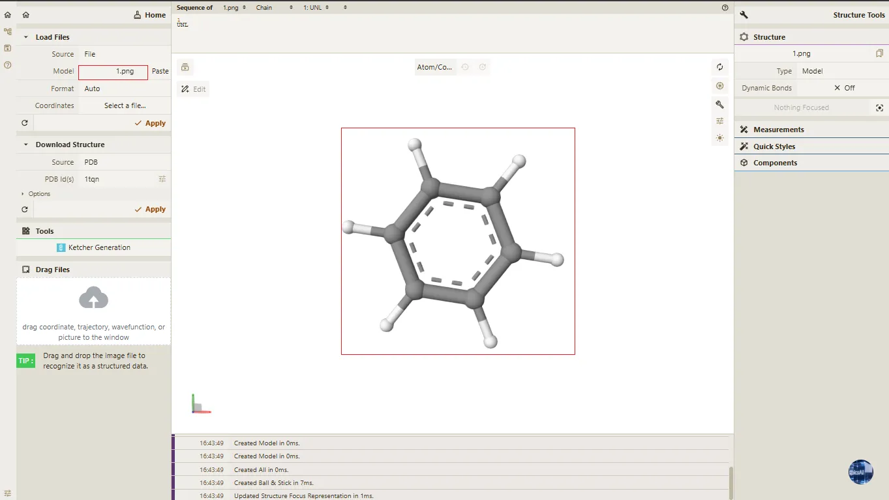
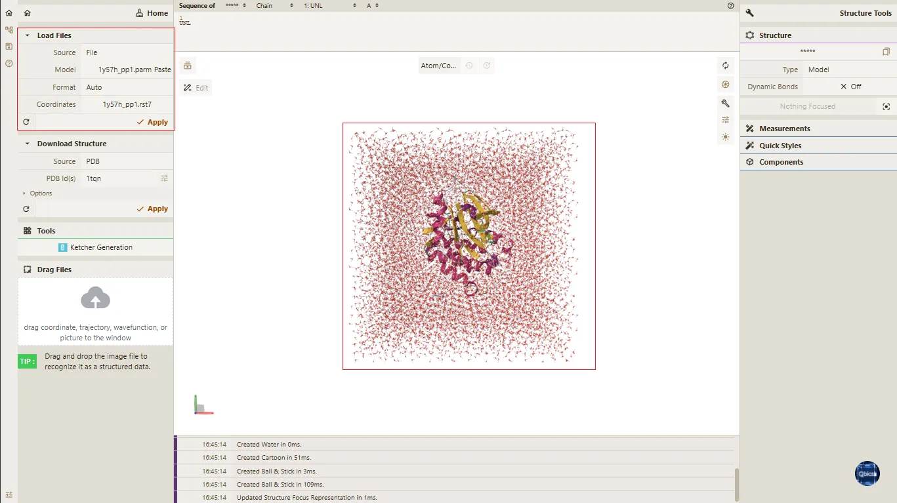
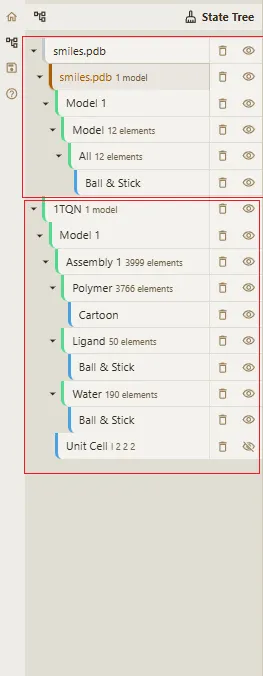

# 三、结构加载与导入

> **Qbics-Molstar 分子可视化平台用户手册**
>
> 官方网站：[https://molstar.szbl.ac.cn/viewer](https://molstar.szbl.ac.cn/viewer)
> 
> 官方文档：[https://molstar.szbl.ac.cn/docs](https://molstar.szbl.ac.cn/docs)
> 
> 第三方文档：[https://rxht.github.io/molstar/](https://rxht.github.io/molstar/)

结构加载与导入是Qbics-Molstar平台开展分子可视化与分析的基础环节，平台支持本地文件上传、在线数据库加载、剪切板导入、2D结构绘制转换等多种加载方式，兼容多类型分子结构文件，适配不同科研场景的数据源需求。

## 1. 支持的文件格式

平台兼容结构、轨迹、体积、拓扑等多类型文件格式，核心支持格式如下（按功能分类）：

- 结构格式：.pdb、.cif、.bcif、.mol、.mol2、.sdf、.xyz、.gjf、.inp、.wfx、.wfn、.molden、.fch、.pdbqt、.gro、.gjf等；

- 体积格式：.ccp4、.mrc、.map、.cub、.cube、.dx、.cif、.brix、.dxbin等；

- 拓扑格式：.psf、.prmtop、.parm7、.top等；

- 压缩格式：.gz、.zip（支持直接加载，无需提前解压）；
  
- 图片格式：.png、.jpg、.jpeg（支持直接加载，无需转换）；

## 2. 上传本地结构文件（PDB、CIF、MOL2 等）

用户可加载已保存在本地设备的分子结构文件，平台支持多种主流结构文件格式，且支持批量上传，具体操作步骤如下：

- 打开平台主界面，在左侧「Home」功能区找到「Load Files」面板（文件加载面板）；

- 点击面板中的「Select files...」按钮，弹出本地文件选择窗口；

- 选中目标结构文件（可按住Ctrl键批量选择多个同类型或不同类型文件），点击「打开」；

- 面板默认「Format」为「Auto」，将自动识别文件格式，无需手动设置；若识别失败，可手动指定对应格式；

- 确认加载参数后点击「Apply」按钮，平台将自动解析文件并渲染结构；

- 加载成功后，中央3D视图区将显示分子结构，左侧状态树同步列出结构层级信息（如模型、组装体、组分等）。

**打开文件选择器**

**文件显示**

> **注意事项：**
> 
> - 批量加载时建议避免混合过多不同类型文件，防止解析冲突导致部分文件加载失败；
> 
> - 文件名及文件路径避免包含中文、特殊符号（如@、#、&），否则可能影响解析；
> 
> - 大型文件（如超过500MB的轨迹文件）加载时需耐心等待，期间避免关闭面板或刷新页面。
> 
> 

## 3. 本地结构文件拖入加载

该方式为快捷上传入口，无需手动打开文件选择窗口，可大幅提升单文件或少量文件的加载效率，具体操作步骤如下：

- 确保平台主界面处于激活状态（未最小化或被其他窗口遮挡）；

- 在本地文件管理器中找到目标结构文件（支持单个或多个文件）；

- 按住文件并直接拖拽至平台主界面的任意区域（3D视图区、左侧功能区、中央空白区均可）；

- 松开鼠标后，平台将自动识别文件格式并启动加载流程，加载完成后3D视图区同步显示结构，底部日志面板将提示加载结果。

**拖拽加载**

> **注意事项：**
> 
> - 拖拽多个文件时，建议将文件集中选中后一次性拖拽，避免分次拖拽导致加载顺序混乱；
> 
> - 拖拽过程中请勿中途中断（如将文件拖回文件管理器），否则可能出现文件损坏提示；
> 
> - 集成显卡设备加载大型复杂结构（如蛋白质复合物）时，可能出现短暂卡顿，属于正常现象，等待渲染完成即可。
> 
> 

## 4. 点击Parse按钮从剪切板加载结构

该方式适用于已将结构数据复制到剪切板的场景（如2D结构图片（使用截图工具拷贝或从网页中复制的图片）、从文件夹中复制的PDB文件等），无需保存为本地文件即可快速加载，操作步骤如下：

- 将目标分子的结构数据（格式需规范，如完整的SMILES代码、PDB原子坐标文本）复制到系统剪切板；

- 打开平台左侧「Home」功能区的「Load Files」面板；

- 点击面板中的「Paste」按钮（部分版本显示为「Parse」），平台将自动读取剪切板中的数据；

- 若数据格式可识别，将直接解析并渲染结构；若格式不明确，面板将弹出格式选择弹窗，手动选择对应格式后点击「Apply」即可完成加载；

- 加载成功后，3D视图区显示结构，状态树同步更新结构信息。

> **注意事项：**
> 
> - 剪切板中的结构数据需保证完整性；
> 
> - 不支持批量粘贴多个文件；
> 
> - 若粘贴后加载失败，可检查数据格式是否符合要求，或尝试将数据保存为本地文件后通过“上传本地结构文件”方式加载。
> 
> 

## 5. 从PDB ID在线加载结构

该方式适用于加载PDB数据库中的公开分子结构，无需手动下载文件，直接通过结构ID即可快速获取，适配科研中对已知公开结构的快速分析需求，操作步骤如下：

- 打开平台左侧「Home」功能区的「Download Structure」面板（下载结构面板）；

- 在「Source」下拉菜单中选择「PDB」（默认选项），确认加载源为PDB数据库；

- 在「PDB Id(s)」输入框中输入目标结构的PDB ID（如6AP4、1tqn，多个ID用英文逗号分隔）；

- 无需手动设置格式，面板默认「Format」为「Auto」，将自动匹配数据库文件格式；

- 点击「Apply」按钮，平台将自动从PDB数据库下载结构数据并渲染；

- 加载成功后，3D视图区显示分子结构，状态树将列出结构的组装体、链、残基等层级信息，底部日志面板提示加载耗时（如“Created Polymer in 1ms”）。

> **注意事项：**
> 
> - 加载时需保证网络稳定（建议带宽≥10Mbps），大型结构（如包含超过10000个原子的蛋白质复合物）下载时间可能较长，需耐心等待；
> 
> - 若输入的PDB ID不存在、已被数据库移除或格式错误，底部日志面板将显示错误提示，需核对ID后重新尝试；
> 
> - 批量加载多个PDB ID时，建议控制数量（单次不超过5个），避免网络拥堵导致加载超时；
> 
> - 网络不稳定时，可先在PDB数据库下载文件至本地，再通过“上传本地结构文件”方式加载，提升稳定性。
> 
> 

## 6. SMILES输入结构加载

SMILES（简化分子线性输入规范）输入方式适用于快速生成小分子3D结构，无需提前准备结构文件，直接输入SMILES代码即可实现可视化，适配药物研发中配体分子的快速构建与分析，操作步骤如下：

- 打开平台左侧「Home」功能区的「Download Structure」面板；

- 在「Source」下拉菜单中选择「SMILES」，切换加载源为SMILES代码；

- 在「SMILES」输入框中输入目标分子的规范SMILES代码（如苯的SMILES代码`c1ccccc1`，复杂分子如`[H]C(=O)N1C(CNC2=CC=C(C=C2)C(=O)N[C@@H](CCC(O)=O)C(O)=O)CNC2=C1C(=O)NC(N)=N2`）；

- 勾选「Is Hydrogen On」选项可显示分子中的氢原子，取消勾选则隐藏，根据分析需求选择；

- 点击「Apply」按钮，平台将自动解析SMILES代码并生成3D结构；

- 加载成功后，中央3D视图区以球棍模式显示小分子结构，支持后续调整显示样式、测量等操作。

> **注意事项：**
> 
> - SMILES代码需符合规范，建议通过PubChem、ChemDraw等工具验证代码有效性后再输入，避免因代码错误导致结构生成失败；
> 
> - 复杂分子（如包含手性中心、多环结构）生成3D结构后，可通过结构编辑功能优化构象，确保键角、键长符合化学规范；
> 
> - 若加载后结构显示异常（如原子重叠、化学键断裂），可重新检查SMILES代码，或简化结构分步构建。
> 
> 

## 7. 图片识别结构加载

该方式适用于从分子结构图片中提取结构信息并生成3D模型，无需手动输入或绘制，适配科研中对文献、报告中结构图片的快速复用需求，操作步骤如下：

- 打开平台左侧「Home」功能区的「Load Files」面板；

- 点击面板中的「Select files...」按钮，选择本地保存的分子结构图片（支持.jpg、.png、.jpeg格式）；

- 或直接将结构图片拖拽至平台主界面，触发图片识别功能；

- 平台自动识别图片中的分子结构特征（如化学键、原子排列），解析完成后点击「Apply」按钮；

- 识别成功后，中央3D视图区将生成对应的3D结构，可进一步调整显示样式与参数。

> **注意事项：**
> 
> - 图片中需清晰展示分子结构的化学键连接与原子类型，避免使用模糊、倾斜或遮挡过多的图片，否则会降低识别准确率；
> 
> - 仅支持识别2D分子结构图片（如ChemDraw绘制图、文献中的结构示意图），不支持3D渲染图、实物照片的识别；
> 
> - 识别结果可能存在偏差，建议生成3D结构后与原图片核对，通过结构编辑功能修正键角、原子类型等细节。
> 

## 8. 2D结构绘制与一键转3D功能（Ketcher工具）

该功能是平台内置的小分子结构设计工具，支持直接绘制2D结构式并一键转换为3D坐标模型，无需依赖第三方化学绘图软件，适配配体设计、自定义分子结构生成等科研场景，操作步骤如下：

- 打开平台左侧「Home」功能区的「Tools」面板（2D结构绘制面板）；

- 点击「Ketcher Generation」按钮，弹出2D结构绘制弹窗；

- 在弹窗左侧工具栏中进行2D结构绘制；

- 绘制完成后，点击弹窗顶部工具栏中的「Mol*」图标，触发2D转3D功能；

- 平台将自动解析2D结构，优化生成符合化学规范的3D原子坐标，转换过程无需手动干预；

- 转换完成后，点击弹窗右上角的「×」关闭弹窗，中央3D视图区将自动加载并渲染生成的3D结构。

> **注意事项：**
> 
> - 绘制2D结构时需保证化学键连接合理（如碳原子最多形成4个键），否则转换后的3D结构可能存在异常；
> 
> - 支持绘制含手性中心、杂环、取代基的复杂小分子，转换后可通过结构分析功能验证构象合理性。
> 
> 

## 9. 同时上传本地Model文件与Coordinates文件

该方式适用于加载分子动力学模拟结果等包含轨迹信息的数据集，需分别上传模型文件（包含拓扑结构）与坐标文件（包含轨迹帧信息），实现轨迹动画的可视化播放，操作步骤如下：

- 打开平台左侧「Home」功能区的「Load Trajectory」面板（轨迹文件加载面板）；

- 在「Source File」（模型文件）栏点击「Select a file...」，选择本地的模型/拓扑文件并上传；

- 在「Coordinates」（坐标文件）栏点击「Select a file...」，选择对应的轨迹/坐标文件并上传；

- 确认两个文件格式匹配（如.psf模型文件对应.dcd坐标文件），点击「Apply」按钮；

- 平台将自动关联模型与坐标文件，加载完成后，3D视图区显示初始帧结构，左侧动画管理器可控制轨迹播放。

> **注意事项：**
> 
> - 模型文件与坐标文件必须匹配（原子序号、链标识、残基信息一致），否则会出现轨迹播放异常（如结构错位、卡顿）；
> 
> - 轨迹文件较大时（如超过1GB），建议关闭其他占用系统资源的软件，确保加载与播放流畅；
> 
> - 若加载后无法播放轨迹，可检查坐标文件的帧信息是否完整，或尝试重新上传文件。
> 
> 

## 10. 多结构同时加载与管理

该功能支持同时加载多个独立的分子结构（如同源蛋白、突变体、配体-受体复合物等），并通过状态树进行分层管理，适配多结构比对、差异分析等科研场景，操作步骤如下：

- 通过上述任意加载方式（如本地上传、PDB ID加载）依次加载多个结构，加载过程中平台将自动分配独立的模型ID；

- 加载完成后，左侧状态树将按加载顺序列出所有结构，每个结构对应独立的根节点（如“6AP4 1 model”“1tqn 1 model”）；

- 结构管理操作：

    - 显示/隐藏：点击对应结构根节点或子节点右侧的眼睛图标，可单独隐藏该结构或其组分（如配体、水）；

    - 选中/聚焦：点击状态树中的结构节点，中央3D视图将自动聚焦该结构；

    - 重命名：右键点击结构根节点，选择「Rename」，可自定义结构名称（如“野生型蛋白”“突变体蛋白”），便于区分；

    - 删除：点击节点右侧的垃圾桶图标，可删除不需要的结构，释放系统资源。

    

> **注意事项：**
> 
> - 同时加载的结构数量建议不超过10个，过多结构会占用大量内存，导致3D视图渲染卡顿；
> 
> - 多结构比对时，可通过右侧「Superposition Panel」（叠加面板）进行空间叠加，量化结构相似性；
> 
> - 切换结构显示状态时，避免同时操作多个节点，防止状态同步冲突。
> 
> 

## 11. 结构加载失败排查与建议

- 加载失败时优先查看底部「Log Panel」（日志面板），错误提示将明确失败原因（如 **File format not supported** 、 **Network error** 等）；

- 确保浏览器符合要求（Chrome 90.0+、Firefox 88.0+），避免使用IE或低版本Edge浏览器；

- Web版本可通过快捷键 **Shift + R** 强制刷新页面，尝试重新加载文件；
  
- 客户端用户可通过「About」→「Check Update」更新至最新版本，修复已知的加载兼容问题；

- 若所有加载方式均失败，可联系平台技术支持（参考官方文档联系方式），提供文件样本与错误日志以便排查。