# 五、结构显示样式控制

> **Qbics-Molstar 分子可视化平台用户手册**
>
> 官方网站：[https://molstar.szbl.ac.cn/viewer](https://molstar.szbl.ac.cn/viewer)
> 
> 官方文档：[https://molstar.szbl.ac.cn/docs](https://molstar.szbl.ac.cn/docs)
> 
> 第三方文档：[https://rxht.github.io/molstar/](https://rxht.github.io/molstar/)

结构显示样式控制是科研可视化的核心功能，平台支持多种显示模式、着色方式及细节控制，可根据科研需求（如整体结构展示、局部细节观察、论文配图）灵活调整，确保分子结构的展示清晰、准确、专业。以下详细介绍各控制功能的操作方法、科研应用场景及注意事项：

## 1. 常用显示模式（卡通、球棍、线条、表面、范德华球等）

平台提供多种常用的分子结构显示模式，每种模式适用于不同的科研展示场景，核心操作方法统一，具体模式介绍及操作步骤如下：

### 1.1 各显示模式详细介绍

- 卡通模式（Cartoon）：最常用的显示模式，以卡通化的方式展示分子的二级结构（α-螺旋显示为螺旋状，β-折叠显示为箭头状，无规则卷曲显示为线条状），适用于展示分子的整体构象、二级结构分布，是论文配图、整体结构分析的首选模式；

- 球棍模式（Ball & Stick）：以球体（代表原子）和棍体（代表化学键）的形式展示分子结构，可清晰显示原子的连接方式、键长、键角，适用于观察分子的局部细节（如配体结构、活性位点的原子排列）、小分子结构分析；

- 线条模式（Line）：仅以线条形式展示化学键，原子以小点显示，结构简洁，适用于展示分子的骨架结构、大型分子复合物的整体连接关系，可减少视觉干扰；

- 表面模式（Surface）：展示分子的溶剂可及表面，以曲面形式呈现，可直观显示分子的表面形态、空腔/口袋位置，适用于药物研发中结合位点的识别、分子表面特性分析；

- 范德华球模式（Van der Waals）：以原子的范德华半径为尺寸，用球体展示每个原子，可清晰显示原子的空间分布、分子的拥挤程度，适用于观察原子间的空间距离、空间位阻（steric位阻）分析；

- 高斯表面模式（Gaussian Surface）：以高斯分布模拟分子表面，视觉效果柔和、过渡自然，可清晰呈现分子表面的细微起伏，适用于科研汇报展示、分子表面疏水/亲水区域可视化，也可叠加其他显示模式用于结构对比分析；

- 其他模式：包括丝带模式（Ribbon，类似卡通模式，更简洁）、tube模式（以管状展示分子骨架），可根据科研展示需求灵活选择。

### 1.2 显示模式切换操作步骤

严格按照平台实际操作流程，具体步骤如下：

- 加载目标分子结构文件后，找到左侧的「StateTree」（状态树）面板；

- 在「StateTree」面板中，定位到最低层级的显示节点（如已显示的「Ball & Stick」「Cartoon」节点）；

- 在该节点上点击鼠标右键，弹出右键菜单，选择「Update Decorator」按钮；

- 点击后，在主场景的左上角会弹出对应的显示模式控制弹窗（即「3D Representation」弹窗）；

- 点击控制弹窗中的目标显示模式，即可完成切换，3D视图区将实时更新显示效果，无需额外确认操作。

**右键菜单操作演示**

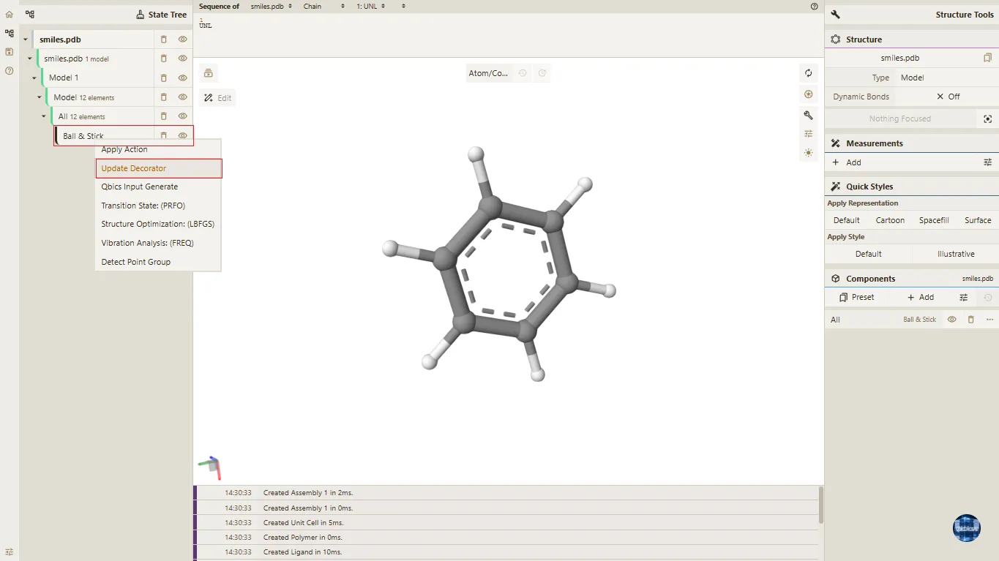

**显示模式控制弹窗及切换效果**

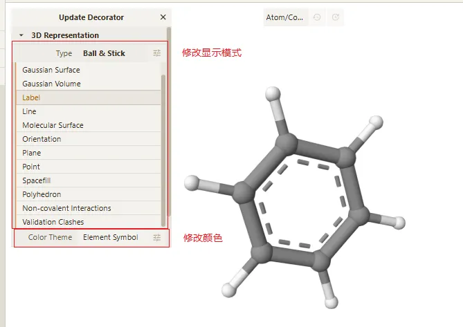

## 2. 着色主题（Color Theme）切换

着色主题用于区分不同结构组分、突出关键特征，平台提供原子属性、链属性两大类着色方案，支持按科研需求灵活选择，具体步骤如下：

- 加载目标分子结构文件后，找到左侧的「StateTree」（状态树）面板；

- 在「StateTree」面板中，定位到最低层级的显示节点（如已显示的「Ball & Stick」「Cartoon」节点）；

- 在该节点上点击鼠标右键，弹出右键菜单，选择「Update Decorator」按钮；

- 点击后，在主场景的左上角会弹出对应的显示模式控制弹窗；

- 点击控制弹窗中的「Color Theme」选项，选择目标着色主题，3D视图区将实时更新显示效果，无需额外确认操作。
  
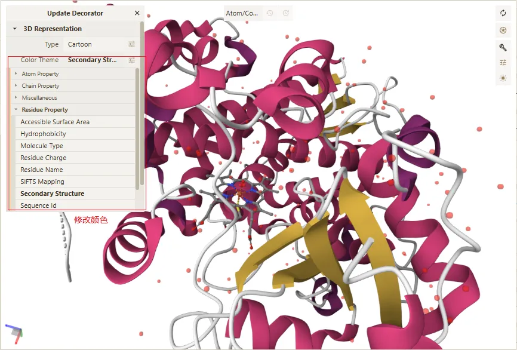

### 2.1 原子属性类着色（突出原子层面特征）

- **Element Symbol（元素符号着色）**：按原子类型（C、N、O、H、S、P等）分配颜色；

- **Formal Charge（形式电荷着色）**：按原子形式电荷（正电荷、负电荷、中性）分配不同颜色，适用于离子键分析、电荷分布可视化；

- **Occupancy（占有率着色）**：按原子占有率数值梯度着色，适用于晶体结构精修结果分析；

- **Element Index（元素索引着色）**：按原子位置索引着色，适用于结构解析质量评估。

### 2.2 链属性类着色（突出链/实体层面特征）

- **Chain Id（链ID着色）**：为不同链分配唯一颜色（如A链蓝色、B链红色），适用于多链蛋白质、分子复合物的链区分；

- **Entity Id（实体ID着色）**：按结构实体（如聚合物、配体、水分子）分配颜色，适用于复杂结构的组分区分；

- **Chain Instance（链实例着色）**：为同一链的不同实例分配颜色，适用于同源多聚体结构分析。

### 2.3 补充说明

- 着色主题与显示类型可自由组合（如「Ball & Stick + Element Symbol」），适配更精细的分析需求；

- 论文配图时建议选择对比度适中的着色方案，避免过于鲜艳或相近的颜色，确保结构细节清晰可辨。

> **注意事项**
> 
> - 着色方式的选择需结合科研需求，如多链分析选择“按链着色”，残基特性分析选择“按残基类型着色”；
> 
> - 论文配图时，配色需清晰、统一，避免使用过于鲜艳、相近的颜色，确保不同结构片段能够清晰区分；
> 
> - 自定义配色时，建议参考科研论文的配色规范，确保配色专业、合理。
> 
> 

## 3. 状态树层级显示、隐藏与删除

在Qbics-Molstar平台进行分子结构可视化分析时，左侧「StateTree」（状态树）面板是结构层级管理的核心入口。状态树按“模型→组装体→聚合物→配体→水分子→显示样式”的层级，清晰呈现已加载结构的所有组分，支持对不同层级节点进行显示、隐藏与删除操作，可快速筛选所需观察的结构内容，减少视觉干扰，提升科研分析效率。以下严格结合平台实际操作步骤，详细介绍各功能的操作方法、应用场景及相关说明。

### 3.1 状态树层级说明

结构加载成功后，左侧「StateTree」面板将自动生成完整的结构层级，各层级节点对应不同的结构组分，自上而下层级关系及说明如下，便于精准定位操作对象：

- 一级节点（根节点）：通常为加载的模型名称（如PDB ID对应的模型），代表整个加载的分子结构，包含所有子层级组分；

- 二级节点：如「Assembly」（组装体）、「Polymer」（聚合物，如蛋白质、核酸），对应结构的核心组分；

- 三级节点：如「Ligand」（配体）、「Water」（水分子）、「Ions」（离子），对应结构的辅助组分；

- 四级节点（最低层级）：显示样式节点（如「Cartoon」「Ball & Stick」），对应各组分的具体显示模式。

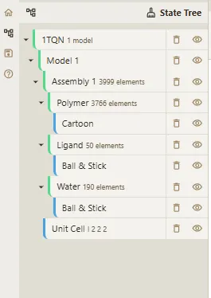

### 3.2 状态树层级显示操作

显示操作适用于将隐藏的结构层级重新调出，便于观察对应组分的结构（如配体、水分子）细节，操作步骤如下：

- 打开左侧「StateTree」面板，找到已隐藏的目标层级节点（隐藏节点对应眼睛图标为闭合状态）；

- 点击该节点右侧的「闭合眼睛」图标，图标将切换为「睁开眼睛」状态；

- 操作完成后，中央3D视图区将实时显示该层级对应的结构组分，无需额外确认操作。

### 3.3 状态树层级隐藏操作

隐藏操作适用于暂时隐藏无需观察的结构组分（如多余的水分子、无关配体），减少视觉干扰，专注于核心结构分析，操作步骤如下：

- 在左侧「StateTree」面板中，定位到需要隐藏的目标层级节点（显示节点对应眼睛图标为睁开状态）；

- 点击该节点右侧的「睁开眼睛」图标，图标将切换为「闭合眼睛」状态；

- 操作完成后，中央3D视图区将实时隐藏该层级对应的结构组分，不影响其他层级的显示。

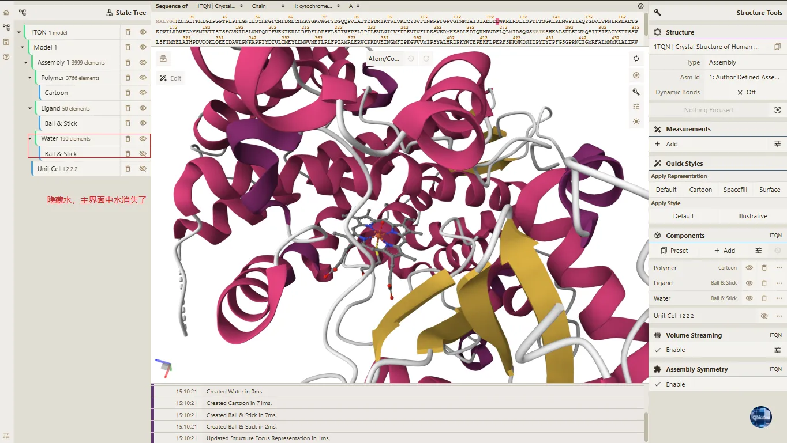

### 3.4 状态树层级删除操作

删除操作适用于彻底移除不需要的结构层级（如无用的配体、水分子，或错误加载的结构组分），删除后该层级将从状态树中移除，且无法通过显示操作恢复，需谨慎操作，操作步骤如下：

- 在左侧「StateTree」面板中，定位到需要删除的目标层级节点；

- 点击该节点右侧的「删除」图标，该层级节点将从状态树中彻底移除；

- 操作完成后，3D视图区同步删除对应结构组分，不影响其他层级的显示。

> **注意事项**
> 
> - 删除操作不可逆，删除前需确认目标层级为无用组分，若误删可重新加载结构文件恢复；
> 
> - 隐藏操作仅暂时隐藏结构组分，未彻底删除，可随时通过点击眼睛图标重新显示；
> 
> - 层级操作优先级：根节点（整个模型）的显示/隐藏/删除，将同步影响所有子层级节点，操作时需谨慎；
> 
> - 若状态树面板未显示，可点击平台左侧「Home」功能区的「StateTree」按钮，调出状态树面板。
> 
> 

## 4. 自定义标签显示 / 多种显示模式

自定义标签显示是Qbics-Molstar平台用于精准标注分子结构关键信息的核心功能，支持按链、残基、元素等多粒度生成标签，可直接叠加在3D视图中，帮助科研人员快速识别目标结构片段、记录关键位点信息，适配结构分析、论文配图标注、科研汇报等多种场景。标签显示模式与结构显示样式独立联动，可灵活组合使用，操作流程简洁高效。

### 4.1 标签显示功能入口

- 加载目标分子结构后，找到左侧「StateTree」（状态树）面板；

- 在状态树中定位到目标结构的显示样式节点（如「Water」「Ligand」「Polymer」等倒数第二层级显示节点）；

- 鼠标右键点击该显示样式节点，在弹出的右键菜单中选择「Apply Action」选项；

- 在展开的次级菜单中点击「Add Component」，启动标签组件添加流程；

- 主场景左上角将弹出「3D Representation」设置弹窗，标签相关设置均在此弹窗内完成。

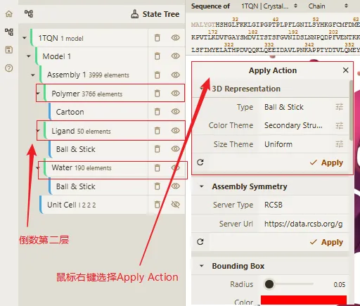

### 4.2 核心标签显示模式及操作步骤

平台支持5种核心标签显示模式，分别对应不同的标注粒度，可根据科研需求精准选择，所有模式的基础操作步骤统一，具体如下：

#### 4.2.1 基础操作步骤

- 在「3D Representation」弹窗中，点击「Type」下拉菜单，选择「Label」选项，启用标签显示功能；

- 点击「Type」右侧的「...」扩展按钮，展开标签精细化设置面板；

- 在设置面板中找到「Level」选项，选择目标标签显示模式（如Chain、Residue、Element等）；

- （可选）调整标签的「Opacity」（透明度）、「Quality」（显示质量）等参数，优化标注效果；

- 点击弹窗底部的「Apply」按钮，标签将自动叠加在3D视图的对应结构位置上。

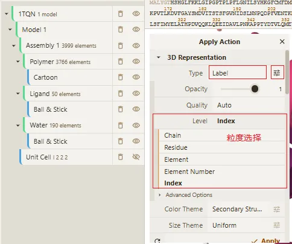

#### 4.2.2 5种标签显示模式及科研应用场景

|标签模式|中文名称|标注内容|核心科研应用场景|
|---|---|---|---|
|Chain|链标签|显示结构中各链的标识（如A、B、C链）|多链蛋白质、分子复合物分析，快速区分不同链结构|
|Residue|残基标签|显示残基名称及编号（如ALA 123、LYS 45）|活性位点标注、突变位点标记、论文配图关键残基说明|
|Element|元素标签|显示原子的元素符号（如C、H、O、N、S）|小分子配体组成分析、原子类型识别、化学键连接标注|
|Element Index|元素序号标签|显示原子的元素序号（如1、2、3）|原子级精准定位、分子动力学轨迹中原子追踪|
|Index|索引标签|显示结构组分的全局索引编号|复杂结构中特定片段快速识别、批量分析时的组分标记|

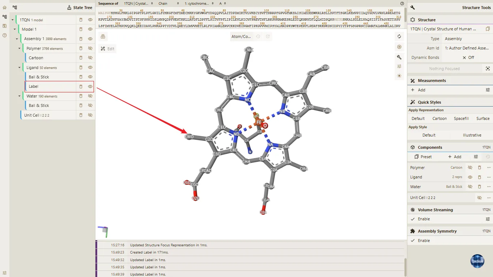

### 4.3 高斯表面显示模式设置（补充操作）

高斯表面模式（Gaussian Surface）是平台常用的表面显示模式之一，视觉柔和且能清晰呈现分子表面细节，其设置操作可沿用上述显示模式切换的核心流程，具体步骤如下，确保操作精准可落地：

- 加载目标分子结构后，找到左侧「StateTree」面板，定位到最低层级的显示节点（如当前显示的「Cartoon」「Ball & Stick」节点）；

- 右键点击该显示节点，在弹出的菜单中选择「Update Decorator」，调出主场景左上角的「3D Representation」控制弹窗；

- 在弹窗中找到「Type」下拉菜单，点击展开后，精准选择「Gaussian Surface」选项，此时3D视图区将初步显示高斯表面效果；

- 继续在该弹窗中，找到「Opacity」（透明度）调节滑块（或输入框），将透明度数值精准调整为0.4（透明度范围为0-1，0为完全透明，1为完全不透明）；

- 调整完成后，无需额外点击确认，3D视图区将实时更新高斯表面的显示效果，透明度设置立即生效，至此完成高斯表面显示模式的全部设置。

设置完成后，高斯表面将以柔和的曲面呈现分子形态，0.4的透明度可兼顾表面细节与内部结构的可见性，尤其适合叠加卡通模式或球棍模式，用于分子表面与内部二级结构、配体位置的对比分析，适配科研汇报与论文配图场景。

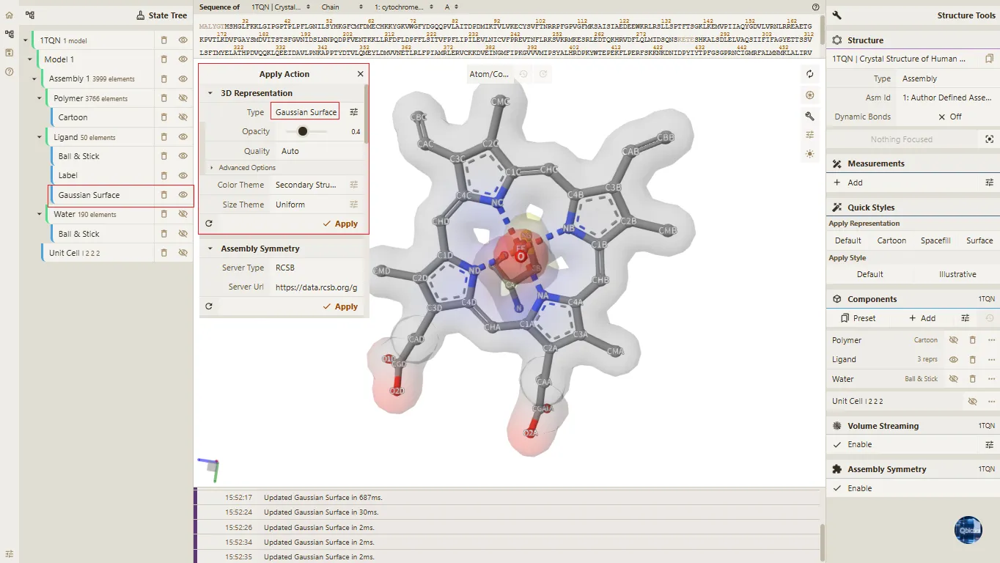

## 5. 更新材质显示模式设置（补充操作）

对已加载分子结构的材质渲染模式进行动态更新与切换，以适配不同的结构分析场景。本章节补充说明材质显示模式的高级设置与精细化操作流程，涵盖材质参数调整、多材质叠加显示及特殊场景下的显示优化，满足科研可视化的多样化需求，具体步骤如下：

- 加载目标分子结构文件后，找到左侧的「StateTree」（状态树）面板；

- 在「StateTree」面板中，定位到最低层级的显示节点（如已显示的「Ball & Stick」「Cartoon」节点）；

- 在该节点上点击鼠标右键，弹出右键菜单，选择「Update Decorator」按钮；

- 点击后，在主场景的左上角会弹出对应的显示模式控制弹窗；
  
- 点击「Type」右侧的「...」扩展按钮，展开标签精细化设置面板；
  
- 在面板中找到 「Advanced Options」高级选项，点击展开后，可查看设置参数；

- 在 「Material」选项中，可选择不同的材质设置方式：
  - 在「Material」选项的右侧有 「Presets」下拉菜单，点击展开后，可查看预设的材质参数。
  - 可以展开「Material」选项，可以使用不同的滑块调整材质参数，如「Metalness」（金属度）、「Roughness」（粗糙度）、「Bumpiness」（凹凸度）等。

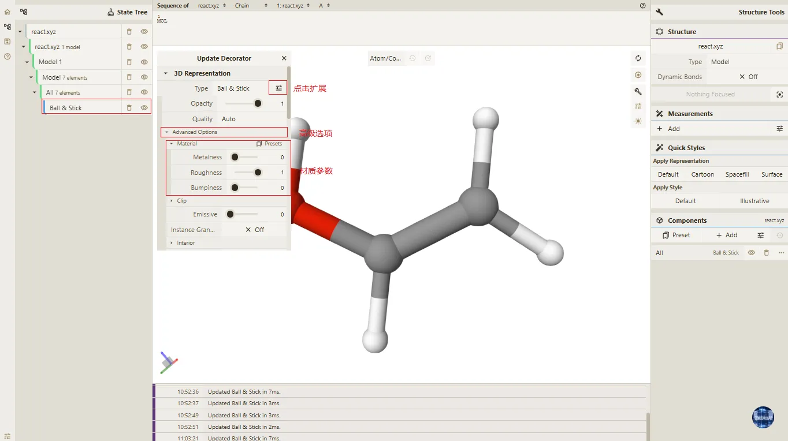

> **注意事项**
> 
> 材质显示模式切换可能会影响渲染性能，高质量模式适用于细节展示但对设备配置要求较高，建议在性能充足的设备上使用。
> 
> 多材质叠加显示时，需注意不同结构的层级关系，避免因透明度设置不当导致底层结构被遮挡。
> 
> 若调整材质后视图无变化，需检查是否选中了正确的结构 / 组件，或刷新材质缓存（重新应用设置）。
> 
> 导出图片 / 视频时，材质显示效果将与视图一致，建议在导出前确认材质设置符合展示需求。

## 6. 预设显示样式（补充操作）

为提升分子结构可视化效率，Qbics-Molstar支持对已加载的分子结构进行预设显示样式设置，可快速切换至科研常用的显示模式（如Cartoon、Spacefill等），无需手动调整各项参数，大幅简化操作流程，适配不同场景下的分子结构查看需求，具体步骤如下：

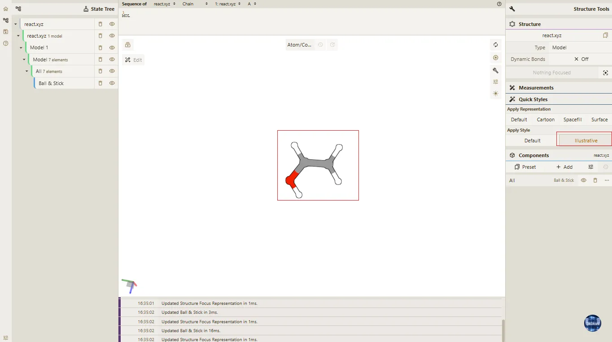

- 通过“打开文件”或拖拽文件的方式，加载目标分子结构文件，确保分子结构正常渲染，无数据缺失、显示异常；

- 在软件界面右侧，找到「Quick Styles」（预设显示样式）面板，该面板整合了各类常用预设样式，便于快速选择；

- 面板内包含多种预设显示样式，各类样式的核心特点如下，可根据实际查看需求选择适配样式：

  - **Default（默认模式）**：展示分子的默认渲染效果，可点击后重置为默认显示模式；
  
  - **Cartoon（卡通模式）**：简洁呈现分子二级结构，清晰区分螺旋、折叠等区域，适用于整体结构查看；

  - **Spacefill（空间填充模式）**：以原子半径比例展示分子空间结构，直观呈现原子间的空间位置关系；

  - **Surface（表面模式）**：展示分子的整体表面轮廓，便于观察分子的空间形态与疏水/亲水区域；

  - **Illustrative（示意模式）**：以简洁示意的方式呈现分子结构，兼顾清晰度与简洁度，适用于展示与汇报场景。

- 在「Quick Styles」面板中，点击目标预设样式，3D视图区将立即切换至该样式对应的显示模式，无需额外手动调整任何参数。

> **注意事项**
> 
> - 操作前需确保分子结构文件已完整加载并正常渲染，若结构显示异常，切换预设样式后可能出现画面错乱、细节缺失等问题；
>
> - 不同预设样式适配不同的查看场景，建议根据研究需求选择：整体结构分析优先选择Cartoon模式，空间位置分析优先选择Spacefill模式；
>
> - 切换预设样式后，若需调整细节（如颜色、透明度），可在对应样式的设置面板中手动修改，不影响预设样式的核心显示效果；
>
> - 多分子结构场景下，切换预设样式将对所有已加载的分子结构生效，无法单独设置某一分子的显示样式。

