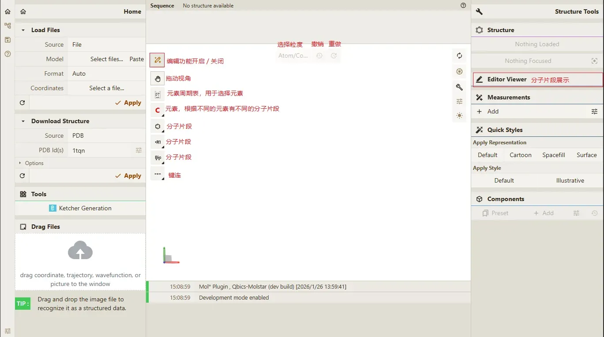
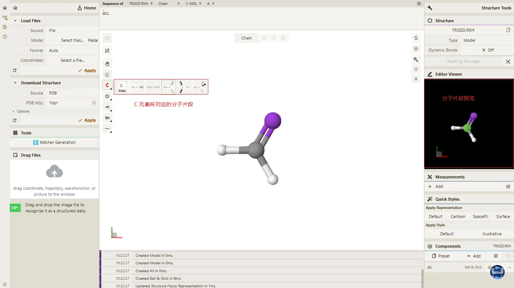
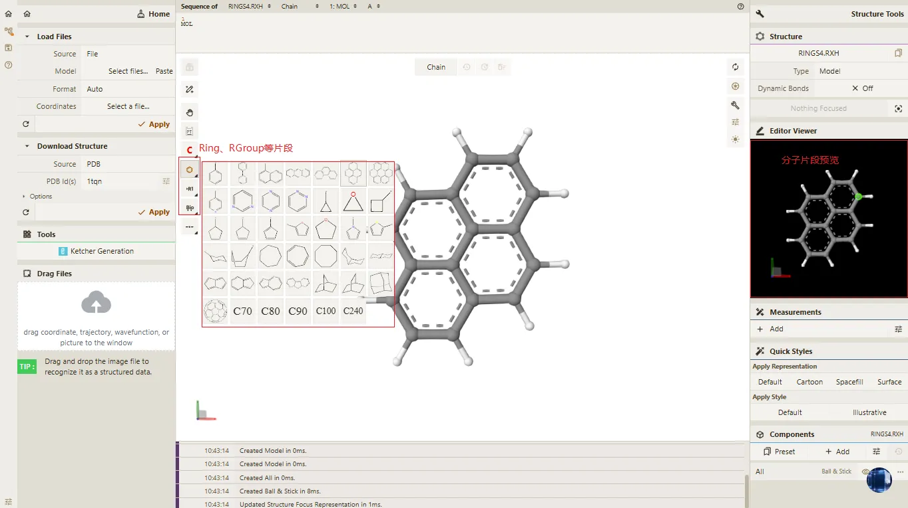
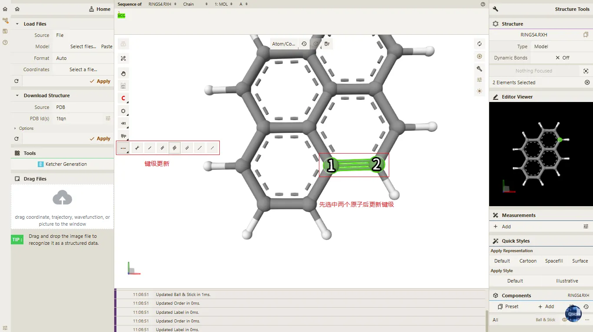
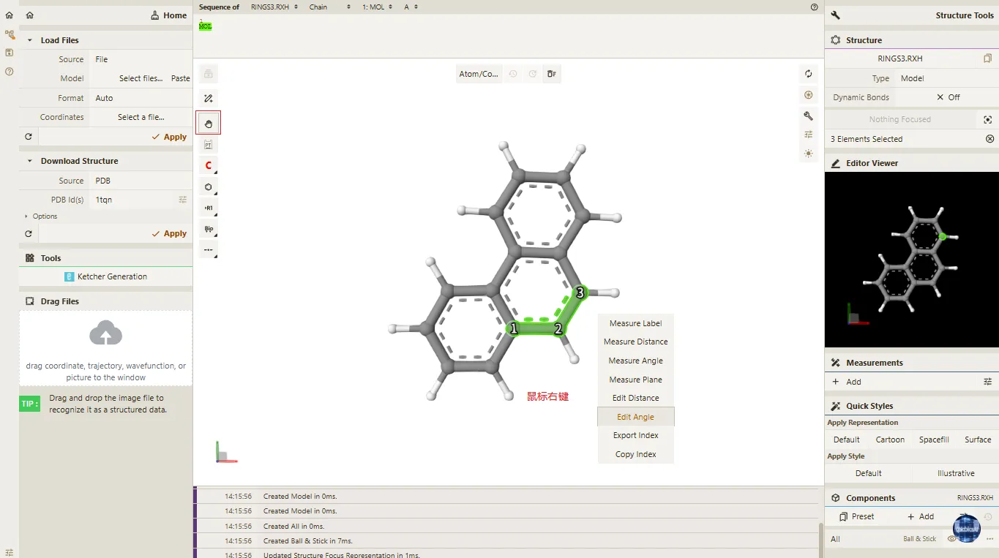
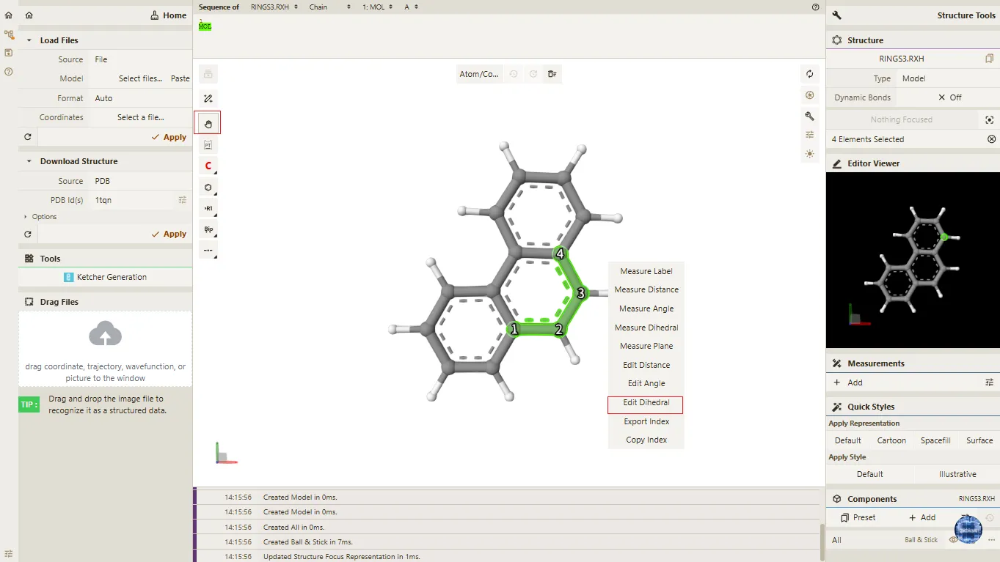

# 八、结构编辑与操作

> **Qbics-Molstar 分子可视化平台用户手册**
>
> 官方网站：[https://molstar.szbl.ac.cn/viewer](https://molstar.szbl.ac.cn/viewer)
> 
> 官方文档：[https://molstar.szbl.ac.cn/docs](https://molstar.szbl.ac.cn/docs)
> 
> 第三方文档：[https://rxht.github.io/molstar/](https://rxht.github.io/molstar/)

Qbics-Molstar 内置了完整的交互式结构编辑器（Editor），支持从零构建分子、修改已有结构、替换元素、添加基团、调整键型等操作，无需依赖外部建模软件。编辑器支持直观的可视化操作、一键片段插入和实时预览，是分子结构定制与修饰的核心工具。

## 1. 进入/退出编辑模式

- 加载任意分子结构（或直接开启编辑模式）后，点击主界面左上角的**笔形图标**，即可开启编辑器；
   
- 编辑器开启后，界面会出现专属工具栏（元素、片段、键型工具），右侧「Editor Viewer」面板同步显示可交互的结构预览；

- 再次点击笔形图标，即可关闭编辑器，退出后结构会自动保存为当前状态。

## 2. 工具栏功能详解

### 2.1 基础交互工具

- **视角工具（手形图标）**：
  - 按住鼠标左键拖动：旋转视图，从不同角度编辑结构；
  - 滚轮：缩放视图；
  - 按住`Ctrl`+鼠标左键拖动：平移视图。

- **撤销/重做**：
  - 点击顶部箭头图标，或使用快捷键：
    - `Ctrl+Z`：撤销上一步操作；
    - `Ctrl+Y`：重做已撤销操作。

- **选择粒度切换（Atom/Coarse Element）**：
  - `Atom/Coarse Element`模式：框选以单个原子为单位；
  - `Residue/Chain`模式：框选以残基/链为单位，适合大分子快速选择。

- **选择工具（选择框）**：
  - 按住`Shift`+鼠标左键拖动：框选结构中的原子、残基/链等元素；
  - 支持多选、删除选中元素等操作。

### 2.2 原子与元素操作

- **快捷元素按钮（C、N、O等）**：
  - 点击后，后续添加原子默认使用该元素；
  - 二次点击后可切换基于该元素的分子片段；

- **元素周期表工具**：
  - 点击周期表图标，弹窗显示完整元素周期表，可在元素周期表中选择任意元素（包括金属、卤素等）；
  - 选择元素后元素周期表弹窗自动关闭，快捷元素按钮会切换为选中元素。

### 2.3 片段与键型工具

- **分子片段按钮**：
  - 提供苯环、Rings、RGroups、Biofrags等分子片段；
  - 点击后，可直接在3D视图中放置对应的分子片段，一键插入结构中，快速构建或修饰骨架。
  - 二次点击可切换苯环、Rings、RGroups、Biofrags等片段；

- **键连工具**：
  - 支持切换单键、双键、三键；
  - 点击两个原子，即可按当前键型创建/修改连接，适配双键异构、配位键构建等场景。

## 3. 核心编辑流程

### 3.1 从零构建分子

- 开启编辑器，在工具栏选择目标元素（如C）；
- 在空白视图中点击，即可添加该元素的原子；
- 切换键型工具（如单键），点击两个原子，创建化学键；
- 如需添加其他基团，点击片段按钮，插入苯环/Rings等模板；
- 调整视角并检查结构，完成后关闭编辑器。

### 3.2 修改已有结构

- 加载结构文件并开启编辑器；
- 选择要修改的原子：
  - 单个原子：直接点击；
  - 多个原子：按住`Shift`+鼠标拖动框选；
  
- 进行修改：
  - 替换元素：点击工具栏中的目标元素，再点击结构上的原子；
  - 拼接片段：选择好片段后，点击结构上的原子，即可拼接该片段；
  - 删除原子：选中后按`Delete`；
  - 修改键型：选中键，再点击工具栏的键型图标；
  
- 操作过程中可随时使用撤销/重做，调整至满意状态。

> **注意事项**
> - 编辑器操作会直接修改当前结构，建议修改前先备份原始文件；
> - 片段插入和键型修改需符合化学合理性，避免生成无实际意义的结构；
> - 编辑完成后，建议通过「导出」功能保存为新文件，方便后续使用。

## 4. 编辑：使用快捷元素功能

本节详细介绍如何通过编辑器的快捷元素功能，完成原子的快速添加、替换及分子片段切换操作，适配基础分子结构编辑场景，操作流程简洁高效，具体步骤如下：

- **开启编辑模式**：加载任意待编辑的分子结构文件；若需从零构建分子，可直接点击主界面左上角的笔形图标，开启结构编辑器，正式进入编辑模式。进入编辑模式后，界面将自动显示快捷元素工具栏及右侧「Editor Viewer」预览面板。

- **选择快捷元素并查看预览**：编辑器开启后，找到界面中的快捷元素工具栏，该工具栏默认包含C（碳）、N（氮）、O（氧）等常用元素按钮。用鼠标左键点击目标快捷元素按钮（如C），右侧「Editor Viewer」面板会同步显示该元素对应的分子片段3D模型，便于直观查看元素形态及相关片段结构。

- **切换元素对应的分子片段**：若需查看当前选中元素的其他分子片段，用鼠标左键二次点击该快捷元素按钮，即可循环切换基于该元素的所有分子片段，切换后「Editor Viewer」面板会实时更新预览内容，方便选择所需片段。

- **添加元素原子**：确认选中目标快捷元素后，将鼠标移动至右侧3D视图的空白区域，用鼠标左键点击空白处，即可在该位置直接添加一个当前选中元素的分子片段。

- **替换原子并接入片段**：若需替换分子结构中已有的原子，先点击快捷元素工具栏中的目标元素按钮（如C），确认元素选中后，将鼠标移动至3D视图中需要替换的原子上，用鼠标左键点击该原子，即可快速将其替换为当前选中的快捷元素，替换后原子的颜色、半径会自动适配新元素，化学键连接关系保持不变。**请注意，此操作并非仅替换元素符号，而是将整个分子片段嫁接至目标位点。**

- **完善结构编辑**：按照步骤2至步骤6的操作，可依次切换快捷元素工具栏中的不同元素，重复添加或替换原子的操作；同时可配合工具栏中的键型工具、分子片段插入工具，调整化学键类型、插入所需分子片段，逐步完善分子结构。

- **关闭编辑器并保存**：所有编辑操作完成后，再次点击主界面左上角的笔形图标，即可关闭编辑器、退出编辑模式。退出后，编辑后的分子结构会自动保存为当前状态，无需手动进行额外保存操作，后续可直接对该结构进行其他操作（如结构分析、导出等）。

提示：若需使用快捷元素工具栏默认未显示的元素（如金属、卤素、稀有气体等），可点击快捷元素工具栏中的「元素周期表图标」，此时会弹出完整的元素周期表弹窗；在弹窗中用鼠标左键点击任意所需元素，弹窗会自动关闭，同时工具栏的快捷元素按钮会切换为选中的元素，方便后续快速调用该元素进行编辑操作。

> **注意事项:**
> 
> - 切换分子片段时，需确保是对当前选中的快捷元素按钮进行二次点击，单次点击仅会选中元素，不会触发片段切换。
> 
> - 添加原子时，需点击3D视图的空白区域；若误点击现有原子，会触发原子替换操作，若出现误操作，可使用快捷键Ctrl+Z撤销上一步操作。
> 
> - 元素替换后，部分原子的键长、键角会自动适配调整，若出现结构畸变，可后续通过结构优化功能修正，确保结构的化学合理性。
> 
> - 使用元素周期表切换元素后，快捷元素工具栏会默认显示最后一次选中的元素，再次点击该按钮即可快速调用，无需重复打开元素周期表。
> 

## 5. 编辑：使用分子片段功能

Qbics-Molstar编辑器内置标准化分子片段模板库，聚焦**多原子成键的完整分子片段**调用，支持模板快速切换、3D模型可视化预览及一键插入/嫁接操作。区别于快捷元素的单原子/基础元素片段操作，本功能可高效完成官能团嫁接、生物片段嵌入、特征骨架构建等进阶结构编辑，适配复杂分子结构的快速修饰与搭建，具体操作流程及规范如下：

- **开启编辑模式**：加载任意待编辑的分子结构文件；若需从零构建分子，可直接点击主界面左上角的笔形图标，开启结构编辑器，正式进入编辑模式。进入编辑模式后，界面将自动显示编辑工具栏及右侧「Editor Viewer」预览面板。

- **切换分子片段模板类型**：编辑器支持四类预制分子片段模板，点击编辑工具栏中对应模板的专属图标，即可一键切换至目标片段模板类型，每类模板均为多原子成键的完整结构，切换后模板自动激活，右侧预览面板同步更新，具体分类如下：

   - 元素周期表元素对应分子片段模板：与快捷元素联动的多原子基础片段，为该元素的典型成键片段，区别于快捷元素的单原子操作；
   - Rang分子片段模板：点击工具栏中的**Rang**图标，即可切换至该类专用片段模板；
   - RGroup分子片段模板：点击工具栏中的**RGroup**图标，即可切换至该类专用片段模板；
   - Biological分子片段模板：点击工具栏中的**Biological**图标，即可切换至生物相关专用片段模板。

- **预览分子片段3D结构**：选定目标分子片段模板后，右侧「Editor Viewer」面板将实时同步显示该模板对应的分子片段3D模型，可通过鼠标对模型进行旋转、平移、缩放操作，直观查看片段的原子排布、键连方式及空间结构特征。

- **执行分子片段编辑操作**：确认选中目标分子片段模板后，在主界面3D视图区域执行操作，完成片段的插入或嫁接，操作逻辑为完整片段的整体调用，非单原子操作，具体方式如下：
   - 片段空白插入：将鼠标移至3D视图的空白位置，点击鼠标左键，即可在该位点整体插入当前选中的分子片段，形成独立的多原子结构片段；
   - 片段位点嫁接：将鼠标移至3D视图中现有结构的目标原子上，点击鼠标左键，即可将该原子位点作为连接锚点，将当前选中的分子片段整体嫁接至该位点，片段其余原子将按自身固有键连方式自动接入现有分子结构，完成整体结构的修饰。

- **多片段组合编辑**：根据分子结构搭建需求，重复执行上述模板切换、片段预览、编辑操作步骤，依次切换不同类型的分子片段模板，多次进行片段插入或嫁接操作；同时可配合编辑器的快捷元素、键型调整等功能，对片段衔接处的结构进行补充修饰，逐步完善复杂分子结构至目标状态。

- **退出编辑模式并保存**：所有分子片段编辑操作完成后，再次点击主界面左上角的笔形图标，即可退出编辑器功能界面。编辑后的分子结构将自动保存为当前状态，无需手动额外保存，后续可直接对该结构进行结构分析、文件导出、进一步优化等操作。

> **注意事项**
> 
> - 切换片段模板时，需精准点击工具栏对应模板的专属图标，模板切换成功后右侧预览面板会同步更新3D模型，需确认片段类型无误后再执行后续操作。
> 
> - 片段插入/嫁接的位点由鼠标点击位置决定，操作前建议提前调整3D视图角度，精准定位目标位置，确保片段接入的空间合理性。
> 
> - 支持**Shift + 鼠标左键**框选多个原子，可实现多个位点的分子片段批量嫁接，有效提升复杂分子结构的编辑效率。
> 
> - 若需删除已插入/嫁接的分子片段，选中片段中的任意一个原子，按下键盘**Delete**键，即可实现整个分子片段的移除，区别于单原子删除操作。
> 
> - 编辑过程中若出现误操作，可使用快捷键**Ctrl + Z**撤销最近的片段操作，或通过**Ctrl + Y**重做已撤销的操作，灵活调整编辑步骤。
> 
> - 分子片段嫁接后，若片段与原有结构的衔接处出现键连异常或空间结构畸变，可后续通过平台的结构优化功能进行修正，确保整体分子结构的化学合理性。

## 6. 编辑：使用键型功能

Qbics-Molstar编辑器内置专业的键型编辑功能，支持分子结构中**化学键级修改**与**键长精准调整**，可实现单键、双键、三键的快速切换及键长数值的自定义设置，适配分子结构成键规律修正、化学键参数优化等精细化编辑场景，具体操作流程及规范如下：

- **开启编辑模式**：加载任意待编辑的分子结构文件；若需对新建分子进行键型设置，可直接点击主界面左上角的笔形图标，开启结构编辑器，正式进入编辑模式。进入编辑模式后，界面将自动显示编辑工具栏及右侧「Editor Viewer」预览面板。
   
- **选择键型编辑目标**：在主界面3D视图区域，精准选中需要进行键型编辑的**两个成键原子**，可通过鼠标左键依次点击两个原子完成选中，选中后原子将高亮显示，确认选中的原子为目标成键对后，进行后续键型编辑操作。

- **执行键级修改操作**：完成目标成键原子的选中后，点击编辑工具栏中的**键连按钮**，即可快速修改该化学键的键级信息，实现单键、双键、三键的一键切换，键级修改后，3D视图中化学键的显示样式将同步更新，直观呈现键级变化。

- **执行键长调整操作**：完成目标成键原子的选中后，在3D视图区域点击鼠标右键，在弹出的右键菜单中选择**Edit Distance**选项，打开键长编辑对话框，具体操作如下：
   - 先在对话框中设置两个原子的更新类型，Atom1和Atom2均支持**Translate Group**（所在原子组整体移动）、**Translate Atom**（仅该原子移动，其余原子固定）、**Fixed**（原子组整体不移动）三种类型，按需选择即可；
   - 再在对话框中输入新的键长数值，单位为**Å**，输入完成后确认设置，即可完成键长的精准调整，3D视图中将实时展示调整后的化学键长度。

- **多部位键型批量编辑**：根据分子结构的键型优化需求，重复执行上述原子选中、键级修改/键长调整的操作步骤，依次对结构中不同的化学键进行编辑；可配合编辑器的快捷元素、分子片段等功能，完成键型与分子结构的协同优化，确保整体结构的成键合理性。

- **退出编辑模式并保存**：所有键型编辑操作完成后，再次点击主界面左上角的笔形图标，即可退出编辑器功能界面。编辑后的分子结构将自动保存为当前状态，无需手动额外保存，后续可直接对该结构进行结构分析、文件导出、进一步优化等操作。

> **注意事项**
> 
> - 在键型编辑操作时，先激活拖动视角（小手图标）按钮，确保在后续选中原子时不会触发编辑功能。
> 
> - 键级修改与键长调整操作的前提为精准选中**两个成键原子**，未选中原子或选中原子数多于两个时，无法触发相关编辑功能。
> 
> - 调整键长时，需根据分子的化学成键规律输入合理的数值，避免因键长设置异常导致分子结构畸变。
>
> 
> - 选择原子更新类型时，若需保持分子骨架稳定，建议将非调整侧的原子设置为**Fixed**模式，仅对目标原子/原子组进行移动。
> 
> - 支持**Shift + 鼠标左键**框选多组成键原子，配合键型编辑功能实现多部位键级/键长的批量调整，提升编辑效率。
> 
> - 编辑过程中若出现误操作，可使用快捷键**Ctrl + Z**撤销最近的键型操作，或通过**Ctrl + Y**重做已撤销的操作，灵活调整编辑步骤。
> 
> - 键型编辑完成后，可通过3D视图的旋转、缩放操作，多角度检查化学键的显示状态，确认键级与键长设置符合编辑需求。

## 7. 编辑：使用键角度功能

Qbics-Molstar编辑器内置精准的键角度编辑功能，支持分子结构中**键角数值的自定义修改**，可通过选择目标原子、设置原子更新类型、输入键角数值完成精细化调整，适配分子空间结构优化、成键角度修正等专业编辑场景，具体操作流程及规范如下：

- **开启编辑模式**：加载任意待编辑的分子结构文件；若需对新建分子进行键角度设置，可直接点击主界面左上角的笔形图标，开启结构编辑器，正式进入编辑模式。进入编辑模式后，界面将自动显示编辑工具栏及右侧「Editor Viewer」预览面板。
   
- **选择键角度编辑目标**：在主界面3D视图区域，精准选中需要进行键角度编辑的**三个成键原子**，按成键连接顺序依次点击三个原子完成选中，选中后原子将高亮显示，确认选中的原子为目标键角对应的原子组后，进行后续键角度编辑操作。
   
- **打开键角度编辑对话框**：完成三个目标原子的选中后，在3D视图区域点击鼠标右键，在弹出的右键菜单中选择**Edit Angle**选项，打开键角度编辑对话框，准备进行原子更新类型设置与键角数值输入。

- **设置原子更新类型**：在键角度编辑对话框中，分别为选中的Atom1、Atom2、Atom3设置更新类型，不同原子支持的更新类型不同，按需选择即可：
   
   - **Atom1**：支持**Rotate Group**（所在原子组整体旋转）、**Rotate Atom**（仅该原子旋转，其余原子固定）、**Fixed**（原子组整体不移动）、**Translate Group**（所在原子组整体移动）；
   
   - **Atom2**：支持**Translate Group**（所在原子组整体移动）、**Translate Atom**（仅该原子移动，其余原子固定）、**Fixed**（原子组整体不移动）；
   
   - **Atom3**：支持**Rotate Group**（所在原子组整体旋转）、**Rotate Atom**（仅该原子旋转，其余原子固定）、**Fixed**（原子组整体不移动）、**Translate Group**（所在原子组整体移动）。

- **输入数值并完成键角度调整**：完成所有原子更新类型的设置后，在对话框的数值输入框中输入新的键角数值，确认输入数值无误后点击确认按钮，即可完成键角度的精准调整，3D视图中将实时展示调整后的分子键角状态。

- **多部位键角度批量编辑**：根据分子结构的空间优化需求，重复执行上述原子选中、打开对话框、设置更新类型、输入数值的操作步骤，依次对结构中不同的键角进行编辑；可配合编辑器的键型、分子片段等功能，完成键角度与分子整体结构的协同优化，确保结构的空间合理性。

- **退出编辑模式并保存**：所有键角度编辑操作完成后，再次点击主界面左上角的笔形图标，即可退出编辑器功能界面。编辑后的分子结构将自动保存为当前状态，无需手动额外保存，后续可直接对该结构进行结构分析、文件导出、进一步优化等操作。

> **注意事项**
> 
> - 在键角度编辑操作时，先激活拖动视角（小手图标）按钮，确保在后续选中原子时不会触发编辑功能。
> 
> - 键角度编辑操作的前提为精准选中**三个成键原子**，未按顺序选中原子、选中原子数非三个时，无法触发键角度编辑功能。
> 
> - 选择原子更新类型时，需根据分子结构优化需求合理设置，建议将需固定的分子骨架对应原子设置为**Fixed**模式，避免整体结构偏移。
> 
> - 输入键角数值时，需结合分子的化学成键规律与空间位阻特点设置合理数值，避免因键角异常导致分子结构不稳定。
> 
> - 支持**Shift + 鼠标左键**框选多组键角对应的原子组，配合键角度编辑功能实现多部位键角的批量调整，提升复杂结构的编辑效率。
> 
> - 编辑过程中若出现误操作，可使用快捷键**Ctrl + Z**撤销最近的键角度操作，或通过**Ctrl + Y**重做已撤销的操作，灵活调整编辑步骤。
> 
> - 键角度调整完成后，可通过3D视图的旋转、平移、缩放操作，多角度检查键角的空间状态，确认键角数值设置符合编辑需求。
> 
> - 多组键角连续编辑后，建议对整体分子结构进行可视化校验，查看原子排布与空间连接是否合理，避免局部调整引发整体结构畸变。

## 8. 编辑：使用键二面角功能

Qbics-Molstar编辑器内置专业的键二面角编辑功能，支持分子结构中**键二面角数值的自定义修改**，可通过选择目标原子、设置原子更新类型、输入二面角数值完成空间构象的精细化调整，适配分子立体结构优化、构象特征修正等专业编辑场景，具体操作流程及规范如下：

- **开启编辑模式**：加载任意待编辑的分子结构文件；若需对新建分子进行键二面角设置，可直接点击主界面左上角的笔形图标，开启结构编辑器，正式进入编辑模式。进入编辑模式后，界面将自动显示编辑工具栏及右侧「Editor Viewer」预览面板。

- **选择键二面角编辑目标**：在主界面3D视图区域，精准选中需要进行键二面角编辑的**四个成键原子**，按成键连接顺序依次点击四个原子完成选中，选中后原子将高亮显示，确认选中的原子为目标键二面角对应的原子组后，进行后续键二面角编辑操作。

- **打开键二面角编辑对话框**：完成四个目标原子的选中后，在3D视图区域点击鼠标右键，在弹出的右键菜单中选择**Edit Dihedral**选项，打开键二面角编辑对话框，准备进行原子更新类型设置与二面角数值输入。

- **设置原子更新类型**：在键二面角编辑对话框中，分别为选中的Atom1、Atom4设置更新类型，不同原子支持的更新类型一致，按需选择即可：

   - **Rotate Groups**：将原子所在的所有原子组整体旋转；
   - **Rotate Group**：将原子所在的原子组整体旋转；
   - **Rotate Atom**：将该原子的位置进行旋转，所在原子组其余原子固定不动；
   - **Fixed**：将原子所在的原子组整体设置为不移动状态。

- **输入数值并完成键二面角调整**：完成所有原子更新类型的设置后，在对话框的数值输入框中输入新的键二面角数值，确认输入数值无误后点击确认按钮，即可完成键二面角的精准调整，3D视图中将实时展示调整后的分子立体构象状态。

- **多部位键二面角编辑**：根据分子结构的立体构象优化需求，重复执行上述原子选中、打开对话框、设置更新类型、输入数值的操作步骤，依次对结构中不同的键二面角进行编辑；可配合编辑器的键型、键角度、分子片段等功能，完成键二面角与分子整体立体结构的协同优化，确保结构的空间构象合理性。

- **退出编辑模式并保存**：所有键二面角编辑操作完成后，再次点击主界面左上角的笔形图标，即可退出编辑器功能界面。编辑后的分子结构将自动保存为当前状态，无需手动额外保存，后续可直接对该结构进行结构分析、文件导出、进一步优化等操作。

> **注意事项**
> 
> - 在键二面角编辑操作时，先激活拖动视角（小手图标）按钮，确保在后续选中原子时不会触发编辑功能。
> 
> - 键二面角编辑操作的前提为精准选中**四个成键原子**，未按连接顺序选中原子、选中原子数非四个时，无法触发键二面角编辑功能。
> 
> - 选择原子更新类型时，需根据分子立体构象的优化需求合理设置，建议将需固定的分子骨架对应原子设置为**Fixed**模式，避免整体构象偏移。
> 
> - 输入键二面角数值时，需结合分子的空间位阻、成键规律及立体化学特征设置合理数值，避免因二面角异常导致分子构象不稳定。
> 
> - 支持**Shift + 鼠标左键**框选多组键二面角对应的原子组，配合键二面角编辑功能实现多部位二面角的批量调整，提升复杂分子构象的编辑效率。
> 
> - 编辑过程中若出现误操作，可使用快捷键**Ctrl + Z**撤销最近的键二面角操作，或通过**Ctrl + Y**重做已撤销的操作，灵活调整编辑步骤。
> 
> - 键二面角调整完成后，可通过3D视图的旋转、平移、缩放操作，从不同空间角度检查分子构象状态，确认二面角数值设置符合编辑需求。
> 
> - 多组键二面角连续编辑后，需对整体分子的立体结构进行可视化校验，查看原子排布、空间连接及构象特征是否合理，避免局部调整引发整体构象畸变。
> 