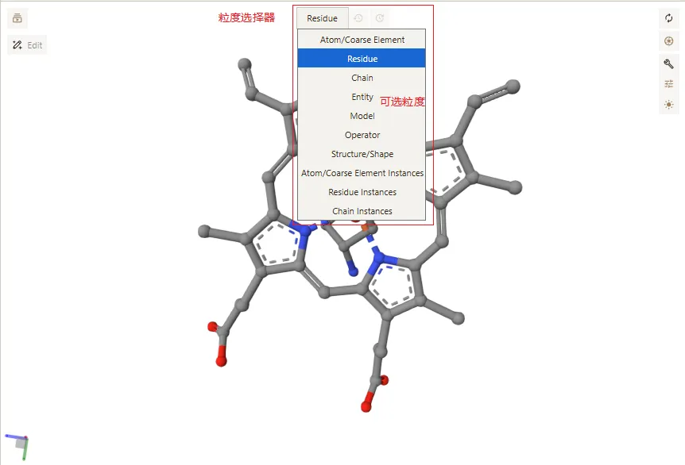
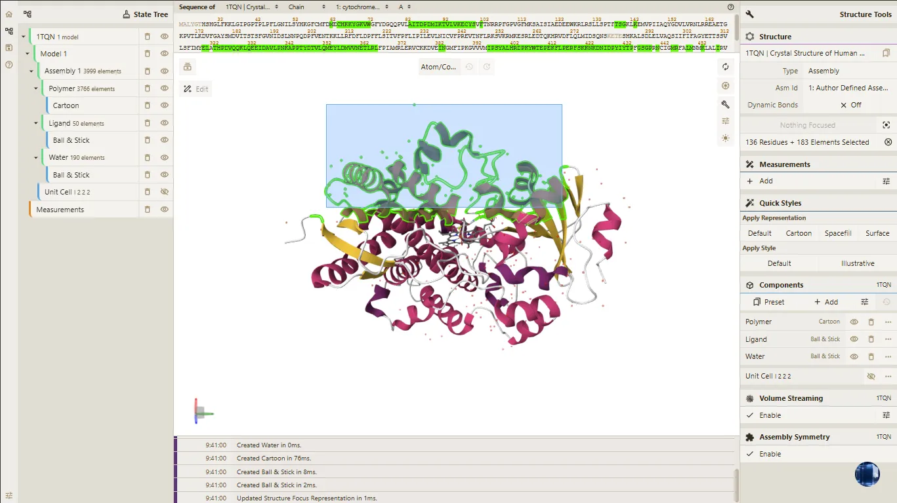
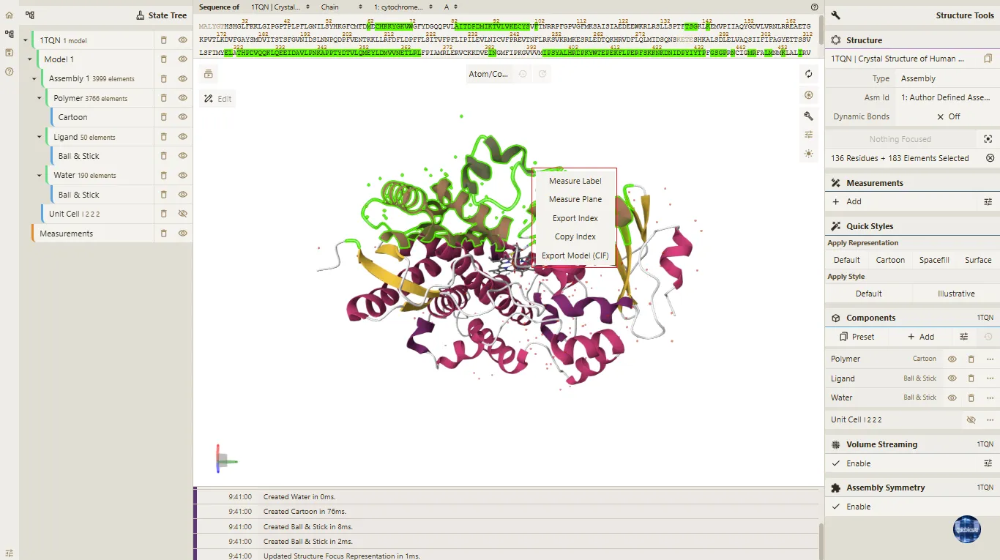
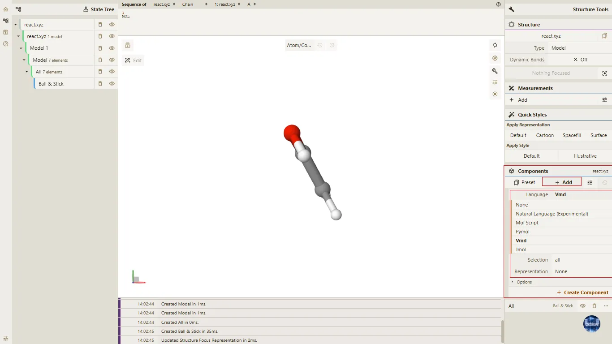
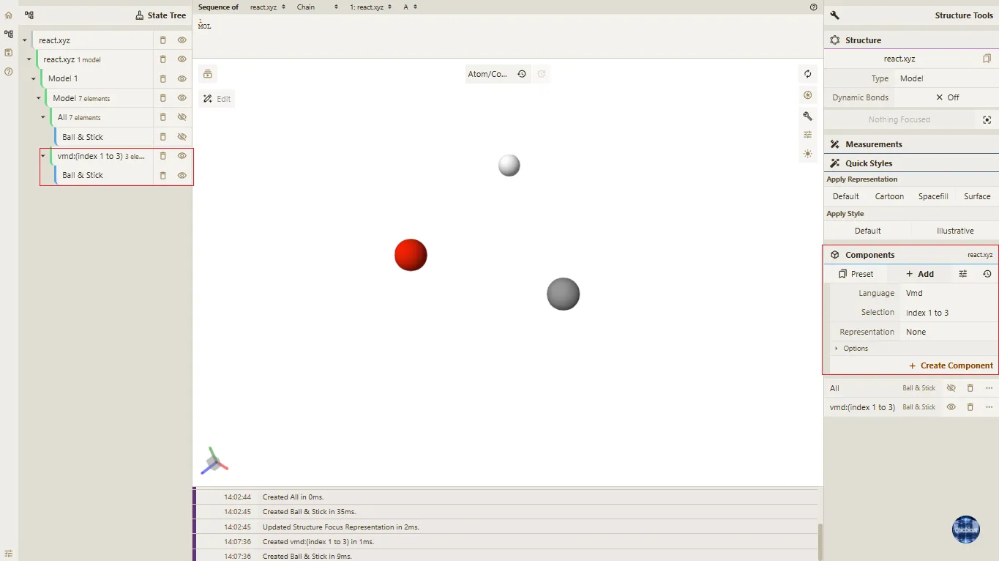
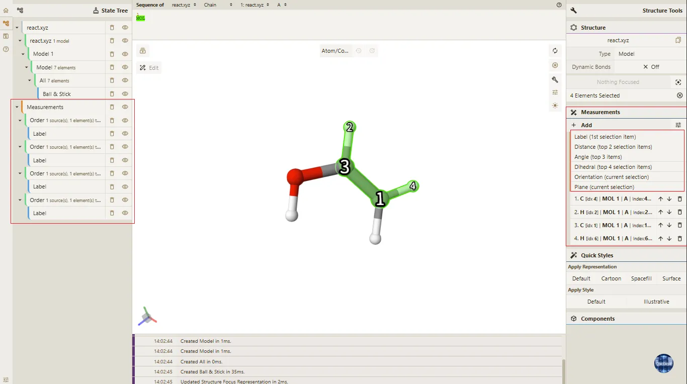
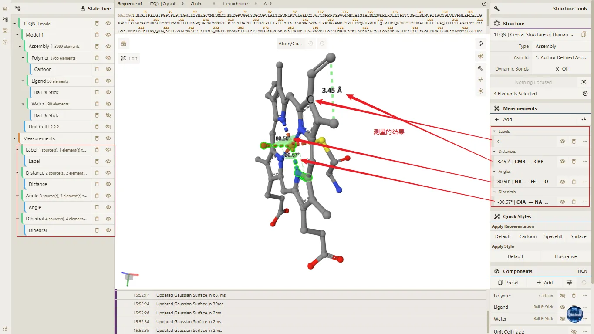

# 六、结构选择与测量

> **Qbics-Molstar 分子可视化平台用户手册**
>
> 官方网站：[https://molstar.szbl.ac.cn/viewer](https://molstar.szbl.ac.cn/viewer)
> 
> 官方文档：[https://molstar.szbl.ac.cn/docs](https://molstar.szbl.ac.cn/docs)
> 
> 第三方文档：[https://rxht.github.io/molstar/](https://rxht.github.io/molstar/)

结构选择与测量是科研人员进行分子结构量化分析的核心步骤，平台支持原子、残基、链、配体等不同层级的精准选择，以及距离、角度、二面角等关键参数的测量与标注，数据精度符合科研规范，可直接用于论文数据呈现与分析。以下详细介绍选择与测量功能的操作方法及相关说明：

## 1. 不同粒度选择操作

在Qbics-Molstar平台进行分子结构分析时，选择粒度的设置直接决定鼠标在3D视图区移入（悬停）或点击时的选中范围，不同粒度对应不同的选中精度与层级，适配从整体模型筛选到原子级细节选择的全科研场景。以下聚焦10种核心选择粒度的设置操作及对应选区范围，确保描述精准、逻辑清晰，贴合平台实际交互逻辑。

### 1.1 粒度选择操作步骤

- 加载目标分子结构后，定位到3D视图区域顶部的「Selection Granularity」粒度切换选择器；

- 鼠标点击该选择器，将弹出下拉弹窗，弹窗内包含10种核心选择粒度（Atom/Coarse Element、Residue、Chain、Entity、Model、Operator、Structure/Shape、Atom/Coarse Element Instances、Residue Instances、Chain Instances）；

- 在下拉弹窗中，点击选择目标粒度，弹窗将自动关闭，无需额外确认；

- 设置立即生效，鼠标在3D视图区的移入（悬停）、点击选中范围将同步更新，可通过鼠标悬停快速验证设置效果。

**粒度切换选择器及下拉弹窗演示**

### 1.2 各选择粒度对应的选区范围

以下仅明确10种选择粒度的核心选区范围，精准匹配平台实际操作，明确区分各粒度差异，便于科研人员根据需求选择合适粒度：

- **Atom/Coarse Element（原子/粗粒元素粒度）**：选区范围为单个原子或粗粒化元素节点，仅包含单个原子本身或对应的粗粒化元素单元，不扩展至相邻原子或其他结构组分。

- **Residue（残基粒度）**：选区范围为单个残基，包含该残基内的所有原子、化学键，仅局限于单个残基本身，不扩展至所属链，也不细化至单个原子。

- **Chain（链粒度）**：选区范围为整个分子链，包含该链内的所有残基、原子、化学键，覆盖整条链的全部结构，不区分链内的细分残基或原子。

- **Entity（实体粒度）**：选区范围为单个结构实体，即结构中具有独立功能或属性的完整组分，如单个聚合物、单个配体、全部水分子集合、全部离子集合等。

- **Model（模型粒度）**：选区范围为整个加载的分子模型，包含模型内的所有实体、链、残基、原子等全部结构组分，是选区范围最广的粒度。

- **Operator（操作子粒度）**：选区范围为单个操作子对应的全部结构，即模型组装过程中单个操作单元（如对称操作）所生成的所有结构组分。

- **Structure/Shape（结构/形状粒度）**：选区范围为分子结构的整体或局部空间形状，聚焦结构的形态特征，不区分具体的原子、残基等细分结构。

- **Atom/Coarse Element Instances（原子/粗粒元素实例粒度）**：选区范围为单个原子或粗粒化元素的具体实例，仅针对某一个相同原子/粗粒元素的实例，不包含其他相同元素的实例（适用于存在多个相同原子/粗粒元素实例的结构）。

- **Residue Instances（残基实例粒度）**：选区范围为单个残基的具体实例，仅针对某一个相同残基的实例，不包含其他相同残基的实例（适用于存在多个相同残基实例的结构）。

- **Chain Instances（链实例粒度）**：选区范围为单个链的具体实例，仅针对某一个相同链的实例，不包含其他相同链的实例（适用于存在多个相同链实例的结构）。

## 2. 框选选择结构（原子、残基、链、配体）

Qbics-Molstar 支持通过 **框选（矩形选择）** 方式，在 3D 视图中快速、精准地选中目标结构区域，可灵活选择原子、残基、链、配体等不同层级的分子对象，为后续结构分析、样式调整、数据导出等操作提供基础，大幅提升结构筛选效率，具体操作步骤如下：

- 通过 “打开文件” 或拖拽文件的方式，加载目标分子结构文件，确保分子结构正常渲染，无数据缺失、显示异常。

- 在 「State Tree」 面板中隐藏或删除不进行框选的结构层级，避免框选结果中包含不需要的对象。

- 在 3D 主视图中，按住 `Shift` 键的同时 **长按鼠标左键并拖动**，绘制矩形选择框，框选需要选中的目标结构区域。

- 在鼠标拖动过程中，系统将实时更新选中区域并高亮框选范围内的对应结构对象（原子/残基/链/配体），确保框选范围与目标结构区域一致。

- 松开鼠标左键后，高亮的结构对象（原子/残基/链/配体）即为选中内容。

- 框选完成后点击空白区域，即可取消当前框选结果。

- 选中目标结构后，可点击鼠标右键，弹出右键菜单，可以选择对应的操作（例如：Export Index、Export Model (CIF)、测量等）。

> **注意事项**
>
> - 框选时需确保选择框完整覆盖目标结构。
>
> - 在 **编辑模式** 下也可进行框选选择原子。
>
> - 若需清空当前选择，可在 3D 视图空白处点击鼠标左键，即可取消当前框选结果。
>

## 3. 使用脚本/自然语言选择结构并创建 Representation

Qbics-Molstar 支持通过**脚本查询（VMD / MolScript / Pymol / Jmol）**与**自然语言查询**两种方式，快速筛选指定结构区域并自动创建可视化表现（Representation），可精准定位原子、残基、链、配体、溶剂等对象，大幅提升结构筛选与展示效率，操作步骤如下。

- 导入分子结构文件，确保结构正常渲染。
  
- 在右侧 **Components** 面板中，点击 **Add** 按钮。
  
- 在弹出的菜单中选择 **Language**，并选择对应脚本类型：
  
  - **Mol Script**: 用于Molstar平台的脚本语言，支持原子、残基、链、配体等层级的精准选择。
  - **VMD**: 用于可视化分析的脚本语言，支持原子、残基、链、配体等层级的精准选择。
  - **Pymol**: 用于分子可视化分析的脚本语言，支持原子、残基、链、配体等层级的精准选择。
  - **Jmol**: 用于分子可视化分析的脚本语言，支持原子、残基、链、配体等层级的精准选择。
  - **Natural Language**: 用于中文描述结构区域，支持常用结构描述，如水分子、显示原子1-52等。
  
- 方式1：脚本查询方式（VMD / MolScript / Pymol / Jmol）
  - 在脚本输入框中输入筛选语句，示例：
    - VMD：`index > 20`、`index 20 to 50`、`water`、`protein`

- 方式2：自然语言查询方式（Natural Language）
  - 在脚本输入框中输入筛选语句，示例：
    - `水分子`、`显示原子1-52`、`所有氧原子`

- 在 **Representation** 下拉选项中，选择所需表现形式（如 Ball & Stick、Surface、Cartoon 等）。

- 点击 **Create Component**，系统自动筛选匹配区域并创建组件。

> **注意事项**
> - 多结构场景下，查询仅对 **Structure** 模块中**加粗选中**的结构生效。
> - 脚本语法必须符合对应工具（VMD / Pymol 等）的标准规范，语法错误将导致查询无结果。
> - 自然语言查询支持常用结构描述，描述越具体，筛选结果越准确。
> - 查询生成的组件可在 **Components** 面板中单独控制显示、隐藏、删除或修改表现形式。
> - 轨迹文件与常规结构文件均支持脚本查询与自然语言查询功能。
> - 执行查询前建议关闭无关结构，避免画面杂乱影响结果查看。
> - 若查询无结果，检查结构是否选中、语法是否正确、描述是否准确。

## 4. 距离、角度、二面角的测量与标注

Qbics-Molstar平台的「Measurements」（测量）模块支持距离、角度、二面角的精准量化与标注，同时可通过标签功能补充结构信息，所有操作需结合选择粒度完成，测量结果实时显示且支持自定义标注样式，适配原子级相互作用分析、结构构象验证等科研场景。

### 4.1 测量功能通用操作前提

- 激活测量模块：点击平台右侧「Measurements」面板中的「+ Add」按钮，展开测量功能菜单（包含Label、Distance、Angle、Dihedral等选项）；

- 设置选择粒度：通过3D视图顶部的「Selection Granularity」选择器，根据测量需求选择对应粒度（原子级测量优先选择「Atom」粒度）；

- 选择测量对象：在3D视图区按测量类型要求，选中对应数量的目标结构（如距离测量选2个原子、角度测量选3个原子），选中后结构将高亮显示；

- 执行测量标注：在「Measurements」菜单中点击对应测量功能，平台将自动计算结果并在3D视图中标注显示。

### 4.2 核心测量功能操作流程

**原子标签（Label）**：

用于在原子旁标注元素名称（如「C」「O」等），辅助原子识别、结构注释，选择粒度选择器设置为「Atom」粒度。
        
- 在3D视图区，用鼠标左键点击单个目标原子（需标注的原子）；

- 点击「Measurements」模块下的「+ Add」按钮，选择「Label (1 selection item required)」功能；

- 标签将实时显示在选中原子旁，默认标注原子元素名称，不允许手动拖动，仅当结构被选择或移动时默认跟随。

**距离测量（Distance）**：

用于量化两个原子间的空间距离，单位默认埃（Å），选择粒度选择器设置为「Atom」粒度。

- 在3D视图区，依次用鼠标左键点击两个目标原子（如配体原子与活性位点残基原子）；

- 点击「Measurements」模块下的「+ Add」按钮，选择「Distance (2 selection items required)」功能；

- 测量结果将实时显示在两个原子间的连线上，默认格式为「X.XX Å」（如2.49 Å），标注文字与连线可通过面板设置颜色与粗细。

**角度测量（Angle）**：

用于量化三个原子形成的键角，单位为度（°），选择粒度选择器设置为「Atom」粒度。

- 在3D视图区按顺序用鼠标左键点击三个目标原子（中间原子为角顶点）；

- 点击「Measurements」→「+ Add」→「Angle (3 selection items required)」功能；

- 测量结果将显示在角顶点附近，默认格式为「XXX.XX°」（如120.00°），标注文字不允许手动拖动，仅当场景中的结构被选择或移动时，标注会默认跟随结构同步移动。

**二面角测量（Dihedral）**：

用于量化四个原子形成的扭角，反映分子构象特征，单位为度（°），选择粒度选择器设置为「Atom」粒度。

- 在3D视图区按化学键连接顺序用鼠标左键点击四个目标原子；

- 点击「Measurements」→「+ Add」→「Dihedral (4 selection items required)」功能；

- 测量结果将显示在四个原子构成的平面附近，默认格式为「XX.XX°」（如60.00°），适配多肽链构象、小分子扭转角分析场景。

> **注意事项**
>
> - 测量前需确认选择粒度与测量对象匹配，原子级测量必须选择 Atom 粒度，否则无法精准选中单个原子；
>
> - 多原子选择时需按顺序点击（尤其是角度、二面角测量），顺序错误将导致测量结果偏差；
>
> - 结构密集区域测量时，建议放大3D视图并配合旋转操作，避免误选相邻原子；
>
> - 标注文字若遮挡结构细节，可通过配置按钮调整文字大小，不支持手动拖动调整位置，仅当结构被选择或移动时标注会默认跟随（含原子标签）；
>
> - 批量测量时，可通过「Measurements」面板批量管理标注（删除、隐藏），避免标注过多导致视图杂乱；
>
> - 论文配图时建议统一标注样式（颜色、字体、单位格式），确保成果展示的专业性与一致性。
>

**距离、角度、二面角测量及原子标签标注效果演示**

