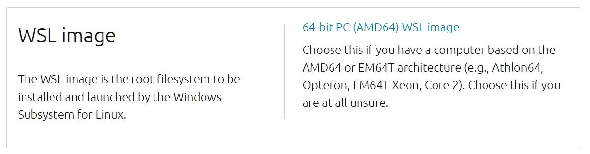

# WSL2 安装 Ubuntu 26.04

## 环境准备与安装

1. 升级 PowerShell
WSL 的诸多新特性（尤其是 --from-file 离线安装）需要 PowerShell 7.x+ 支持。Windows 自带的 5.1 版本在 WSL 集成上已显老旧，建议直接从 GitHub Release 跟进最新版。

[PowerShell 最新版本](https://github.com/PowerShell/PowerShell/releases)

2. 升级 WSL2

Ubuntu 26.04，需要新版的 WSL2 版才能正确识别其 systemd 引导和较新的 syscall 需求。WSL2 内核版本直接决定了对新发行版的兼容性。

执行以下命令升级 WSL2：

```sh:no-line-numbers
wsl --update --pre-release

# 正在检查更新。
# 正在将适用于 Linux 的 Windows 子系统更新到版本： 2.9.4。
# [=================         29.5%                           ]
```

3. .wslconfig 配置

详细配置可查看 [wsl配置参数](https://learn.microsoft.com/zh-cn/windows/wsl/wsl-config) 。

- **networkingMode=mirrored**: 在 WSL2 默认的 NAT 网络模式 下，localhost 代理无法直接在 WSL 中使用，需要手动配置 Windows IP 和端口。而 Mirrored（镜像）模式 可以让 WSL 与 Windows 主机共享同一 IP，实现端口和代理的无缝访问。

- **autoMemoryReclaim=gradual**: 这是是一个 **实验性** 配置项，用于控制 自动内存回收 的策略。当 WSL 虚拟机运行一段时间后，可能会占用大量内存，即使容器或进程已经停止，这部分内存也不会立即归还给 Windows 主机。该参数可以帮助自动释放缓存内存，减少 VmmemWSL 占用。
    - disabled：关闭自动内存回收，WSL 占用的内存不会自动释放。

    - gradual：缓慢、逐步地回收缓存内存，减少对正在运行任务的性能冲击。

    - dropCache：立即释放缓存内存，回收速度快，但可能会影响性能。

文件路径 `C:\Users\<用户名>\.wslconfig`

```ini
[experimental]
autoMemoryReclaim=gradual # 自动内存回收
networkingMode=mirrored # 启用镜像模式
dnsTunneling=true # DNS 隧道
firewall=true # 防火墙集成
autoProxy=true # 自动代理集成

[wsl2]
guiApplications=false
```

## Ubuntu 26.04 镜像下载

[Ubuntu 26.04 镜像下载](https://releases.ubuntu.com/resolute/ubuntu-26.04-wsl-amd64.wsl)

选择 WSL 版本的 Ubuntu 26.04 镜像版本




## Ubuntu 26.04 安装

执行以下命令安装 Ubuntu 26.04：

```sh:no-line-numbers
wsl --install --from-file D:/ubuntu/ubuntu-26.04-wsl-amd64.wsl --name Ubuntu-26.04
```
