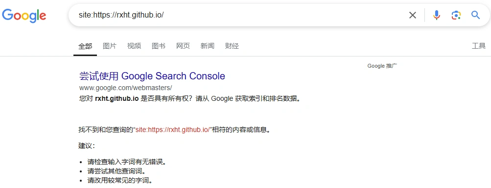
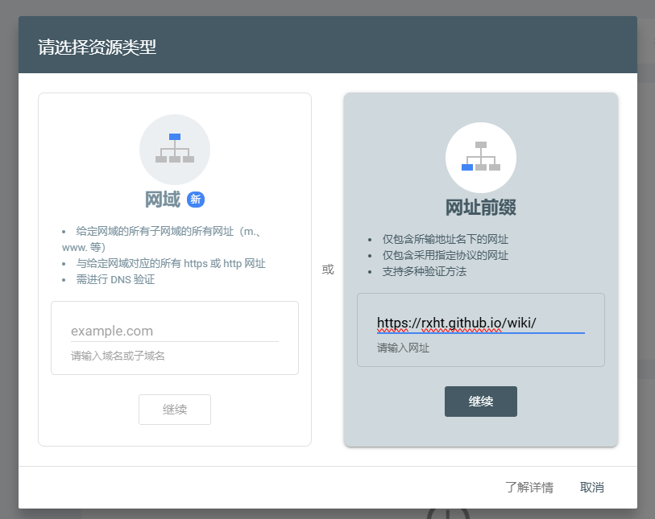
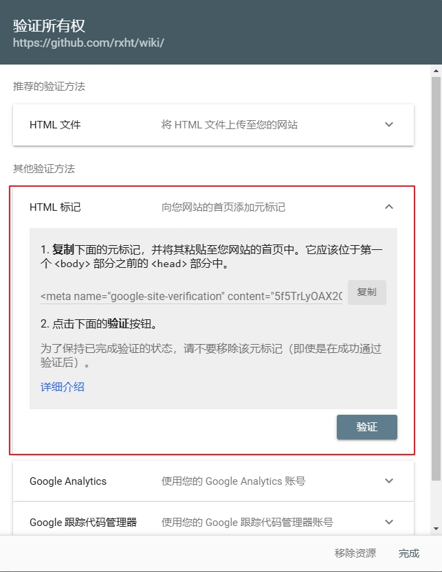

# google 收录

## 检查网站是否被收录

在 [google](https://www.google.com.hk/) 的搜索引擎中搜索对应的内容

```txt
site:https://rxht.github.io/
```

如果出现如下结果则表示网站还未被 [google](https://www.google.com.hk/) 收录



## 开始配置

1. 进入 [Google Swarch Console](https://search.google.com/search-console) 网站，登录

2. 点击添加资源，在弹框中选择 <b>网址前缀</b>，然后将对应的网站输入，点击继续



3. 在 <b>验证所有权</b> 弹框中选择其他验证方式 <b>HTML 标记</b>，复制这个字符串后添加到文件 `config.mts` 的 `<head>` 中



4. 得到上述字符串后按照 VitePress 的 head 配置规则进行配置

文件路径 `.vitepress/config.mts`

```typescript{5}
import { defineConfig } from 'vitepress';
// https://vitepress.dev/reference/site-config
export default defineConfig({
  head: [
    ["meta", { name: "google-site-verification", content: "0F9InGQokC5QJgzFqyZHxxkKrGdA0zAAWOWOgKmtT00" }], // google 收录
    ["meta", { name: "og:type", content: "website" }],
    ["meta", { name: "og:locale", content: "zh-cn" }],
    ["meta", { name: "og:site_name", content: "RXHT-博客" }],
  ],
  ...
})

```

5. 设置 `sitemap` 参数的到网站地图

文件路径 `.vitepress/config.mts`

```typescript{10-12}
import { defineConfig } from 'vitepress';
// https://vitepress.dev/reference/site-config
export default defineConfig({
  head: [
    ["meta", { name: "google-site-verification", content: "0F9InGQokC5QJgzFqyZHxxkKrGdA0zAAWOWOgKmtT00" }], // google 收录
    ["meta", { name: "og:type", content: "website" }],
    ["meta", { name: "og:locale", content: "zh-cn" }],
    ["meta", { name: "og:site_name", content: "RXHT-博客" }],
  ],
  sitemap: {
    hostname: 'https://rxht.github.io/wiki/'
  },
  ...
})

```

6. 重新编译打包项目，并进行部署

7. 部署完成后在 <b>验证所有权</b> 弹框中点击 <b>验证</b> 按钮，等待提示所有权验证成功

8. 在 [Google Swarch Console](https://search.google.com/search-console) 网站中进入 <b>站点地图</b>

9. 添加新的站点地图，如下图所示，输入完成后点击提交


::: tip
提交完 sitemap.xml 文件以后，你的网页并不会立刻被 Google 搜索引擎收录，第一次提交通常需要等待五六天左右甚至更长的时间。之后可以点击侧边栏的 Links 或者 Coverage 进行查看。
:::
