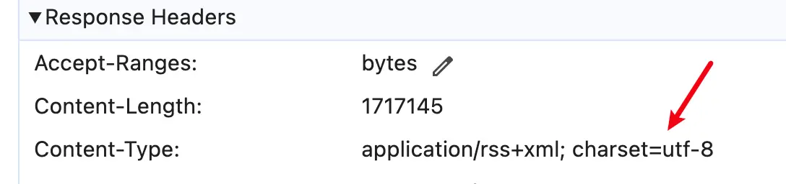

# 配置 vitepress-plugin-rss

> 基于 pagefind 实现的离线全文搜索


## 下载依赖
::: code-group

```sh [npm]
$ npm i vitepress-plugin-rss
```

```sh [pnpm]
$ pnpm add vitepress-plugin-rss
```

```sh [yarn]
$ yarn add vitepress-plugin-rss
```

:::

## 引入插件

文件路径 `.vitepress/config.mts`

```typescript{2,7-11} [.vitepress/config.mts]
import { defineConfig } from 'vitepress'
import { RssPlugin } from 'vitepress-plugin-rss'

export default defineConfig({
  vite: {
    plugins: [
        RssPlugin({
            title: 'WIKI',
            baseUrl: 'https://rxht.github.io',
            copyright: `版权所有 © 2024-${new Date().getFullYear()} 荣轩浩[rxht]`
        })
    ]
  }
})
```

## UI更新

在网站的 <b>socialLinks</b> 会自动新增一个 <b>RSS</b> 图标，如下图


## 编译时控制台输出

```sh:no-line-numbers
🎉 RSS generated feed.rss
rss filepath: xxxxxxx\wiki\.vitepress\dist\feed.rss
rss url: https://rxht.github.io/wiki/feed.rss
```


::: tip

如果不想让指定文章出现在 <b>RSS</b> 文件中，可以在文章顶部添加 `publish: false`

```md
---
publish: false
---
```

:::


::: tip

如果 <b>RSS</b> 文件出现乱码，以 Nginx 为例，可以添加如下配置

```json
location ~ \.rss$ {
  charset utf-8;
}
```

修复完成后请求 <b>RSS</b> 文件会有如下返回结果



:::

[更详细配置可查看](https://www.npmjs.com/package/vitepress-plugin-rss)
