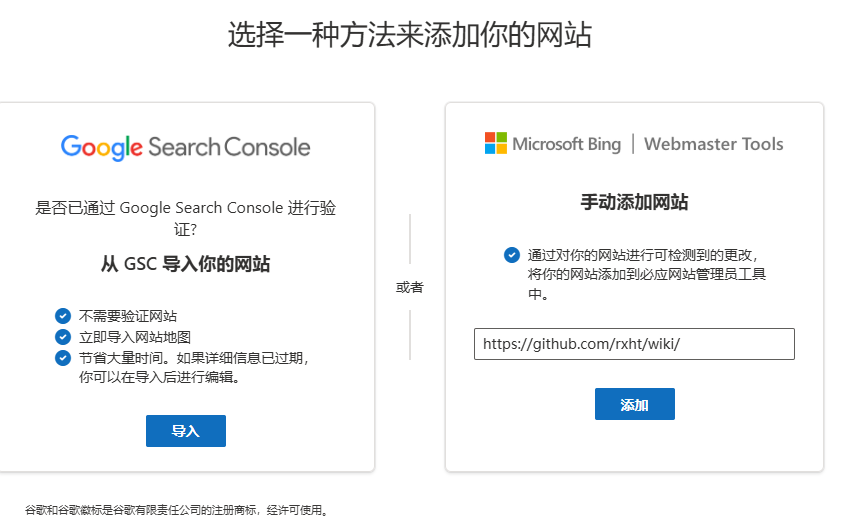
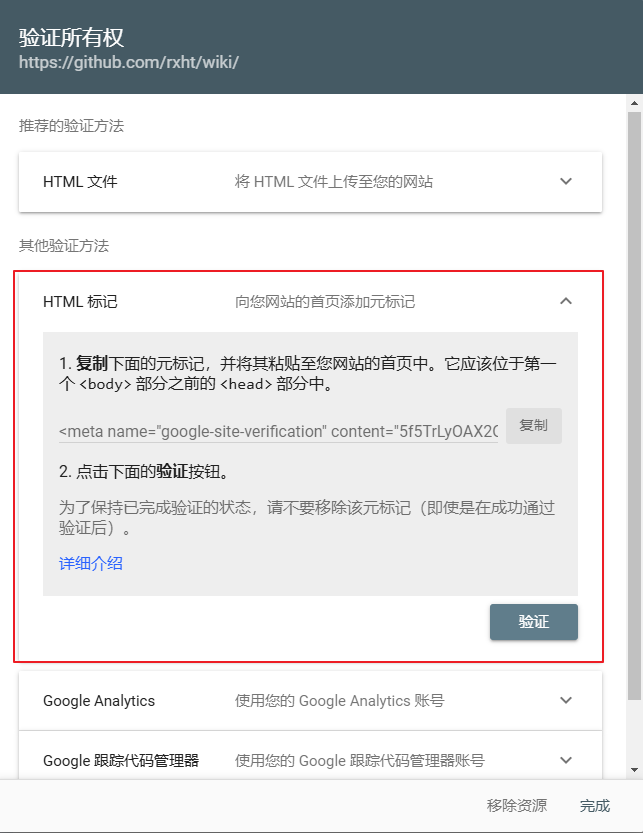
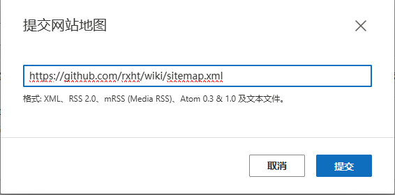

# bing 收录

## 检查网站是否被收录

在 [bing](https://cn.bing.com/) 的搜索引擎中搜索对应的内容

```txt
site:https://rxht.github.io/
```

## 开始配置


1. 进入 [Bing Webmasters](https://www.bing.com/webmasters/home) 网站，登录


2. 点击添加网站，在弹框中选择 <b>手动添加网站</b>，然后将对应的网站输入，点击添加



3. 在 <b>添加并验证网站</b> 弹框中选择其他验证方式 <b>HTML Meta标记</b>，复制这个字符串后添加到文件 `config.mts` 的 `<head>` 中



4. 得到上述字符串后按照 VitePress 的 head 配置规则进行配置


文件路径 `.vitepress/config.mts`

```typescript{5}
import { defineConfig } from 'vitepress';
// https://vitepress.dev/reference/site-config
export default defineConfig({
  head: [
    ["meta", { name: "msvalidate.01", content: "9AC86FD1DE0C9B5003A7EC062D6CCAFA"}], // bing 收录
    ["meta", { name: "og:type", content: "website" }],
    ["meta", { name: "og:locale", content: "zh-cn" }],
    ["meta", { name: "og:site_name", content: "RXHT-博客" }],
  ],
  ...
})

```

5. 设置 `sitemap` 参数的到网站地图

文件路径 `.vitepress/config.mts`

```typescript{10-12}
import { defineConfig } from 'vitepress';
// https://vitepress.dev/reference/site-config
export default defineConfig({
  head: [
    ["meta", { name: "msvalidate.01", content: "9AC86FD1DE0C9B5003A7EC062D6CCAFA"}], // bing 收录
    ["meta", { name: "og:type", content: "website" }],
    ["meta", { name: "og:locale", content: "zh-cn" }],
    ["meta", { name: "og:site_name", content: "RXHT-博客" }],
  ],
  sitemap: {
    hostname: 'https://rxht.github.io/wiki/'
  },
  ...
})

```

6. 重新编译打包项目，并进行部署

7. 部署完成后在 <b>添加并验证网站</b> 弹框中点击 <b>验证</b> 按钮，等待提示所有权验证成功


8. 在 [Bing Webmasters](https://www.bing.com/webmasters/home) 网站中进入 <b>网站地图</b>

9. 提交网站地图，如下图所示，输入完成后点击提交



::: tip
提交完sitemap.xml 文件以后，你的网页并不会立刻被 Bing 搜索引擎收录，第一次提交通常需要等待五六天左右甚至更长的时间。
:::
