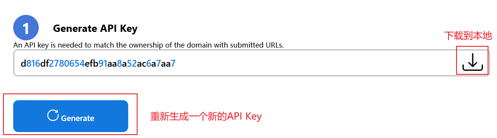

# SEO 优化： IndexNow

> 通过实时索引掌控您的SEO策略 - Take control of your SEO game with real-time indexing


## 介绍

IndexNow是一种开源协议，可以让网站所有者在网站内容出现变化（添加、更新或删除）后通知搜索引擎，让搜索引擎立即索引这些页面和内容。这使搜索引擎能够在其搜索结果中快速反映这种变化，从而提高整体抓取效率。

## 生成API密钥

可以在网站[Mocrosoft](https://www.bing.com/indexnow/getstarted)生成一个密钥，然后点击下载按钮将密钥下载到本地。



## 将API密钥添加到VitePress项目中

将所下载的API Key文件 `${API_KEY}.txt` 保存到 VitePress 项目的 public 目录下。

> [!TIP] 提示
> 所下载的API Key文件 `${API_KEY}.txt` 可以对其进行改名，但必须以 `utf-8` 格式与 `.txt` 后缀结尾。


## 提交URL

要使用 HTTP 请求提交一个URL（用搜索引擎提供的 URL 替换 ），请向以下 URL 发出请求：

```http:no-line-numbers
https://<searchengine>/indexnow?url=url-changed&key=your-key
```

> - 已更改 URL 是你已被添加、更新或删除网站的一个 URL。URL 必须经过 URL 转义和编码，请确保你的 URL 遵循 RFC-3986 的 URI 标准。
> - 你的秘钥密续至少最少有 8 个，最多 128 个十六进制字符。密钥只能包含以下字符：小写字母（a-z），大写字母（A-Z），数字（0-9），以及短破折号（-）。

例如，如果你想通知搜索引擎，`https://www.example.com/product.html` 已更新，并且你想使用此秘钥 `7b1acc95d64f4496a7ba0744adb6af04`

```http:no-line-numbers
https://<searchengine>/indexnow?url=https://www.example.com/product.html&key=7b1acc95d64f4496a7ba0744adb6af04
```

- 向Bing提交示例：https://www.bing.com/indexnow?url=https://www.example.com/product.html&key=7b1acc95d64f4496a7ba0744adb6af04
- 向Yandex提交示例：https://yandex.com/indexnow?url=url-changed&kurl=https://www.example.com/product.html&key=7b1acc95d64f4496a7ba0744adb6af04

你可以使用浏览器、wget、curl 或你选择的任何其他机制发出 HTTP 请求。请求成功将返回一个 HTTP 200 响应代码；如果你收到不同的响应，请验证提交的次数是否过多，密钥和 URL 是否有效，并重新提交请求。HTTP 200 响应代码只表明搜索引擎已收到你的 URL。

## 提交一组 URL

要使用 HTTP 请求提交一组 URL，请向搜索引擎提供的 URL 发出 POST JSON 请求。用搜索引擎的主机名称替换

```http:no-line-numbers
POST /indexnow HTTP/1.1
Content-Type: application/json; charset=utf-8
Host: <searchengine>
{
  "host": "www.example.com",
  "key": "7b1acc95d64f4496a7ba0744adb6af04",
  "urlList": [
      "https://www.example.com/url1",
      "https://www.example.com/folder/url2",
      "https://www.example.com/url3"
      ]
}
```

你可以在每次发布中提交最多 10,000 个URL，如果需要，可以混合 http 和 https URL。

你可以使用 wget、curl 或你选择的任何其他机制发出 HTTP 请求。请求成功将返回一个 HTTP 200 响应代码；如果你收到不同的响应，你应该验证请求，如果一切看起来没问题，就重新提交请求。HTTP 200 响应代码只表明搜索引擎已收到你的 URL 组。

推荐的方法是，内容被添加、更新或删除以后，就自动提交URL，但要达到一定的限度；见《常见问题解答》中的用户生成内容的最佳做法。

## 通过秘钥验证所有权

要提交 URL，你必须通过在主机内存放至少一个文本文件以“证明”对提交 URL 的主机的所有权。向搜索引擎提交的 URL 后，搜索引擎将爬网秘钥文件以验证所有权，并使用秘钥，直到你更改钥匙。只有你和搜索引擎知道秘钥和文件钥匙的位置。

有两种方式可以验证所有权。

- 方案 1

在你主机的根目录下托管一个文本密钥文件。
必须在你的网站根目录下托管一个 UTF-8 编码的文本密钥文件{your-key}.txt，在文件中列出密钥。

例如，对于前面的例子，你将需要把你的UTF-8密钥文件托管在 https://www.example.com/7b1acc95d64f4496a7ba0744adb6af04.txt 且该文件必须包含密钥7b1acc95d64f4496a7ba0744adb6af04

- 方案 2

在你的主机内托管一个文本密钥文件。
你也可以在同一主机的其他位置托管一个到多个 UTF-8 编码的文本密钥文件，你必须在每个 IndexNow 通知中通过使用 keyLocation 变量指定位置告知搜索引擎这个文本密钥文件的位置。

如果你提交了一个 URL，指定密钥文件位置作为 keyLocation URLs 参数值。

```http:no-line-numbers
https://<searchengine>/indexnow?url=http://www.example.com/product.html&key=7b1acc95d64f4496a7ba0744adb6af04&keyLocation=http://www.example.com/myIndexNowKey63638.txt
```

如果你提交一组 URL，在 JSON 内容中指定密钥文件的位置作为 keyLocation 变量。

```http:no-line-numbers 7
POST /indexnow HTTP/1.1
Content-Type: application/json; charset=utf-8
Host: <searchengine>
{
  "host": "www.example.com",
  "key": "7b1acc95d64f4496a7ba0744adb6af04",
  "keyLocation": "https://www.example.com/myIndexNowKey63638.txt",
  "urlList": [
      "https://www.example.com/url1",
      "https://www.example.com/folder/url2",
      "https://www.example.com/url3"
      ]
}
```

在此方案 2 中，一个密钥文件的位置决定了这个密钥可以包含的 URL 组。一个位于 http://example.com/catalog/key12457EDd.txt 的密钥文件可以包括以 http://example.com/catalog/ 开始的任何 URL，但不能包括以 http://example.com/help/ 开始的URL。

http://example.com/catalog/show?item=23
http://example.com/catalog/show?item=233&user=3453
URLs not considered valid in http://example.com/catalog/sitemap.xml include:

http://example.com/image/show?item=23
http://example.com/image/show?item=233&user=3453
在方案 2 中被认为无效的 URL 可能无法被考虑用于索引。强烈建议使用方案 1，将文件密钥放在网络服务器的根目录下。
